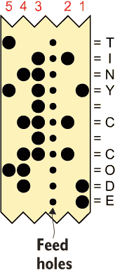
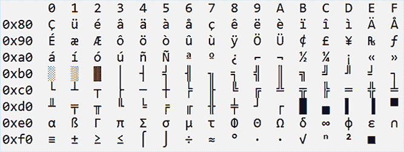

# 8 Unicode 和宽字符

在一开始是莫尔斯电码，这是一种将电脉冲——长和短——转换成字符串和可读文本的简单方法。莫尔斯并不是第一个电子编码方法，但它可能是最著名的。它在 1840 年开发，以塞缪尔·莫尔斯的名字命名，他帮助发明了电报，并且也与《太空迷航员》中的史密斯博士有惊人的相似之处。

在莫尔斯电码之后的 30 年左右出现了博多电码。它也用于电报通信，*博多*（baw-DOH）使用 5 位序列来表示字母表中的字母。后来，这种代码被修改成默里电码，用于带有键盘的电传打字机和早期的计算机。然后是 IBM 的二元编码十进制（BCD），用于他们的主机计算机。最终，ASCII 编码标准在 20 世纪末解决了所有人的文本编码问题。

本章的主题是字符编码，这是一种将字符的字母汤赋予代码值以在计算机中进行数字表示的艺术。这一努力的成果是 Unicode，它几乎为人类历史上几乎所有的可想象书写文字赋予了值。为了帮助在 C 语言中探索 Unicode，在本章中你将：

+   复习各种计算机编码系统

+   研究 ASCII 文本、代码页和 Unicode

+   为你的程序设置区域设置细节

+   理解不同的字符类型，例如 UTF-8

+   使用宽字符和字符串

+   执行宽字符文件 I/O

我真的看不到任何新的文本编码格式会取代 Unicode。这是一个稳固的系统，每年都会分配新的字符。它唯一的限制似乎是在各种字体中的实施不完善。因此，尽管你可以在 Linux 终端窗口中编程 Unicode，但文本输出可能不会准确显示。为了最好地解决这个问题，确保你的终端程序窗口允许你更改字体，这样你就可以见证 Unicode 可以产生的有趣、奇特和令人印象深刻的效果。

## 8.1 计算机中的文本表示

计算机理解数字，这些数字以字节的形式组织在内存中，由处理器操作，并长期存储在媒体上。系统实际上并不关心文本，并且对拼写一无所知。尽管如此，为了与人类沟通，许多这些字节值对应于打印字符。正是这种字符编码的一致性使得计算机能够与人类沟通并交换信息，尽管它们天生并不愿意这样做。

### 8.1.1 复习早期文本格式

这些天你只有在电影中才会听到莫尔斯电码。一定发生了重要的事情，通信只能通过敲击管道或其他同样绝望和愚蠢的方式来进行。其中一个角色用陈词滥调回应说他们的莫尔斯电码知识“生疏了”，但信息被解码，观众印象深刻，这一天得以挽救。

摩尔斯电码由一系列的短划线和点组成，长或短的脉冲，用于编码字母和数字。大小写之间没有区别。一些常见的代码在“极客”中是众所周知的，例如 S-O-S，尽管我无法立即记住哪个三位点划组合属于 S 或 O。我想我可以查看表 8.1 来确定哪个是哪个。

表 8.1 摩尔斯电码

| 字符 | 代码 | 字符 | 代码 | 字符 | 代码 |
| --- | --- | --- | --- | --- | --- |
| A | .- | M | -- | Y | -.-- |
| B | -... | N | -. | Z | --.. |
| C | -.-. | O | --- | 1 | .----- |
| D | -.. | P | .--. | 2 | ..--- |
| E | . | Q | --.- | 3 | ...-- |
| F | ..-. | R | .-. | 4 | ....- |
| G | --. | S | ... | 5 | ..... |
| H | .... | T | - | 6 | -.... |
| I | .. | U | ..- | 7 | --... |
| J | .--- | V | ...- | 8 | ---.. |
| K | -.- | W | .-- | 9 | ----. |
| L | .-.. | X | -..- | 0 | ----- |

我将避免涉及有关划线或点的长度以及空格等技术细节的细节。尽管如此，我可以提出的一个“极客”观点是，编码设计得使得常用字母有更少的单位，例如 E、T、I、A、N 等等。

下一个列表显示了*toMorse()*函数，该函数根据输入字符输出摩尔斯电码字符串。字符字符串存储在两个*const char*数组中，分别对应 morse_alpha[]的 A 到 Z 序列和 morse_digit[]的 0 到 9 序列。一个*if-else*结构使用 ctype 函数提取字母和数字字符；所有其他字符都被忽略。

列表 8.1 *toMorse()*函数

```
void toMorse(char c)
{
    const char *morse_alpha[] = {                    ❶
        ".-", "-...", "-.-.", "-..", ".", "..-.",
        "--.", "....", "..", ".---", "-.-", ".-..",
        "--", "-.", "---", ".--.", "--.-", ".-.",
        "...", "-", "..-", "...-", ".--", "-..-",
        "-.--", "--.."
    };
    const char *morse_digit[] = {                    ❶
        "-----", ".----", "..---", "...--", "....-",
        ".....", "-....", "--...", "---..", "----."
    };

    if( isalpha(c) )                                 ❷
    {
        c = toupper(c);                              ❸
        printf("%s ",morse_alpha[c-'A']);            ❹
    }
    else if( isdigit(c) )                            ❺
    {
        printf("%s ",morse_digit[c-'0']);            ❻
    }
    else if( c==' ' || c=='\n' )                     ❼
    {
        putchar('\n');
    }
    else                                             ❽
        return;
}
```

❶ 将数组声明为*const char*以防止代码在其它情况下修改它们；这种类型的结构不喜欢被操作。

❷ 提取字母字符

❸ 转换为大写；摩尔斯电码不区分大小写。

❹ 从'A'减去字符以获得正确的数组元素偏移量

❺ 检查数字 0 到 9

❻ 从'0'减去数字以获得正确的数组元素偏移量

❼ 对于空格和换行符，输出换行符

❽ 忽略非摩尔斯字符；不生成输出。

*toMorse()*函数可以很容易地设置为一个过滤器，该过滤器将文本输入转换为摩尔斯电码字符串进行输出。这种过滤器可以在本书的在线仓库中找到的源代码文件 morse_code_filter.c 中找到。

另一种文本编码方案是博多码。这个术语对你来说可能很陌生——除非你是那些曾经用“波特”来称呼他们的拨号调制解调器速度的老手。一个 300 波特调制解调器以每秒 300 个字符的速度缓慢移动。因为波特并不完全代表每秒字符数，所以更快的调制解调器（以及今天的宽带）是以每秒比特数（BPS）来衡量的，而不是波特。

不管怎样。

Baudot 方案以 5 位块对文本进行编码。这位工程师和发明家唐纳德·穆雷将此代码改编为 Murray 代码，用于电传打字机。这些机器具有 QWERTY 键盘，常被用作早期计算机系统的输入设备。具体来说，穆雷开发了纸带以存储和读取按键。纸带上的孔代表字符，如图 8.1 所示。



图 8.1 带有孔的纸带，代表 Baudot-Murray 代码

Baudot-Murray 代码的 International Telegraph Alphabet No. 2 (ITA2)标准于 1928 年推出。在美国，该标准被称为 US-TTY（TTY 代表电传打字机）。由于它宽度为 5 位，无法提供足够的值来处理完整的字符集。因此，该代码需要一个转换字符来在字母和符号集之间切换。

表 8.2 列出了字母集的 Baudot-Murray 十六进制代码。代码 0x1B 切换到数字集字符，如表 8.3 所示。代码 0x1B 或代码 0x1F 切换回。

表 8.2 ITA2 和 US-TTY 的 Baudot-Murray 代码，字母集

| Code | Character | Code | Character | Code | Character | Code | Character |
| --- | --- | --- | --- | --- | --- | --- | --- |
| 0x00 | \0 | 0x08 | \r | 0x10 | T | 0x18 | O |
| 0x01 | E | 0x09 | D | 0x11 | Z | 0x19 | B |
| 0x02 | \n | 0x0A | R | 0x12 | L | 0x1A | G |
| 0x03 | A | 0x0B | J | 0x13 | W | 0x1B | shift |
| 0x04 | space | 0x0C | N | 0x14 | H | 0x1C | M |
| 0x05 | S | 0x0D | F | 0x15 | Y | 0x1D | X |
| 0x06 | I | 0x0E | C | 0x16 | P | 0x1E | V |
| 0x07 | U | 0x0F | K | 0x17 | Q | 0x1F | del |

表 8.3 ITA2 和 US-TTY 的 Baudot-Murray 代码，数字集

| Code | Character | Code | Character | Code | Character | Code | Character |
| --- | --- | --- | --- | --- | --- | --- | --- |
| 0x00 | \0 | 0x08 | /r | 0x10 | 5 | 0x18 | 9 |
| 0x01 | 3 | 0x09 | $ | 0x11 | " | 0x19 | ? |
| 0x02 | \n | 0x0A | 4 | 0x12 | ) | 0x1A | & |
| 0x03 | - | 0x0B | ' | 0x13 | 2 | 0x1B | shift |
| 0x04 | space | 0x0C | , | 0x14 | # | 0x1C | . |
| 0x05 | \a | 0x0D | ! | 0x15 | 6 | 0x1D | / |
| 0x06 | 8 | 0x0E | : | 0x16 | 0 | 0x1E | ; |
| 0x07 | 7 | 0x0F | ( | 0x17 | 1 | 0x1F | letters |

不要试图理解 Baudot-Murray 中使用的字符映射。如果你对 ASCII 代码的排列方式感到满意（参考第五章），那么表 8.2 和 8.3 中显示的文本编码尤其令人困惑。记住，这些代码是为了与早期系统保持一致性而创建的。也许在编码中可以找到一些道理。谁知道呢？

我非常兴奋地想写一个程序来在 ASCII 和 Baudot-Murray 编码之间进行转换。这种转换的问题在于生成的代码几乎是暴力破解，字符到字符的交换。再加上字符集的转换，这样的编程任务变成了一个没有实际目的的噩梦。

### 8.1.2 发展为 ASCII 文本和代码页

除了在电传打字机上使用的 Baudot-Murray 代码之外，IBM 为其大型机发明了一种文本编码标准：扩展二进制编码十进制交换码（EBCDIC）。这个方案是第一个 8 位字符编码标准之一，尽管它主要用于 IBM 大型机。

对于输入，IBM 系统使用穿孔卡片。因此，EBCDIC 编码方案被设计出来，目的是为字符分配代码，目的是防止卡片上的穿孔孔洞聚集在一起。这种方法是必要的，以防止卡片撕裂或孔洞相互连接。为了达到这个目标，EBCDIC 代码在其序列中具有间隔；许多 EBCDIC 字符代码是空白的。

随着计算从穿孔卡片转向，众多程序员欢呼雀跃。美国标准协会于 1963 年开发了新的编码标准——ASCII。这是一个 7 位标准，ASCII 增加了逻辑性——更重要的是——对文本编码的同情心。

7 位 ASCII 代码至今仍在使用，尽管今天的字节始终由 8 位组成。这个额外的位意味着现代计算机可以为字节的数据编码 256 个字符，其中只有一半（代码 0 至 127）由 ASCII 标准化。

你可以在第四章中了解更多关于 ASCII 的乐趣。本节的重点是关于 128 至 255 的字符代码，所谓的扩展 ASCII 字符集。

扩展 ASCII 从未成为官方标准，而且在所有 8 位计算机之间也不一致。在 20 世纪 70 年代末和 80 年代初，这些额外的 128 个字符在字节中被映射到各种微型计算机上的非 ASCII 字符上。代码的可用性意味着在典型的计算机上可以生成更多符号，包括常见的字符，如×、÷、±、希腊字母、分数、带重音的字符、双字母符号等。

图 8.2 列出了 20 世纪 80 年代初原始 IBM PC 系列计算机上可用的扩展 ASCII 字符集。尽管字符种类丰富，但这些 128 个额外符号仍不足以代表所有可用或期望的字符——这只是个开头。



图 8.2 原始 IBM PC“扩展 ASCII”字符集

为了容纳更多字符，早期的计算机使用了代码页。*代码页*代表一组不同的字符，包括 ASCII（代码 0 至 127）和 8 位字符代码，128 至 255。

图 8.2 中显示的 128 至 255 代码字符代表 IBM PC 代码页 437。其他代码页使用不同的符号。最终，为特定外国语言和字母表制作了代码页。中文、日文、阿拉伯文和其他字符集在各种代码页上都有特色。

在古老的 MS-DOS 操作系统中有可用的命令允许切换代码页字符集，尽管计算机仍然限制在每次只能使用一个代码页的字符。在系统配置文件（CONFIG.SYS）中，COUNTRY 命令设置区域详细信息，包括可用的代码页。在命令提示符下，使用 CHCP 命令来检查当前代码页以及将字符集更改为新的代码页。

Linux 不使用代码页，主要是因为它实现了 Unicode（见下一节）。然而，Windows 仍然使用与原始 IBM PC 相同的扩展 ASCII 代码页。当程序输出从 128 到 255 的字符代码值时，你可以查看这些遗留字符。

下面的列表中的源代码生成了图 8.2 的内容。程序的核心由嵌套的 for 循环组成，输出代表传统扩展 ASCII 字符集或代码页 1 的行和列。*printf()*语句中的格式化确保输出以方便的表格形式出现。

列表 8.2 extended_ascii.c 的源代码

```
#include <stdio.h>

int main()
{
    int x,y;

    printf("      ");                  ❶
    for(x=0; x<16; x++)
        printf(" %X ",x);              ❷
    putchar('\n');

    for( x=0x80;x<0x100; x+=0x10 )     ❸
    {
        printf(" 0x%2x ",x);
        for( y=0; y<0x10; y++ )
        {
            printf(" %c ",x+y);        ❹
        }
        putchar('\n');
    }

    return(0);
}
```

❶ 使用六个空格对齐输出

❷ 输出标题行

❸ 输出左侧列

❹ 内部循环输出字符，计算正确的偏移量 x+y

由 extended_ascii.c 源代码生成的程序在 Windows 计算机上运行效果最佳。如果你在 Linux 或 Mac 上运行它，表格将是空的或填充着问号。字符并没有丢失；只是在 Linux/Unix 环境中没有生成，除非在代码中设置了特定的区域设置。这一主题将在本章后面讨论。

交换代码页和探索扩展 ASCII 字符集的任务不再需要来生成花哨的文本。随着 20 世纪 90 年代 Unicode 的出现，自早期电报时代以来的所有文本编码不一致性终于得到了解决。

### 8.1.3 深入 Unicode

回到 20 世纪 80 年代，那些坐在那里思考如何做些新奇事情的计算科学家们撞上了好运。他们考虑了创建一种一致的方式来编码文本的可能性——不仅限于 ASCII 或拉丁字母字符，而是这个星球上已知的所有涂鸦、符号和装饰品，无论是过去还是现在。结果在 20 世纪 90 年代揭晓，那就是 Unicode。

Unicode 的原始目的是将字符宽度从 8 位扩展到 16 位。这种变化并没有将字符数量翻倍——它将可能的字符编码从 256 增加到超过 65,000。但即使这个巨大的数量也不够。

现在，Unicode 标准包括数百万个字符，包括象形文字和表情符号，其中一部分在图 8.3 中展示。新字符不断被添加，几乎每年都在增加。例如，在 2021 年，添加了 838 个新字符。


图 8.3 各种 Unicode 字符

当前 Unicode（截至 2022 年）的代码空间由 1,114,111 个代码点组成。*代码空间*是整个 Unicode 的范围。你可以将*代码点*视为字符。然而，并非每个代码点都分配了字符：代码空间中的许多块是空的。一些代码点被设计为覆盖或长音符号，以与其他字符结合。在众多代码点中，前 128 个代码点与 ASCII 标准相一致。

Unicode 字符以 U+*nnnn* 的格式引用，其中 *nnnn* 是代码点的十六进制值。代码空间被组织成代表各种语言或文字的代码面板。大多数引用 Unicode 字符的网页，如 [unicode-table.com](http://unicode-table.com)，在浏览字符集合时使用这些代码平面或块。

要将 Unicode 代码点——比如 U+2665——转换为 C 中的字符，你必须遵循一种编码格式。这些编码格式中最受欢迎的是 Unicode 转换格式，UTF。存在几种 UTF 的变体：

+   UTF-8 使用 8 位块（字节）来存储字符值，多个字节包含某些值的代码。字节数量不同，但它们都是 8 位块。

+   UTF-16 使用 16 位块（单词）来存储字符值。这种格式不像 UTF-8 那样受欢迎。

+   UTF-32 使用 32 位块（长单词）。所有字符都由 32 位表示，无论它们是否需要存储空间。这种格式并不那么受欢迎，因为它占用的空间比许多代码点所需的更多。

这些编码格式在设置区域设置时发挥作用，这是在 C 中处理 Unicode 文本的关键。有关区域设置的更多信息，请参阅第 8.2.1 节。

字符本身被描述为*宽字符*，或可能需要多个字节来生成输出的字符。这个主题将在第 8.2.2 节中介绍。

最后，请注意，并非每种字体都支持整个 Unicode 字体集。缺失的字符将根据字体以空格、问号或方框的形式输出。当你运行本章后面的某些程序时，可能会遇到这个问题。解决方案是为终端窗口设置另一种字体，或者配置终端窗口，使其能够输出 Unicode 文本。

## 8.2 宽字符编程

仅将宽字符输出到控制台是不行的。你可以尝试。也许你会幸运，尤其是在 Windows 上。但要正确地在你的 C 程序中输出和编程 Unicode 文本，你必须首先设置区域设置。这个设置通知计算机程序能够处理宽字符。

在设置区域设置后，代码必须访问和使用宽字符进行其文本 I/O。这个过程是某些文本模式程序如何在终端窗口中输出花哨的 Unicode 字符，以及电子邮件消息甚至短信显示表情符号和其他有趣字符的方式。一旦你学会了本节中介绍的步骤，你的程序也可以做到这一点。

### 8.2.1 设置区域

程序中的区域设置确定诸如语言、日期和时间格式、货币符号等特定于语言或地区的详细信息。此功能和它的伙伴允许你在不深入研究，例如，文化中的千位分隔符或货币符号的情况下编写适用于不同地区的程序。

对于宽字符输出，设置正确的区域允许你的代码使用宽字符——Unicode 字符集。是的，设置区域是秘密。

要在 Linux 环境中查看当前的区域设置，请在终端窗口中输入 locale 命令。以下是看到的输出：

```
LANG=C.UTF-8
LANGUAGE=
LC_CTYPE="C.UTF-8"
LC_NUMERIC="C.UTF-8"
LC_TIME="C.UTF-8"
LC_COLLATE="C.UTF-8"
LC_MONETARY="C.UTF-8"
LC_MESSAGES="C.UTF-8"
LC_PAPER="C.UTF-8"
LC_NAME="C.UTF-8"
LC_ADDRESS="C.UTF-8"
LC_TELEPHONE="C.UTF-8"
LC_MEASUREMENT="C.UTF-8"
LC_IDENTIFICATION="C.UTF-8"
LC_ALL=
```

UTF-8 字符格式是允许 Unicode 文本输入/输出的格式——尽管要在代码中启用 UTF-8 输出，你必须使用在 locale.h 头文件中声明的 *setlocale()* 函数。以下是格式：

```
char *setlocale(int category, const char *locale);
```

第一个参数，类别，是一个定义的常量，表示你想要设置的区域哪个方面。使用 LC_ALL 来设置所有类别。LC_CTYPE 类别专门用于文本。

第二个参数是要设置的特定区域详细信息的字符串。例如，对于文本，你可以指定 "en_US.UTF-8"，这将激活英语的 8 位 Unicode 字符集。也可以指定一个空字符串。

*setlocale()* 函数返回一个表示请求的特定信息的字符串。你不需要使用该字符串；设置区域对于宽字符输入/输出就足够了。

注意，*setlocale()* 函数在某些 Windows 编译器中不可用。在 Windows 中访问 Unicode 字符的方法与本章中描述的不同。

下一个列表显示了一个使用 *setlocale()* 函数输出区域详细信息的微小程序——特别是正在使用的字符集。第 8 行使用 *setlocale()* 函数返回一个描述当前区域的字符串，保存在变量 locale 中。一个 *printf()* 语句输出了区域字符串。以这种方式使用，*setlocale()* 函数不会更改区域设置；它只报告信息。

列表 8.3 locale_function.c 的源代码

```
#include <stdio.h>
#include <locale.h>                                 ❶

int main()
{
    char *locale;                                   ❷

    locale = setlocale(LC_ALL,"");                  ❸
    printf("The current locale is %s\n",locale);    ❹

    return(0);
}
```

❶ *setlocale()* 函数需要 locale.h 头文件。

❷ 指向字符串的指针以保留函数的输出

❸ 同步 GPU 以完成工作

❹ 输出区域详细信息

这里是示例输出：

```
The current locale is C.UTF-8
```

C 代表 C 语言。如果不是，它应该是。UTF-8 是字符编码。

设置区域后，输出 Unicode 字符的下一步是理解宽字符的概念。

### 8.2.2 探索字符类型

要启用访问 Unicode 的巨大字符集的魔法，你必须熟悉计算机领域使用的三种字符类型：

+   单字节字符

+   宽字符

+   多字节字符

单字节字符提供了生成文本的传统方式。这些是 8 位值，*char*数据类型，等于一个字节的存储空间。尽管*char*值的范围从 0 到 255（无符号），但只有 0 到 127 的值使用 ASCII 标准分配了字符。

宽字符数据类型使用超过 8 位来编码文本。字节数可能因字符而异。在 C 中，*wchar_t*数据类型处理宽字符，而宽字符（wchar）函数族操作这些字符。

多字节字符需要几个字节来表示一个字符。这个描述包括宽字符，但也包括需要前缀字节或引导单元，然后是另一个字节序列来表示单个字符的字符。这种多字节字符可能用于特定的应用程序和计算机平台。本书不涉及此类内容。

要表示单字节字符，你使用 C 中的*char*数据类型。例如：

```
char hash = '#';
```

哈希字符被分配给*char*变量 hash。字符代码是 35 十进制，23 十六进制。

要表示宽字符，请使用*wchar_t*数据类型。其定义可以在 wchar.h 头文件中找到，必须在你的代码中包含此头文件。此头文件还原型化了各种宽字符函数。（见下一节。）

以下语句声明了宽字符 yen：

```
wchar_t yen = 0xa5;
```

日元字符¥是 U+00a5。这个值被分配给*wchar_t*变量 yen。编译器不会让你直接分配字符：

```
wchar_t yen = L'¥';
```

L 前缀将字符定义为长（宽）。这个前缀的作用类似于应用于*long*整数值的 L 后缀：123L 表示 123 作为一个*long int*值指定的值。虽然这个 L 前缀技巧可以与表示为宽字符的 ASCII 字符一起工作，但你的 C 编译器很可能在尝试编译包含此类字符的源代码文件时失败；我看到的警告是“非法字符编码。”你的编辑器也可能不允许你直接输入或粘贴宽字符。

L 前缀也用于声明宽字符字符串。以下是一个宽字符字符串的例子：

```
wchar_t howdy[] = L"Hello, planet Earth!";
```

上面的字符串“Hello, planet Earth!”由宽字符组成，归功于 L 前缀。*wchar_t*数据类型声明了宽字符串 howdy。

与单字符一样，你不能在宽字符串中插入特殊字符。以下声明被标记为非法字符编码：

```
wchar_t monetary[] = L"$¥€₤";
```

这样的字符串可以这样组成：

```
wchar_t monetary[] = {
    0x24, 0xa5, 0x20ac, 0xa3, 0x0
};
```

上述十六进制值代表美元符号、日元、欧元和英镑字符，之后跟着空字符作为字符串的终止符。

要输出宽字符和宽字符串，请使用 w*printf()*函数。这个函数与标准库的*printf()*函数类似，但它处理宽字符串。宽字符和宽字符串使用特殊的占位符：

+   %lc 占位符代表一个宽字符。

+   %ls 占位符代表宽字符串。

占位符中的小写 L 识别目标变量为宽字符或 *wchar_t* 数据类型。这个字符类似于 %ld 占位符中的小 L，用于表示长十进制整数值。

### 8.2.3 生成宽字符输出

要在 C 中输出宽字符，你将使用在 wchar.h 头文件中声明的函数，该头文件还方便地定义了 *wchar_t* 数据类型。这些函数与标准字符串函数（来自 string.h）平行，大多数伴随函数以 w 或其他细微差异为前缀。例如，宽字符版本的 *printf()* 是 *wprintf()*。

哦，你还需要 locale.h 头文件，因为宽字符函数必须首先设置区域设置才能激活。有关使用 *setlocale()* 函数的详细信息，请参阅第 8.2.1 节。

下一个示例展示了使用 *wprintf()* 函数的传统“Hello, world!”类型程序源代码，并加入了我自己的宽字符处理。由于输出是 ASCII，尽管是宽 ASCII，因此不需要 *setlocale()* 函数。*stdio.h* 头文件也不需要，因为代码中没有使用其任何函数。

列表 8.4 hello_wworld01.c 的源代码

```
#include <wchar.h>                       ❶

int main()
{
    wprintf(L"Hello, wide world!\n");    ❷

    return(0);
}
```

❶ 宽字符定义和函数

❷ w*printf()* 函数类似于 *printf()* 函数。对于由宽字符组成的字符串，需要 L 前缀。尽管这里的文本是 ASCII，但内部使用宽字符来表示文本。

这是程序的输出：

```
Hello, wide world!
```

没有什么令人惊讶的，但不要让缺乏悬念让你产生错误的熟悉感。为了帮助你轻松地使用宽字符函数，你可以分两步修改代码。

首先，在代码中较早的位置将字符串设置为它的声明：

```
wchar_t hello[] = L"Hello, wide world!\n";
```

*wchar_t* 数据类型定义了一个由宽字符串中的字符组成的数组 hello[]。如果省略 L 前缀，编译器会抛出一个数据类型不匹配错误。是的，这是一个错误：代码无法编译。要创建宽字符串，你需要 *wchar_t* 数据类型和双引号中包含的文本上的 L 前缀。

第二，修改 *wprintf()* 语句以输出字符串：

```
wprintf(L"%ls",hello);
```

格式化字符串需要 L 前缀，因为所有宽字符函数都处理宽字符。%ls 占位符代表一个宽字符字符串。参数 hello 引用了宽字符 hello[] 数组的地址。

这两个对 hello_wworld01.c 代码的更新可以在在线存储库中的源代码文件 hello_wworld02.c 中找到。输出与第一个程序相同。

要输出单个宽字符，使用 *putwchar()* 函数。它的工作方式类似于 putchar()，并且是几个以 w 开头的宽字符函数之一。

下一个列表中的代码输出四个扑克牌花色：黑桃、红心、梅花和方块。它们的 Unicode 值被分配为 suits[]数组的元素。需要*setlocale()*函数，因为这些不是 ASCII 字符。在 for 循环中，*putwchar()*函数输出字符。最后的*putwchar()*函数输出一个换行符——宽换行符。

列表 8.5 suits.c 的源代码

```
#include <wchar.h>
#include <locale.h>

int main()
{
    const int count = 4;
    wchar_t suits[count] = {
        0x2660, 0x2665, 0x2663, 0x2666    ❶
    };
    int x;

    setlocale(LC_CTYPE,"en_US.UTF-8");    ❷

    for( x=0; x<count; x++ )
        putwchar(suits[x]);               ❸
    putwchar('\n');

    return(0);
}
```

❶ 四个扑克牌花色的 Unicode 值

❷ 设置区域设置，因为这些不是 ASCII 字符。

❸ putwchar()函数输出每个宽字符值。

这是代码的输出：

♠♥♣♦

在我的 Linux 系统中，输出是单色的。但在我的 Macintosh 上，红心和方块符号是红色的。这种差异基于所使用的字体。Mac 似乎在其终端窗口中提供了比我的 Linux 发行版更好的 Unicode 字符选择。 

suits.c 的代码示例说明了创建了多个 Unicode 字符串并输出。创建 suits[]数组的技术是如何从头开始构建宽字符字符串，尽管 suits[]是一个字符数组而不是字符串，它必须以空字符结尾。

在下面的列表中，在*main()*函数中声明了三个 Unicode 字符串。每个字符串都以换行符和空字符结尾。*fputws()*函数将字符串作为输出发送到*stdout*设备（文件句柄，在 stdio.h 中定义）。这个函数与*fputs()*函数等效。

列表 8.6 wide_hello.c 的源代码

```
#include <stdio.h>                     ❶
#include <wchar.h>
#include <locale.h>

int main()
{
    wchar_t russian[] = {              ❷
        0x41f, 0x440, 0x438, 0x432, 0x435, 0x442, '!' , '\n', '\0'
    };
    wchar_t chinese[] = {
        0x4f31, 0x597d, '\n', '\0'
    };
    wchar_t emoji[] = {
        0x1f44b, '\n', '\0'
    };

    setlocale(LC_ALL,"en_US.UTF-8");
    fputws(russian,stdout);            ❸
    fputws(chinese,stdout);
    fputws(emoji,stdout);

    return(0);
}
```

❶ 定义*stdout*所需的

❷ 每个数组都创建为一个字符串，包括换行符和空字符。

❸ fputws()函数需要一个宽字符串和文件句柄作为参数。

图 8.4 显示了 wide_hello.c 程序生成的输出。这个截图来自我的 Macintosh，其中终端应用程序正确地生成了所有 Unicode 字符。在 Linux 中输出看起来相似，但在 Windows 10 Ubuntu Linux 中，只有西里尔文文本被输出；其余文本以方框中的问号出现。这些通用字符意味着图 8.4 中显示的 Unicode 字符在终端的指定字体中不可用。


图 8.4 wide_hello.c 程序的适当解释输出

一些字体无法正确渲染 Unicode 字符集的部分，这是你在编码宽文本输出时应该始终考虑的问题。

并非你输出的每个字符串都需要所有宽字符文本字符，例如列表 8.6 中显示的字符串。实际上，你通常可能只在一个可打印的普通 ASCII 文本字符串中找到一个字符。下面演示了一种将此类字符偷偷放入字符串的方法。在这里，日元字符（¥）被声明为一个单独的*wchar_t*变量 yen。这个值通过使用%lc 占位符在*wprintf()*函数中输出。

列表 8.7 yen01.c 的源代码

```
#include <wchar.h>
#include <locale.h>

int main()
{
    wchar_t yen = 0xa5;                       ❶

    setlocale(LC_CTYPE,"en_US.UTF-8");

    wprintf(L"That will be %lc500\n",yen);    ❷

    return(0);
}
```

❶ 字符由其 Unicode 值指定，U-00A5。

❷ %lc 占位符表示 yen 中的宽字符值。

下面是代码的输出：

```
That will be ¥500
```

在代码中，我将 LC_CTYPE 区域设置值设置为 en_US.UTF-8，这对于英语语言是合适的，因为它在美国被广泛使用。你不需要设置日语区域设置（ja_JP.UTF-8）来输出字符。

在字符串中插入非 ASCII Unicode 字符的另一种方法是替换。例如，你可以创建一个 ASCII 文本的宽字符字符串，然后在字符串输出之前插入一个特定的字符。

要修改列表 8.7，首先创建一个包含不可输入 Unicode 字符占位符的宽字符字符串：

```
wchar_t s[] = L"That will be $500\n";
```

在宽字符字符串 s[]的第 13 个元素中，我使用美元符号代替我需要的日元符号。下一步是将此元素替换为正确的宽字符：

```
s[13] = 0xa5;
```

这个任务之所以有效，是因为字符串 s[]中的所有字符都是宽字符。字符代码 0xa5 替换了美元符号。然后使用此语句输出字符串：

```
wprintf(L"%ls",s);
```

代码更新被命名为 yen02.c，并可在本书的在线仓库中找到。如果你进行这种技巧，确保正确记录 0xa5 的值，以免混淆可能后来检查你代码的其他程序员。

练习 8.1

使用前面描述的方法，并在源代码文件 yen02.c 中可用，在字符串中替换一个 Unicode（不可输入）字符。创建一个输出以下文本的程序：

```
I ♥ to code.
```

心形符号的 Unicode 值是 U+2665，在 suits.c 源代码中之前已显示。

我的解决方案作为 code_love.c 在在线仓库中可用。

### 8.2.4 接收宽字符输入

宽字符输入函数在 wchar.h 头文件中定义，与它们的输出对应函数一起，在上一节中已介绍。与宽字符输出函数一样，这些输入函数与标准输入函数平行。例如，*getwchar()*函数接收宽字符输入，就像*getchar()*函数接收普通字符输入一样。或者应该称之为瘦字符输入？

宽字符输入的难点在于如何生成宽字符。标准键盘输入像往常一样工作——字符被解释为其宽值。一些键盘有 Unicode 字符键，例如£或€符号。检查你的 Linux 终端程序是否允许使用花哨的字符输入方法，通常可以通过右键菜单进行。当这些工具对你不可用时，剩下的唯一技巧是从其他地方复制和粘贴 Unicode 字符，例如网页或某些 Unicode 友好的应用程序的输出。

mood.c 的源代码如下所示。它使用*getwchar()*函数处理标准输入，包括宽字符。单字符输入在*wprintf()*语句中被回显。%lc 占位符代表*wchar_t*变量 mood。

列表 8.8 mood.c 的源代码

```
#include <locale.h>
#include <wchar.h>

int main()
{
    wchar_t mood;                         ❶

    setlocale(LC_CTYPE,"en_US.UTF-8");

    wprintf(L"What is your mood? ");      ❷
    mood = getwchar();                    ❸
    wprintf(L"I feel %lc, too!\n",mood);  ❹

    return(0);
}
```

❶ 单个宽字符变量 mood 持有输入。

❷ 这个字符串是 ASCII 编码的，但 L 前缀使其由宽字符组成。

❸ 从标准输入获取宽字符并将其存储在 wchar_t 变量 mood 中

❹ %lc 占位符代表宽字符 mood。

由 mood.c 创建的程序从标准输入读取，尽管你输入的任何文本在内部都使用宽字符表示。因此，无论你输入的是 Unicode 字符还是任何其他键盘字符，程序都会运行，如下例所示：

```
What is your mood? 7
I feel 7, too!
```

然而，真正的测试是输入一个 Unicode 字符，特别是表情符号。在某些 Linux 版本中（不是 Windows 版本），你可以在终端窗口中右键单击（或控制单击）以访问输入表情符号字符。

在 Windows 中，按键盘上的 Windows 和点号键来弹出表情符号调色板。这个技巧在 Ubuntu Linux 的 shell 窗口中也有效。

在 Macintosh 上，按 Ctrl+Command+Space 键盘快捷键可以看到一个弹出表情符号调色板，如图 8.5 所示。从该调色板中，你可以选择一个表情符号来代表你的心情，然后它就会出现在输出字符串中。


图 8.5 在终端应用中使用 Macintosh 表情符号输入面板

作为最后的手段，你可以从另一个程序或网站上复制并粘贴所需的字符。只要终端窗口的字型有该字符，它就会出现在程序的输出中。

*getwchar()* 函数以与 *getchar()* 相同的方式处理流输入；它不是一个交互式函数。请参阅第四章以获取有关 C 中流 I/O 的信息。对于宽字符，规则与标准 *char* 数据类型相同。

要读取多个字符，请使用 *fgetws()* 函数。这个函数是 *fgets()* 的宽字符版本，具有类似的参数集。以下是 *man* 页面的格式：

```
wchar_t *fgetws(wchar_t *ws, int n, FILE *stream);
```

第一个参数是一个 *wchar_t* 缓冲区，用于存储输入。然后是缓冲区大小，这是输入字符数减去一个空字符（自动添加），最后是文件流，例如 stdin 用于标准输入。

*fgetws()* 函数在成功时返回缓冲区的地址，否则返回 NULL。

下一个列表中展示的 wide_string_in.c 的源代码说明了如何使用 *fgetws()* 函数。宽字符缓冲区输入存储从标准输入设备（stdin）读取的宽字符。*wprintf()* 函数输出存储在输入缓冲区中的字符。

列表 8.9 wide_in.c 的源代码

```
#include <stdio.h>                            ❶
#include <wchar.h>
#include <locale.h>

int main()
{
    const int size = 32;                      ❷
    wchar_t input[size];                      ❸

    setlocale(LC_CTYPE,"UTF-8");

    wprintf(L"Type some fancy text: ");
    fgetws(input,size,stdin);                 ❹
    wprintf(L"You typed: '%ls'\n",input);     ❺

    return(0);
}
```

❶ 对于定义 *stdin* 是必需的

❷ 使用常量设置缓冲区大小

❸ 宽字符输入缓冲区

❹ 从标准输入将大小字符读入输入缓冲区

❺ 使用 %ls 占位符输出宽字符字符串

从 wide_in.c 源代码创建的程序就像任何基本的 I/O 程序一样工作——这可能是你第一次学习 C 语言编程时编写的。区别在于读取、存储和输出的是宽字符。因此，你可以让你的文本变得复杂，如下面的示例运行所示：

```
Type some fancy text: 你好，世界
You typed: '你好，世界
'
```

就像标准输入和 *fgets()* 函数一样，换行符会保留在输入字符串中。你可以在输出中看到它的效果，最后的单引号出现在下一行。

另一个我不情愿要介绍的宽输入函数是 *wscanf()*. 这个函数基于 *scanf()*，这可能是我最不喜欢的 C 语言输入函数，尽管它有其用途。然而，这个函数很难处理，因为你必须恰好获取输入数据，否则它就像一个有倒刺的专业足球运动员一样崩溃。

这里是关于 *wscanf()* 的手册页：

```
int wscanf(const wchar_t *restrict format, ...);
```

这种格式与 *scanf()* 函数相同，尽管格式化字符串（第一个参数）由宽字符组成。如果你使用这个函数，你可能会至少一次或两次忘记格式化字符串上的 L 前缀。

列表 8.10 展示了一个愚蠢的 I/O 程序，我可能在初学者编程书中使用它。涉及的唯一 Unicode 字符是英镑符号 (£)，它在代码的早期被声明。否则，请注意 *wscanf()* 函数如何使用 L 前缀来指定格式化字符串。所有语句都输出宽字符。输入也可以是宽字符，尽管只有 ASCII 数字 0 到 9 对代码有实际意义。

列表 8.10 wscanf.c 的源代码

```
#include <wchar.h>
#include <locale.h>

int main()
{
    const wchar_t pound = 0xa3;                 ❶
    int quantity;
    float total;

    setlocale(LC_CTYPE,"en_US.UTF-8");

    wprintf(L"How many crisps do you want? ");
    wscanf(L"%d",&quantity);                    ❷
    total = quantity * 1.4;                     ❸
    wprintf(L"That'll be %lc%.2f\n",            ❹
            pound,
            total
          );

    return(0);
}
```

❶ 英镑字符被定义为 *wchar_t* 常量。

❷ 就像 *scanf()* 语句一样，但使用宽字符格式化字符串

❸ 随机数学，只是为了让代码做些事情

❹ `%lc` 占位符输出英镑符号；`%.2f` 将金额格式化为两位小数。

这里是一个示例运行：

```
How many crisps do you want? 2
That'll be £2.80
```

它们必须是很好吃的薯片。

练习 8.2

源代码文件 wide_in.c（列表 8.9）处理输入字符串。但是当字符串的长度小于允许的最大字符数时，换行符会保留在字符串中。你的任务是修改源代码，以便从输出中移除字符串中的任何换行符。

完成这个任务的其中一种方法是你编写自己的输出函数。这太简单了。相反，你必须创建一个函数，该函数可以移除由 *fgetws()* 函数添加的换行符，从而有效地裁剪字符串。

我的解决方案可以在本书的在线仓库中找到，名为 wide_in_better.c。请在查看我的解决方案之前，先自己尝试这个练习。

### 8.2.5 在文件中处理宽字符

wchar.h 头文件还定义了标准 C 库中可用的宽字符文件 I/O 函数的宽字符等效函数——例如，*fputwc()* 将宽字符发送到流中，相当于 *fputc()*. 这些宽字符函数与标准库文件 I/O 函数配对，如 *fopen()*. 这种混合创造了一个激动人心的宽字符和非宽字符的混合，所以要注意你的字符串！

与标准 I/O 一样，你的宽字符文件函数必须设置区域设置。文件必须以读取、写入或两者兼有的方式打开。宽字符文件 I/O 函数用于从文件中获取和放置文本。WEOF 常量用于标识宽字符文件结束符，*wint_t* 数据类型。一旦文件活动完成，文件就会被关闭。如果你在 C 中处理过文件 I/O，这个操作应该很熟悉。

例如，考虑输出希腊字母表的 24 个大写字母（alpha 到 omega，Α (U+0391) 到 Ω (U+03A9)），并将字母表保存到文件中的代码。Unicode 值逐个递增，尽管存在空白区域 U+03A2。这些值与小写希腊字母表平行，它从 U+03B1 开始。大写空白区域保持了大小写值的平行，因为在希腊语中使用了两个小写 sigma 字符。这些 Unicode 值在代码中通过常量表示：

```
const wchar_t alpha = 0x391;
const wchar_t omega = 0x3a9;
const wchar_t no_sigma = 0x3a2;
```

文件创建后，大写希腊字符逐个写入文件，使用下一个列表中显示的 *for* 循环。常量 alpha 和 omega 代表第一个和最后一个字符的 Unicode 值。*wchar_t* 常量 no_sigma 在循环中的 *if* 测试中使用，以便跳过其字符（U+03A2，即空白）。 

列表 8.11 将大写希腊字母写入文件的循环

```
wprintf(L"Writing the Greek alphabet...\n");    ❶
for( a=alpha; a<=omega; a++ )                   ❷
{
    if( a==no_sigma )                           ❸
        continue;                               ❹
    fputwc(a,fp);                               ❺
    fputwc(a,stdout);                           ❻
}
fputwc('\0',fp);                                ❼
```

❶ 通知用户正在发生的事情

❷ 遍历希腊字母表

❸ 测试空白区域和 ...

❹ ... 跳过这个非字符，继续循环

❺ 将希腊字母写入文件（*FILE* 指针 fp）

❻ 同时将字符发送到标准输出

❼ 向文件写入一个空字符，以便宽字符串文件输入函数可以在以后读取它

列表 8.11 中未显示的其余代码，可在本书的在线仓库中找到，源代码文件为 greek_write.c。缺少打开和关闭文件的语句，以及各种变量声明。以下是示例输出：

```
Writing the Greek alphabet...
ΑΒΓΔΕΖΗΘΙΚΛΜΝΞΟΠΡΣΤΥΦΧΨΩ
Done 
```

设置了区域设置后，文件包含希腊大写字母而不是垃圾数据。因为终端窗口足够智能，可以识别 Unicode，所以你可以使用 *cat* 命令来转储文件：

```
$ cat alphabeta.wtxt
ΑΒΓΔΕΖΗΘΙΚΛΜΝΞΟΠΡΣΤΥΦΧΨΩ $
```

文件名为 alphabeta.wtxt。我创造了 wtxt 扩展名用于宽文本文件。你也会看到文件内容缺少换行符，这就是为什么命令提示符 ($) 出现在 Omega 之后。

下面是 *hexdump* 工具的输出，以显示文件的原始字节：

```
0000000 91ce 92ce 93ce 94ce 95ce 96ce 97ce 98ce
0000010 99ce 9ace 9bce 9cce 9dce 9ece 9fce a0ce
0000020 a1ce a3ce a4ce a5ce a6ce a7ce a8ce a9ce
0000030 0000
0000031
```

从文件中读取宽字符有几种方法。因为我将空字符写在了字母表的末尾，所以可以使用 *fgetws()* 函数来读取文本行。这个函数是 *fgets()* 函数的宽字符兄弟。

下面的列表显示了文件读取代码，位于本书在线仓库中源代码文件 greek_read01.c 中。传统的文件 I/O 命令打开文件。设置区域设置。然后 *fgetws()* 函数执行其魔法，读取大写字母的宽字符串。输出该行，然后关闭文件。

列表 8.12 greek_read01.c 的源代码

```
#include <stdio.h>
#include <stdlib.h>
#include <wchar.h>
#include <locale.h>

int main()
{
    const char *file = "alphabeta.wtxt";    ❶
    const int length = 64;                  ❷
    FILE *fp;
    wchar_t line[length];                   ❸

    fp = fopen(file,"r");                   ❹
    if( file==NULL )                        ❺
    {
        fprintf(stderr,"Unable to open %s\n",file);
        exit(1);
    }

    setlocale(LC_CTYPE,"en_US.UTF-8");

    wprintf(L"Reading from %s:\n",file);    ❻
    fgetws(line,length,fp);                 ❼
    wprintf(L"%ls\n",line);                 ❽

    fclose(fp);

    return(0);
}
```

❶ 要打开的文件

❷ 定义输入缓冲区的常量

❸ 宽字符输入缓冲区

❹ 打开文件进行读取

❺ 处理任何错误

❻ 告诉用户正在发生什么

❼ 从文件中读取一行文本（直到空字符）

❽ 输出读取的行

因为 greek_write.c 的源代码在字母表末尾添加了一个空字符，所以 greek_read01.c 中的 *fgetws()* 函数会一次性从文件中读取文本：就像 *fgets()* 函数一样，*fgetws()* 在遇到空字节、换行符或缓冲区填满时停止读取。以下是程序的输出：

```
Reading from alphabeta.wtxt:
ΑΒΓΔΕΖΗΘΙΚΛΜΝΞΟΠΡΣΤΥΦΧΨΩ
```

要一次从文件中读取一个宽字符，请使用 *fgetwc()* 函数，它是 *fgetc()* 的宽字符对应函数。与 *fgetc()* 一样，*fgetwc()* 返回的值不是一个字符，甚至不是一个宽字符。它是一个宽整数。以下是 *fgetwc()* 函数的 *man* 页面格式：

```
wint_t fgetwc(FILE *stream);
```

函数的参数是一个打开的文件句柄，或者 *stdin* 用于标准输入。返回的值是 *wint_t* 数据类型。与 *fgetc()* 一样，原因是宽字符文件结束标记 *WEOF* 可能会被遇到，而 *wchar_t* 类型无法正确解释它。

要将 greek_read01.c 的代码修改为从文件中读取单个字符，只需要进行几个更改：

移除了 line[] 缓冲区和长度常量。取而代之的是，声明了一个单个 *wint_t* 变量：

```
wint_t ch;
```

要从文件中读取，将 *fgetws()* 语句以及 *wprintf()* 语句替换为以下语句：

```
while( (ch=fgetwc(fp)) != WEOF )
    putwchar(ch);
putwchar('\n');
```

*while* 循环的条件从打开的文件句柄 fp 中读取一个字符（一个 *wint_t* 值）。这个值与宽字符文件结束标记 *WEOF* 进行比较。只要字符不是文件结束，循环就会重复。

循环的唯一语句是 putwchar(ch)，它输出读取的字符。最后的 *putwchar()* 语句输出换行符，清理输出。

greek_read02.c 的完整源代码可在本书在线仓库中找到。该程序的输出与使用 *fgetws()* 函数读取字母表的程序版本相同。

```
Reading from alphabeta.wtxt:
ΑΒΓΔΕΖΗΘΙΚΛΜΝΞΟΠΡΣΤΥΦΧΨΩ
```

练习 8.3

以我的希腊字母程序为指南，编写代码将西里尔字母表写入文件。你可以选择编写一个程序从你创建的文件中读取西里尔字母表，尽管*cat*命令同样有效。

西里尔字母表的第一字母 A，其 Unicode 编码为 U+0410。最后一个字母是Я，其 Unicode 编码为 U+042F。这些都是大写字母。与希腊字母不同，Unicode 序列中不包含空格。

我的解决方案被称为 cyrillic.c，并且可以在本书的在线代码仓库中找到。
