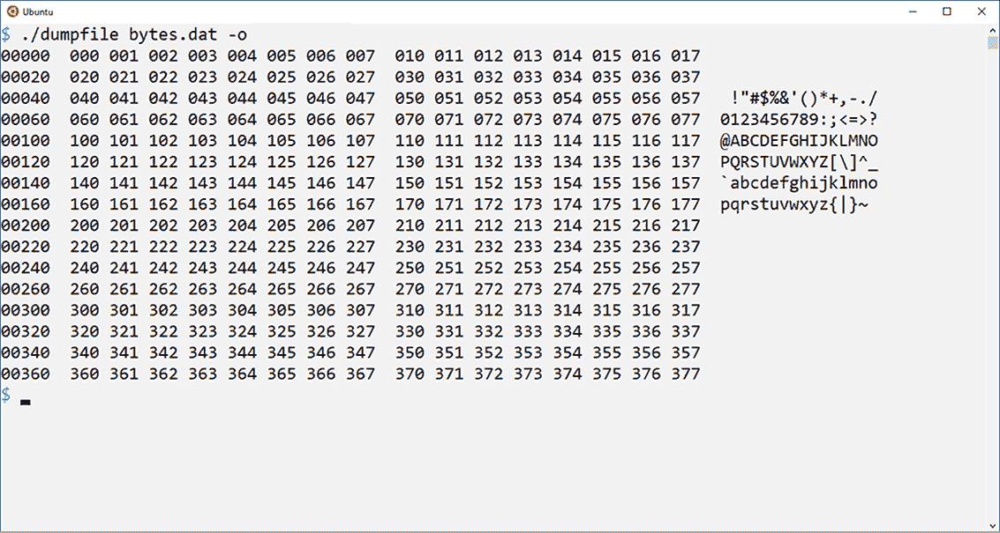

# 9 十六进制转储器

我亲自看过，但我就是看不到存储在介质上的文件。在以前，你可以取出软盘并看到实际的介质。然而，介质上的数据仍然以微小的电子粒子形式编码，肉眼甚至穿着衣服的眼睛都看不见。不，唯一能够窥视文件原始内容的方法是使用工具，比如 *hexdump*。

是的，*hexdump* 是一个 Linux 工具，作为默认安装的一部分提供。它在技术人员中非常受欢迎，功能强大。没有必要重新创建它——除非你想改进它。或者你可能想扩展你的编程知识，并在过程中学习一些技巧，例如：

+   在基本级别上检查存储

+   正确输出字节数据

+   从文件中读取原始数据

+   调整和定位程序输出

+   添加和处理命令行开关

本章的目标并不是模仿十六进制转储工具，而是通过自己动手操作来了解它能做什么，并更加欣赏它。在这个过程中，你将发现更多关于编写此类工具以及如何优化自己的程序以符合你偏好的方法。

## 9.1 字节和数据

计算机对字节一无所知。数字信息以比特形式存储——*比特*是*二进制*和*数字*这两个词的碰撞。二进制数字是 1 和 0，比特要么是 1 要么是 0。字节将比特聚集成方便、快乐的组，它们代表更大的数字。

从计算机的早期就提出了一个问题：一个字节可以容纳多少比特？如果技术人员想要这样做，计算机的整个存储空间可以是一个长达数十亿的比特的单字节。这样的长度将是非常不切实际的。因此，技术人员将比特组织成更小的块，字节大小从几个比特到每个字节超过十几个比特不等。

今天，标准是每字节 8 位。但即使如此，在处理计算机中的信息时，也需要更大的存储容量。

### 9.1.1 回顾存储单位和大小混乱

在计算机爱好者梳着油亮的背头、系着细黑领带、戴着圆框眼镜、珍视口袋保护器的时候——是的，甚至女性也是如此——字节，或者称为 *音节*，由任意数量的比特组成，这取决于系统硬件。我记得使用过 12 位字节的巨型机。我知道有使用 6 位字节的更小、定制的系统。当微型计算机热潮在 20 世纪 80 年代初将这些机器转变为必备的商业计算机时，计算机世界就确定了 8 位字节。

在 C 语言中，8 位字节直接对应于 *char* 数据类型。尽管你不会找到任何公开承认“字节就是 *char*”的 C 语言大人物，但这基本上是正确的。（即便如此，请记住，在 C 语言中，数据类型是依赖于实现的。）

计算机处理比字节更大的值，这需要将它们组织成称为*words*（16 位）、*doublewords*（32 位）、*quadwords*（64 位）和*double-quad words*（128 位）的块。这种单词混乱的混乱在表 9.1 中总结，除了双倍四倍字，因为其值无法放入表格中。

表 9.1 位宽描述和细节

| 位宽 | 描述 | 数据类型 | 值范围（有符号） | 值范围（无符号） |
| --- | --- | --- | --- | --- |
| 8 | 字节 | *char* | -128 到 127 | 0 到 255 |
| 16 | 字词 | *short* | -32,768 到 32,767 | 0 到 65,535 |
| 32 | 双字 | *Int* | -2,147,483,648 到 2,147,483,647 | 0 到 4,294,967,295 |
| 64 | 四倍字 | *long* | -9,223,372,036,854,775,808 到 9,233,372,036,854,775,807 | 0 到 18,446,744,073,709,551,615 |

表 9.1 中显示的值与数据块的字宽相关。例如，双字的范围从 -2³¹ 到 2³¹ - 1。如果 C 语言中可用 128 位整数（某些语言扩展提供了它），其有符号值范围从 -2¹²⁷ 到 2¹²⁷ - 1。如果这本书的边距足够宽，我会把具体的值全部写出来。或者——更好的是——如果这本书有一个中心折页，我相信打印出的 2¹²⁷ - 1 的值会对一些程序员有吸引力。

你可以快速拼凑一个 C 程序来揭示各种数据类型及其位宽的值。为此，你需要知道每种数据类型的大小。例如，使用这个表达式来获取字节的位数：

```
unsigned long byte = sizeof(char)*8;
```

*sizeof*运算符返回先前描述的 C 语言数据类型*char*使用的字节数。这个值乘以八以获得位数。结果存储在无符号长变量 byte 中；*sizeof*运算符返回无符号*long*值。类似的语句用于 word/*short*、doubleword/*int*和 quadword/*long*变量和数据类型。

使用这个*printf()*语句来输出值：

```
printf("%11s %2lu bits %21.f\n",
        "Byte",
        byte,
        pow(2,byte)
      );
```

*printf()*函数的格式字符串确保输出的值被适当地间隔，并格式化为表格。每个数据类型都有几个输出细节的语句，结果是一个列出数据大小、位数以及十进制大小值的表格。*pow()*函数将 2 的位数提升到 pow(2,byte)。*pow()*函数需要包含 math.h 头文件。

包含所有*printf()*语句以输出数据类型表的源代码文件 byte_sizes.c 可在本书的在线存档中找到。它需要你链接数学库：在 Linux 中，确保你在编译器的最终命令行选项中指定-lm 开关以链接数学（m）库。以下是示例输出：

```
       Byte  8 bits                   256
       Word 16 bits                 65536
 Doubleword 32 bits            4294967296
   Quadword 64 bits  18446744073709551616
```

你不需要执行 byte_sizes.c 代码中使用的数学和开销。原因是编译器本身有一个限制。具体来说，限制值被设置为在相应命名的 limits.h 头文件中定义的常量。

下面的列表输出了在 limits.h 中定义的常用常量。请在您的系统上运行此代码以查看值和范围，尽管对于大多数程序员来说，这些值与表 9.1 中显示的值一致。代码的关键在于识别 limits.h 中定义的常量。这些定义的常量如下所示。

列表 9.1 limits.c 的源代码

```
#include <stdio.h>
#include <limits.h>

int main()
{
    printf("Char:\n");
    printf("\tNumber of bits: %d\n",CHAR_BIT);       ❶
    printf("\tSigned minimum: %d\n",SCHAR_MIN);      ❷
    printf("\tSigned maximum: %d\n",SCHAR_MAX);      ❸
    printf("\tUnsigned max: %d\n",UCHAR_MAX);        ❹

    printf("Short:\n");
    printf("\tSigned minimum: %d\n",SHRT_MIN);
    printf("\tSigned maximum: %d\n",SHRT_MAX);
    >printf("\tUnsigned max: %d\n",USHRT_MAX);

    printf("Int:\n");
    printf("\tSigned minimum: %d\n",INT_MIN);
    printf("\tSigned maximum: %d\n",INT_MAX);
    printf("\tUnsigned max: %u\n",UINT_MAX);         ❺

    printf("Long:\n");
    printf("\tSigned minimum: %ld\n",LONG_MIN);      ❻
    printf("\tSigned maximum: %ld\n",LONG_MAX);
    printf("\tUnsigned max: %lu\n",ULONG_MAX);       ❼

    printf("Long long:\n");
    printf("\tSigned minimum: %lld\n",LLONG_MIN);    ❽
    printf("\tSigned maximum: %lld\n",LLONG_MAX);
    printf("\tUnsigned max: %llu\n",ULLONG_MAX);     ❾

    return(0);
}
```

❶ *char* 类型似乎是唯一具有“BIT”定义常量的类型。

❷ 有符号 *char* 最大值

❸ 有符号 *char* 最小值

❹ 无符号 *char* 最大值；零是最小值。

❺ 无符号整数最大值使用 %u 占位符。

❻ 长整型需要 %ld 占位符。

❼ 无符号长整型需要 %lu 占位符。

❽ 双长整型需要 %lld。

❾ 双无符号长整型的占位符是 %llu。

输出将在这里显示，但练习的重点是，可以从 limits.h 头文件中定义的常量中获取这些最小和最大值；您的代码不需要进行数学计算：

```
Char:
    Number of bits: 8
    Signed minimum: -128
    Signed maximum: 127
    Unsigned max: 255
Short:
    Signed minimum: -32768
    Signed maximum: 32767
    Unsigned max: 65535
Int:
    Signed minimum: -2147483648
    Signed maximum: 2147483647
    Unsigned max: 4294967295
Long:
    Signed minimum: -9223372036854775808
    Signed maximum: 9223372036854775807
    Unsigned max: 18446744073709551615
Long long:
    Signed minimum: -9223372036854775808
    Signed maximum: 9223372036854775807
    Unsigned max: 18446744073709551615
```

当您需要一个特定大小的整数时，最好使用特定的整数类型变量。以下类型是可用的：

+   *int8_t* 用于 8 位整数

+   *int16_t* 用于 16 位整数

+   *int32_t* 用于 32 位整数

+   *int64_t* 用于 64 位整数

使用这些类型声明的变量总是具有指示的特定宽度。这些 *typedef* 值（即 _t 后缀表示的含义）在 stdint.h 头文件中定义，对于大多数 C 编译器，该头文件会自动包含在 stdio.h 中。因此，请随意使用这些数据类型定义来利用特定宽度的整数值。

这些精确的整数宽度类型的原因是历史性的。当我最初学习编程 C 语言时，*int* 数据类型是 16 位宽。如今，它是 32 位。然而，*int16_t* 和 *int32_t* 类型总是设置为指示的宽度。

考虑到整数宽度的多样性，字节仍然是计算机中的基本计数单位。内存容量、媒体存储、文件大小——所有这些量都是以 8 位字节、*char* 值来衡量的。这个标准产生了两种字节计数系统：一种基于 2 的幂（二进制），另一种基于 10 的幂（十进制）。

计算字节的传统方式，我成长过程中所熟悉的方式，是千字节系统：当我还是一个准极客时，1 K 是 1 千字节的数据，或 1024 字节。值 1,024 是 2¹⁰，这似乎对计算机极客来说足够好了；1,024 对于数字会计目的来说足够接近 1,000，额外的 24 字节通常被政府以税收的形式拿走。当时告诉初学者 1 K 是“大约 1,000 字节”是合适的。唉，这种逻辑的二元定义现在不再适用了。

今天，1,024 字节被称为千字节。如果您提到千字节，专家现在声称这个值是 1,000 字节。

+   千字节（KB）是 1,000 字节。

+   千字节（KiB）是 1,024 字节。

变化原因在于，术语*kilo*、*mega*、*giga*等在描述非计算机世界的数量时，确实意味着一千、一百万和十亿。为了保持一致，我们的数字统治者规定，术语*kilobyte*也必须恰好意味着 1000 字节。传统的 1,024 字节，或 2¹⁰，被降级为愚蠢的术语*kibibyte*，听起来像狗粮。

其他让我烦恼的值包括 2²⁰或 1,048,576 的 mebibyte (MiB)和 2³⁰或 1,073,741,824 的 gibibyte (GiB)。对我来说，这些仍然是 megabyte (MB)和 gigabyte (GB)。其他都是愚蠢的、盲目从众的疯狂行为。

### 9.1.2 输出字节值

忘掉那些犹豫不决的 C 语言统治者，在本节中接受一个字节的大小与字符相同。当你分配 1 K 的内存时，你正在为单个块预留 1,024（是的）个*char*大小的内存块。输出 0 到 255 范围内的值，你就是在输出一个字节。要处理内存，你处理字节，*char*大小的块。这些信息很常见；全世界的技术爱好者都接受这一点。

练习 9.1

编写代码输出从 0 到 255 的*char*值。每个值单独占一行。这个练习可能看起来毫无意义地简单，但我强烈建议你尝试一下。来吧！这只需要几行代码。将你的解决方案保存为 byte_values01.c。

这里是我的解决方案的输出，中间省略了一大段数字：

```
0
1
2
3
...
253
254
255
```

在查看我的解决方案之前，你尝试了*for*循环吗？你首先尝试使用*char*变量，然后尝试使用*unsigned char*吗？你使用一种一开始看起来不明显的技术强制输出吗？

严肃地说：如果你还没有尝试编写解决方案，现在就试试。

我的解决方案将在下一部分列出。它使用了一个无限循环的*while*，精心构造以确保当变量 a 的值等于 255 时循环终止。

列表 9.2 byte_values01.c 的源代码

```
#include <stdio.h>

int main()
{
    unsigned char a;         ❶

    a = 0;
    while( 1 )               ❷
    {
        printf("%d\n",a);    ❸
        if( a==255 )         ❹
            break;
        a++;                 ❺
    }

    return(0);
}
```

❶ *unsigned* *char*的范围是从 0 到 255。

❷ 无限循环

❸ 输出值

❹ 当值达到 255 时，中断循环

❺ 否则，增加变量 a 的值

列表 9.2 中显示的解决方案不是我的第一次尝试。不，就像你（如果你实际上完成了练习）一样，我从*for*循环开始：

```
for( a=0; a<=255; a++ )
    printf("%d\n",a);
```

这个*for*循环永远不会终止。编译器可能会警告，但循环没有结束。尽管*unsigned char*的最大值是 255，看起来条件似乎已经满足，但它永远不会：变量 a 的值会从 255 不断回绕到 0。

此外，如果你想检查字节、输出它们或以其他方式处理它们的值，你必须使用*int*数据类型。所有*char*或字节数值都容易适应整数大小的块。int 数据类型避免了*char*可能发生的任何回绕，这可能是像*getchar()*和*putchar()*这样的函数使用整数而不是*char*类型的原因之一。

下一个列表通过将 256 个字符值存储在字符数组 data[]中来修改列表 9.2 中的源代码。两个 for 循环处理数组，第一个用于填充它，第二个用于输出其值。尽管数组只存储字节值，但 int 变量 b 用于存储这些值。

列表 9.3 byte_values02.c 的源代码

```
#include <stdio.h>

int main()
{
    unsigned char data[256];    ❶
    int b;

    for( b=0; b<256; b++ )      ❷
        data[b] = b;

    for( b=0; b<256; b++ )      ❸
        printf("%d\n",data[b]);

    return(0);
}
```

❶ 存储所有字节值的空间

❷ 用 0 到 255 的值填充数组

❸ 将数组输出，每个值单独一行

从 byte_values02.c 输出的内容与第一个程序相同，但新的格式，即使用数组存储值，允许对存储的数据进行修改和操作。目标是准确以可读的格式呈现数据。这样做的不优雅术语是*dump*。

### 9.1.3 数据导出

Dump 既是名词也是动词，两者都不太令人愉快。以食物准备为例：没有任何一种食物准备会使用到这个词*dump*。这个术语不够优雅，也很粗俗，而且被丢弃的东西通常被认为是没有用的——除非它是数据。

在数字领域，*dump*是从一个地方到另一个地方的数据移动。你可能熟悉臭名昭著的术语*core dump*，这是当你的程序严重出错时，操作系统试图通过将内存和处理器内容导出到打印机来检查数据以确定错误所在的情况。别担心——你不会。

早期计算机爱好者可能还记得*screen dump*这个术语。它是将屏幕上的所有文本发送到打印机的副本。当 IBM 在他们的第一台 PC 键盘上添加 Print Screen 键时，他们限制了该术语的使用。突然之间，屏幕导出变成了“print screen”，尽管按这个键仍然会将屏幕上的所有文本导出到打印机。

在 C 语言中，要导出数据，你需要将其从一个位置复制到另一个位置。你可以导出内存块，尽管只有程序可以访问的内存。更常见的是，你将文件的内容以十六进制形式输出到屏幕上。程序员可以检查原始数据，并希望从中获得对正在发生的事情的洞察或获取一些其他有用的信息。我在检查文件导出时经历了许多“啊哈！”的时刻。

要从内存中导出数据，你可以修改现有的源代码文件 byte_values01.c。第一个更改是将数据以十六进制形式导出。人类对十进制字节值很熟悉，但 0 到 255 的十六进制值都整齐地打包成两位数序列。此外，大多数极客都认识十六进制值及其二进制等效值。这种关系使得故障排除变得容易。对于非极客参考，表 9.2 列出了十六进制值及其与二进制的关系，还加入了十进制值。

表 9.2 十进制、十六进制和二进制值

| 十进制 | 十六进制 | 二进制 | 十进制 | 十六进制 | 二进制 |
| --- | --- | --- | --- | --- | --- |
| 0 | 0 | 0000 | 8 | 8 | 1000 |
| 1 | 1 | 0001 | 9 | 9 | 1001 |
| 2 | 2 | 0010 | 10 | A | 1010 |
| 3 | 3 | 0011 | 11 | B | 1011 |
| 4 | 4 | 0100 | 12 | C | 1100 |
| 5 | 5 | 0101 | 13 | D | 1101 |
| 6 | 6 | 0110 | 14 | E | 1110 |
| 7 | 7 | 0111 | 15 | F | 1111 |

十六进制转储简短且有用。毕竟，一个可能不理解“01001000 01100101 01101100 01101100 01101111 00101100 00100000 01101110 01100101 01110010 01100100 00100001”的极客当然能理解“48 65 6C 6F 2C 20 6E 65 72 64 21”。

要输出十六进制，byte_values02.c 的源代码第 12 行进行了修改：将 %d 占位符替换为 %02X，以输出一个带前导零的 2 位大写十六进制值：

```
printf("%02X\n",data[b]);
```

更新后的代码的输出范围从 00 到 FF，涵盖了字节值的全部范围。但它仍然输出在单个列中，这并不高效。

第二个更改在每个字节值输出前填充一个空格，并消除了换行符：

```
printf(" %02X",data[b]);
```

为了保持输出整洁，在第二个 *for* 循环之后添加了一个 *putchar()* 语句：

```
putchar('\n');
```

代码的输出现在全部显示在单个屏幕上，但不够优雅：

```
 00 01 02 03 04 05 06 07 08 09 0A 0B 0C 0D 0E 0F 10 11 12 13 14 15 16 17 18 19 1
A 1B 1C 1D 1E 1F 20 21 22 23 24 25 26 27 28 29 2A 2B 2C 2D 2E 2F 30 31 32 33 34
35 36 37 38 39 3A 3B 3C 3D 3E 3F 40 41 42 43 44 45 46 47 48 49 4A 4B 4C 4D 4E 4F
 50 51 52 53 54 55 56 57 58 59 5A 5B 5C 5D 5E 5F 60 61 62 63 64 65 66 67 68 69 6
A 6B 6C 6D 6E 6F 70 71 72 73 74 75 76 77 78 79 7A 7B 7C 7D 7E 7F 80 81 82 83 84
85 86 87 88 89 8A 8B 8C 8D 8E 8F 90 91 92 93 94 95 96 97 98 99 9A 9B 9C 9D 9E 9F
 A0 A1 A2 A3 A4 A5 A6 A7 A8 A9 AA AB AC AD AE AF B0 B1 B2 B3 B4 B5 B6 B7 B8 B9 B
A BB BC BD BE BF C0 C1 C2 C3 C4 C5 C6 C7 C8 C9 CA CB CC CD CE CF D0 D1 D2 D3 D4
D5 D6 D7 D8 D9 DA DB DC DD DE DF E0 E1 E2 E3 E4 E5 E6 E7 E8 E9 EA EB EC ED EE EF
 F0 F1 F2 F3 F4 F5 F6 F7 F8 F9 FA FB FC FD FE FF
```

为了进一步改进代码，每输出 16 个字节就输出一个换行符，因为 16 是十六进制的一个快乐值。代码第二个 *for* 循环的以下修改添加了换行符，该换行符结合了最近添加的 *putchar()* 语句：

```
for( b=0; b<256; b++ )
{
    printf(" %02X",data[b]);
    if( (b+1)%16==0 )
        putchar('\n');
}
```

*if* 测试使用变量 b 的值来确定何时添加换行符。将 b 的值加一（b+1），以避免在第一个值（零）之后出现换行符。否则，每当 b 的值能被 16 整除时，就输出一个换行符。以下是结果：

```
 00 01 02 03 04 05 06 07 08 09 0A 0B 0C 0D 0E 0F
 10 11 12 13 14 15 16 17 18 19 1A 1B 1C 1D 1E 1F
 20 21 22 23 24 25 26 27 28 29 2A 2B 2C 2D 2E 2F
 30 31 32 33 34 35 36 37 38 39 3A 3B 3C 3D 3E 3F
 40 41 42 43 44 45 46 47 48 49 4A 4B 4C 4D 4E 4F
 50 51 52 53 54 55 56 57 58 59 5A 5B 5C 5D 5E 5F
 60 61 62 63 64 65 66 67 68 69 6A 6B 6C 6D 6E 6F
 70 71 72 73 74 75 76 77 78 79 7A 7B 7C 7D 7E 7F
 80 81 82 83 84 85 86 87 88 89 8A 8B 8C 8D 8E 8F
 90 91 92 93 94 95 96 97 98 99 9A 9B 9C 9D 9E 9F
 A0 A1 A2 A3 A4 A5 A6 A7 A8 A9 AA AB AC AD AE AF
 B0 B1 B2 B3 B4 B5 B6 B7 B8 B9 BA BB BC BD BE BF
 C0 C1 C2 C3 C4 C5 C6 C7 C8 C9 CA CB CC CD CE CF
 D0 D1 D2 D3 D4 D5 D6 D7 D8 D9 DA DB DC DD DE DF
 E0 E1 E2 E3 E4 E5 E6 E7 E8 E9 EA EB EC ED EE EF
 F0 F1 F2 F3 F4 F5 F6 F7 F8 F9 FA FB FC FD FE FF
```

完整的源代码文件作为 byte_values03.c 在在线仓库中可用。输出效果更好，但仍可进行一些改进。因为数据转储是顺序的，所以很容易看到模式和参考行和列。然而，数据并不总是看起来这么漂亮。

练习 9.2

分两步改进 byte_values03.c 中的代码。首先，添加一个初始列，显示字节值的偏移量。将此值输出为 5 位十六进制数。然后输出 16 字节的行。

其次，添加一个额外的空格来分隔第八列和第九列。这个空格使行和列更容易阅读。

我解决方案的输出，byte_values04.c，如下所示：

```
00000  00 01 02 03 04 05 06 07  08 09 0A 0B 0C 0D 0E 0F
00010  10 11 12 13 14 15 16 17  18 19 1A 1B 1C 1D 1E 1F
00020  20 21 22 23 24 25 26 27  28 29 2A 2B 2C 2D 2E 2F
00030  30 31 32 33 34 35 36 37  38 39 3A 3B 3C 3D 3E 3F
00040  40 41 42 43 44 45 46 47  48 49 4A 4B 4C 4D 4E 4F
00050  50 51 52 53 54 55 56 57  58 59 5A 5B 5C 5D 5E 5F
00060  60 61 62 63 64 65 66 67  68 69 6A 6B 6C 6D 6E 6F
00070  70 71 72 73 74 75 76 77  78 79 7A 7B 7C 7D 7E 7F
00080  80 81 82 83 84 85 86 87  88 89 8A 8B 8C 8D 8E 8F
00090  90 91 92 93 94 95 96 97  98 99 9A 9B 9C 9D 9E 9F
000A0  A0 A1 A2 A3 A4 A5 A6 A7  A8 A9 AA AB AC AD AE AF
000B0  B0 B1 B2 B3 B4 B5 B6 B7  B8 B9 BA BB BC BD BE BF
000C0  C0 C1 C2 C3 C4 C5 C6 C7  C8 C9 CA CB CC CD CE CF
000D0  D0 D1 D2 D3 D4 D5 D6 D7  D8 D9 DA DB DC DD DE DF
000E0  E0 E1 E2 E3 E4 E5 E6 E7  E8 E9 EA EB EC ED EE EF
000F0  F0 F1 F2 F3 F4 F5 F6 F7  F8 F9 FA FB FC FD FE FF
```

完成练习 9.2 后，十六进制显示看起来更好。

最后的改进是添加一个第三列 ASCII，在字节值之后。这个附加信息将可显示的 ASCII 文本的十六进制字节进行交叉引用，为人类快速扫描转储以获取相关信息提供了一个方便的方法。

由于流输出，向输出添加 ASCII 列的过程很复杂。每一行都必须顺序处理：先输出 16 个字节的十六进制值，然后以可打印的 ASCII 字符形式输出相同的字节。为了解决这个问题，我发明了 *line_out()* 函数，该函数位于源代码文件 byte_values05.c 中，该文件可在在线仓库中找到。

*line_out()*函数有三个参数，如下所示：表示字节计数的偏移量，数据块长度，以及数据本身作为一个*unsigned char*指针。大部分代码是从早期的 byte_values04.c 源代码中提取的，尽管变量 a 跟踪循环中的进度，并与数据指针一起使用来获取特定的字节值：*(data+a)。这个函数输出一个转储的行，因此它从*main()*函数中调用以输出所有数据。

列表 9.4 *line_out()*函数

```
void line_out(int offset, int length, unsigned char *data)
{
    int a;

    printf("%05X ",offset);                        ❶

    for( a=0; a<length; a++ )                      ❷
    {
        printf(" %02X",*(data+a));                 ❸
        if( (a+1)%8==0 )                           ❹
            putchar(' ');
    }

    putchar(' ');                                  ❺
    for( a=0; a<length; a++ )                      ❻
    {
        if( *(data+a)>=' ' && *(data+a)<='~' )     ❼
            putchar( *(data+a) );                  ❽
        else
            putchar(' ');                          ❾
    }

    putchar('\n');
}
```

❶ 输出偏移值

❷ 第一个循环输出十六进制值。

❸ 十六进制值的计算基于数据的起始位置加上循环值。

❹ 在第八个十六进制字节输出后，为了可读性添加额外的空格

❺ 在十六进制列之后添加另一个空格

❻ 第二个循环输出 ASCII 值（如果有）。

❼ 检查可打印字符范围

❽ 输出一个可打印字符

❾ 否则，输出一个空格

*line_out()*函数并不完美，我将在后面的部分讨论这个问题，但至少目前它是可行的。以下是一些示例输出：

```
00000  00 01 02 03 04 05 06 07  08 09 0A 0B 0C 0D 0E 0F
00010  10 11 12 13 14 15 16 17  18 19 1A 1B 1C 1D 1E 1F
00020  20 21 22 23 24 25 26 27  28 29 2A 2B 2C 2D 2E 2F  !"#$%&'()*+,-./
00030  30 31 32 33 34 35 36 37  38 39 3A 3B 3C 3D 3E 3F 0123456789:;<=>?
00040  40 41 42 43 44 45 46 47  48 49 4A 4B 4C 4D 4E 4F @ABCDEFGHIJKLMNO
00050  50 51 52 53 54 55 56 57  58 59 5A 5B 5C 5D 5E 5F PQRSTUVWXYZ[\]^_
00060  60 61 62 63 64 65 66 67  68 69 6A 6B 6C 6D 6E 6F `abcdefghijklmno
00070  70 71 72 73 74 75 76 77  78 79 7A 7B 7C 7D 7E 7F pqrstuvwxyz{|}~
00080  80 81 82 83 84 85 86 87  88 89 8A 8B 8C 8D 8E 8F
00090  90 91 92 93 94 95 96 97  98 99 9A 9B 9C 9D 9E 9F
000A0  A0 A1 A2 A3 A4 A5 A6 A7  A8 A9 AA AB AC AD AE AF
000B0  B0 B1 B2 B3 B4 B5 B6 B7  B8 B9 BA BB BC BD BE BF
000C0  C0 C1 C2 C3 C4 C5 C6 C7  C8 C9 CA CB CC CD CE CF
000D0  D0 D1 D2 D3 D4 D5 D6 D7  D8 D9 DA DB DC DD DE DF
000E0  E0 E1 E2 E3 E4 E5 E6 E7  E8 E9 EA EB EC ED EE EF
000F0  F0 F1 F2 F3 F4 F5 F6 F7  F8 F9 FA FB FC FD FE FF
```

ASCII 列出现在最右边，反映了中心列中显示的十六进制字节的可打印字符值。不可打印字符以空格形式出现。

练习 9.3

很遗憾，从*byte_values*系列程序中得到的样本输出是可预测的——从 0x00 到 0xFF 的 256 字节值的一块。为什么不稍微加点料，并用随机值重新填充 data[]缓冲区呢？

将 byte_values05.c 的源代码修改为一个新的源代码文件，byte_values06.c。让*main()*函数用 256 个随机值填充 data[]数组，每个值在 0 到 255 的范围内。运行程序几次以确认程序正确地解释了存储的字节的十六进制和 ASCII 值。

## 9.2 转储那个文件！

转储实用程序旨在深入查看文件的数据。好吧，这是一个文件转储实用程序。这个细节是操作系统一眼就能提供的信息。不，你可以从目录列表中得知文件名、大小和日期。文件类型基于文件名扩展名，因此可能会误导。不，唯一深入查看文件并检查其暗藏数据的方法是转储。

Linux 的*hexdump*实用程序在文件转储任务上表现得相当出色。所以，这一章就结束了。

严肃地说，使用这个实用程序并不能帮助你学习如何编写自己的文件实用程序，按照你喜欢的定制方式。我称这个新实用程序为*dumpfile*。它的工作方式与*hexdump*类似，但按照我的喜好来操作。

### 9.2.1 读取文件数据

可以将 *dumpfile* 实用程序编写为过滤器，就像 Linux 的 *hexdump* 一样。作为一个过滤器，hexdump 会处理所有输入，无论它来自文件还是来自某个程序的输出。如果你对这样的任务感兴趣，请查看第四章以获取有关 Linux 环境中过滤器的信息。你可以将本章中提供的 *dumpfile* 代码作为过滤器进行修改，尽管我更希望 *dumpfile* 作为传统的命令行实用程序工作。

从文件中读取数据的实用程序使用两种方法。第一种是在命令提示符中指定文件名——通常作为第一个（并且往往是唯一）参数。第二种方法是在实用程序启动后提示输入文件名，或者如果命令行参数中缺少文件名，则提示输入文件名。目前，我假设文件名参数作为命令行参数提供。因此，实用程序必须检查是否存在这样的参数。这种确认需要 *main()* 函数指定并使用其参数：

```
int main(int argc, char *argv[])
```

argc 的值始终至少为 1，这是程序的文件名。如果用户输入了任何参数，argc 的值将大于 1。程序首先确认是否存在参数。如果没有，则会向标准错误设备（*stderr*）发送警告消息，并终止程序：

```
if( argc<2 )
{
    fprintf(stderr,"Format: dumpfile filename\n");
    exit(1);
}
```

*exit()* 函数需要包含 stdlib.h 头文件。否则，你可以在代码的这一部分使用 return(1) 来退出 *main()* 函数。我更喜欢使用 *exit()*，因为它可以在任何函数中用来终止程序，并且它与 *atexit()* 或 *on_exit()* 等其他函数相关联，这使得使用 *exit()* 相比于 *return* 关键字具有战略优势。此外，它也更短，更容易输入。

在确认参数数量后，argv[1] 中持有的字符串被用于 *fopen()* 函数来读取文件数据。这一步不仅打开了文件，而且在成功的情况下，还会确定文件是否存在。我使用 char 指针 filename 来引用 argv[1] 中的字符串，这有助于提高可读性：

```
filename = argv[1];
fp = fopen(filename,"r");
if( fp==NULL )
{
    fprintf(stderr,"Unable to open file '%s'\n",filename);
    exit(1);
}
```

我处理文件数据的第一选择是使用 *fgets()* 函数一次读取 16 个字节；16 是输出行中十六进制字节的数量。但如果我想直接使用现有的 *line_out()* 函数，就不能让数据中的第 16 个字节是空字符。这个字节是 *fgets()* 函数添加到它所读取的缓冲区中的，除非首先遇到换行符。

我的第二个选择是使用 *fread()*. 虽然 *fgets()* 是一个字符串读取函数，但 *fread()* 会以给定的块大小消耗数据。它可以轻松地将 16 字节的缓冲区填满原始数据，这正是我所需要的。即便如此，我还是选择了使用 *fgetc()* 函数，它一次读取一个字符。将这个函数放在 *while* 循环中，它会吞噬字符，将它们添加到 16 字节的缓冲区中，并在遇到文件结束符（EOF）时处理该条件。

以下列表显示了源代码文件 dumpfile01.c 中 *main()* 函数的核心。while 循环重复，直到找到文件指针 fp 的文件结束（EOF）。从文件中获取字节值 ch，并立即检查 EOF 标记。检测到 EOF 后，测试变量 index 的值是否为零，这意味着缓冲区仍有数据要打印。如果是这样，则调用 *line_out()* 函数。否则，文件仍有数据要读取，并将字符 ch 存储在缓冲区中。一旦缓冲区满（index==length），则调用 *line_out()* 函数。完整的代码可以在在线存储库中找到，作为 dumpfile01.c。

列表 9.5 来自 dumpfile01.c 的字符读取循环

```
while( !feof(fp) )                             ❶
{
    ch = fgetc(fp);                            ❷
    if( ch==EOF )                              ❸
    {
        if( index != 0 )                       ❹
            line_out(offset,index,buffer);     ❺
        break;                                 ❻
    }
    buffer[index] = ch;                        ❼
    index++;                                   ❽
    if( index==length )                        ❾
    {
        line_out(offset,length,buffer);        ❿
        offset+=length;                        ⓫
        index = 0;                             ⓬
    }
}
```

❶ 循环直到遇到文件结束

❷ 获取一个字符

❸ 立即检查文件结束

❹ 如果索引为零，缓冲区为空；否则 . . .

❺ . . . 输出十六进制转储的最后一行。

❻ 终止循环

❼ 存储字符

❽ 增加缓冲区中的索引

❾ 如果缓冲区已满，则输出一行十六进制转储

❿ 输出行

⓫ 调整偏移量

⓬ 将索引重置为开始读取下一个长度（16）字节

读取文件中的所有字节后，while 循环终止，文件被关闭，程序结束。

我创建了一个测试数据文件 bytes.dat 以供读取。它可在在线存储库中找到，与本章的所有源代码文件一起。此文件包含从 0x00 到 0xFF 的顺序字节值，我使用这些值来测试和调试从 dumpfile01.c 源代码文件创建的程序。以下是一些示例输出：

```
00000  00 01 02 03 04 05 06 07  08 09 0A 0B 0C 0D 0E 0F
00010  10 11 12 13 14 15 16 17  18 19 1A 1B 1C 1D 1E 1F
00020  20 21 22 23 24 25 26 27  28 29 2A 2B 2C 2D 2E 2F   !"#$%&'()*+,-./
00030  30 31 32 33 34 35 36 37  38 39 3A 3B 3C 3D 3E 3F  0123456789:;<=>?
00040  40 41 42 43 44 45 46 47  48 49 4A 4B 4C 4D 4E 4F  @ABCDEFGHIJKLMNO
00050  50 51 52 53 54 55 56 57  58 59 5A 5B 5C 5D 5E 5F  PQRSTUVWXYZ[\]^_
00060  60 61 62 63 64 65 66 67  68 69 6A 6B 6C 6D 6E 6F  `abcdefghijklmno
00070  70 71 72 73 74 75 76 77  78 79 7A 7B 7C 7D 7E 7F  pqrstuvwxyz{|}~
00080  80 81 82 83 84 85 86 87  88 89 8A 8B 8C 8D 8E 8F
00090  90 91 92 93 94 95 96 97  98 99 9A 9B 9C 9D 9E 9F
000A0  A0 A1 A2 A3 A4 A5 A6 A7  A8 A9 AA AB AC AD AE AF
000B0  B0 B1 B2 B3 B4 B5 B6 B7  B8 B9 BA BB BC BD BE BF
000C0  C0 C1 C2 C3 C4 C5 C6 C7  C8 C9 CA CB CC CD CE CF
000D0  D0 D1 D2 D3 D4 D5 D6 D7  D8 D9 DA DB DC DD DE DF
000E0  E0 E1 E2 E3 E4 E5 E6 E7  E8 E9 EA EB EC ED EE EF
000F0  F0 F1 F2 F3 F4 F5 F6 F7  F8 F9 FA FB FC FD FE FF
```

### 9.2.2 修复不均匀输出

在数字领域中，只有少数文件的大小是 16 的倍数。对于这些文件，*dumpfile* 程序工作得非常完美。确实，程序可以处理从任何大小的文件中读取字节，但当文件大小不是 16 的精确倍数时，它会对输出产生丑陋的影响。

这里你可以看到 *dumpfile* 工具输出的末尾应用于莎士比亚的 *第 18 首十四行诗*：

```
....
00230  72 65 61 74 68 65 20 6F  72 20 65 79 65 73 20 63  reathe or eyes c
00240  61 6E 20 73 65 65 2C 0A  53 6F 20 6C 6F 6E 67 20  an see, So long
00250  6C 69 76 65 73 20 74 68  69 73 2C 20 61 6E 64 20  lives this, and
00260  74 68 69 73 20 67 69 76  65 73 20 6C 69 66 65 20  this gives life
00270  74 6F 20 74 68 65 65 2E  0A to thee.
```

在偏移量 0x00270（最后一行），你可以看到文件的最后一个字节，0A，紧接着是行的 ASCII 列。文本“to thee”在它应该对齐的地方左侧好几个空格——如果文件正好在 16 字节边界结束。

为了解决这个问题，必须修改 *line_out()* 函数。它必须知道当一行输出不匹配默认的 16 字节输出长度时。说到这里，到目前为止展示的所有代码中，输出宽度始终是 16 字节。在 *main()* 函数中将此值指定为常量：

```
const int length = 16;
```

在此处定义的常量值仅在 *main()* 函数内部可见。因为这个值现在也与 *line_out()* 函数相关，所以我将其重新定义为常量。以下预处理指令创建了它：

```
#define SIZE 16
```

这个更改可以在更新的源代码文件 dumpfile02.c 中找到。

在下一个列表中，你可以看到如何使用定义的常量 SIZE 在 `*line_out()` 函数中，以帮助测试输出最后行是否短于 16 字节。此更改需要在两个现有的 `*for` 循环之间添加一个 `if` 语句。`if` 决策有助于平衡最后输出行的剩余部分，以便 ASCII 列对齐。

列表 9.6 更新 `*line_out()` 函数以处理短的最后行

```
if( length<SIZE )              ❶
{
    for( ; a<SIZE; a++ )       ❷
    {
        printf("   ");         ❸
        if( (a+1)%8==0 )       ❹
            putchar(' ');
    }
}
```

❶ 如果行中少于 SIZE (16) 字节 . . .

❷ 使用变量 a 继续循环

❸ 输出三个空格

❹ 在第 8 个和第 16 个字节后添加一个额外的空格

`*for` 循环（参见图表 9.6）缺少初始化条件，因为它只是继续使用变量 a 的当前值，就像它离开前面的循环一样。循环输出一组三个空格以平衡任何缺失的十六进制字节值。if( (a+1)%8==0 ) 测试考虑了每八字节后添加的额外空格，这分隔了两个十六进制列。

完整的源代码可在仓库中找到，作为 `dumpfile02.c`。以下是使用之前使用的相同文件，但改进后的代码的输出：

```
...
00230  72 65 61 74 68 65 20 6F  72 20 65 79 65 73 20 63  reathe or eyes c
00240  61 6E 20 73 65 65 2C 0A  53 6F 20 6C 6F 6E 67 20  an see, So long
00250  6C 69 76 65 73 20 74 68  69 73 2C 20 61 6E 64 20  lives this, and
00260  74 68 69 73 20 67 69 76  65 73 20 6C 69 66 65 20  this gives life
00270  74 6F 20 74 68 65 65 2E  0A                       to thee.
```

练习 9.4

编程是否永远完成？为了进一步更新 `dumpfile02.c` 的源代码，修改 `*main()` 函数，以便如果缺少文件名参数，程序会提示输入。

重要的是你的代码能够识别用户只是按下 Enter 键或以其他方式忽略文件名提示。程序尝试打开一个 NULL 字符串文件名是没有意义的。除了这个要求之外，你不需要对文件名进行其他验证，因为 `*fopen()` 语句会自动这样做。我的解决方案可在在线仓库中找到，作为 `dumpfile03.c`。

## 9.3 命令行选项

你可以为 `*dumpfile` 程序添加什么？首先，简化的输出如何，只显示十六进制字节？或者对于老用户，添加一个选项来以八进制（基数 8）显示字节如何？你可能还能想到更多要添加的功能，比如彩色编码输出？显然，这样的复杂性需要帮助系统提供一些文档。哦，我可以继续说！

作为命令行实用程序，选项和功能由 `*switches` 控制——激活、停用或指定数量和限制的附加命令行参数。在 Linux 中，这些开关的格式为：-a，其中字母前面有一个连字符或短横线。（Windows 使用斜杠字符 (/)，这是微软多年前做出的一个愚蠢的决定，在比尔·盖茨有资格投票之前。）

在 Linux 中，你可以指定多个开关：

```
dumpfile -a -b -c
```

这些可以一起使用：

```
dumpfile -abc
```

一些开关可以有选项：

```
dumpfile -q:5
```

你可以通过测试和循环来劳作，检查开关。或者，你可以利用一个方便的 C 库特性：`*getopt()` 函数。它帮助你的程序处理开关，这样你就不必编写代码。

### 9.3.1 使用 `getopt()` 函数

*getopt()* 函数帮助您的代码处理命令行开关。我确信它被几乎所有现有的 Linux 命令行工具使用，包括来自多元宇宙的几个工具。以下是它的 *man* 页面格式：

```
int getopt(int argc, char * const argv[], const char *optstring);
```

前两个参数与 *main()* 函数的 argc 和 *argv[] 参数相同。最后一个参数，optstring，是有效开关字符的列表。例如：

```
getopt(argc,argv,"abc");
```

这里有效的开关是 -a、-b 和 -c。函数被反复调用，每次返回一个有效字符的 ASCII 码（一个 *int* 值），未知选项的字符 '?'，或者当函数耗尽所有命令行选项时返回 -1。

伴随的 *getopt_long()* 函数处理完整的单词开关，尽管在本章中我只探索了 *getopt()* 函数来处理传统的、单字符的开关。

*getopt()* 和 *getopt_long()* 都要求在您的代码中包含 unistd.h 头文件。

列表 9.7 显示了在将 *getopt()* 函数添加到我的 *dumpfile* 代码之前，我用作测试的代码。全局变量 opterr 设置为零，以确保 *getopt()* 不输出其自己的错误消息。*getopt()* 函数本身位于 *while* 循环的条件中。函数的返回值与 -1 进行比较，表示已检查所有命令行参数，这会停止循环。否则，变量 r 中返回的值在 *switch-case* 结构中使用，以指示设置了哪个选项。这种设置通常是 *getopt()* 函数的实现方式。

列表 9.7 options01.c 的源代码

```
#include <stdio.h>
#include <unistd.h>                                  ❶

int main(int argc, char *argv[])
{
    int r;

    opterr = 0;                                      ❷
    while( (r=getopt(argc,argv,"abc")) != -1 )       ❸
    {
        switch(r)                                    ❹
        {
            case 'a':                                ❺
                puts("alfa option set");
                break;
            case 'b':
                puts("bravo option set");
                break;
            case 'c':
                puts("charlie option set");
                break;
            case '?':                                ❻
                printf("Switch '%c' is invalid\n",optopt);
                break;
            default:                                 ❼
                puts("Unknown option");
        }
    }

    return(0);
}
```

❶ 需要 unistd.h 头文件才能使用 *getopt()* 函数。

❷ 抑制 *getopt()* 的错误输出

❸ 扫描参数，重复循环直到处理完所有参数

❹ 检查返回的字符

❺ *case* 语句检查每个有效选项字母。

❻ 对于未知/无效选项，返回一个问号。

❼ 我怀疑 *default* 条件永远不会满足。

当测试从 options01.c 源代码构建的程序时，乐趣开始了。首先，尝试不使用任何选项：

```
$ ./options
```

没有生成输出。很好。

所有选项都在这里指定：

```
$ ./options -a -b -c
alfa option set
bravo option set
charlie option set
```

它们可以按任何顺序指定：

```
$ ./options -c -a -b
charlie option set
alfa option set
bravo option set
```

或者一个单独的配对，但紧凑在一起：

```
$ ./options -cb
charlie option set
bravo option set
```

*getopt()* 函数允许您以这种方式读取选项，而不必自己编写复杂的比较和处理代码。当然，到目前为止的代码对选项没有任何操作。下一步是添加表示选项尝试完成的开关的变量。

在我从 options01.c 更新到 options02.c 的过程中，我添加了三个 *int* 变量：alfa、bravo 和 charlie。每个变量都在 *while* 循环中的 *getopt()* 语句之前初始化：

```
alfa = 0;
bravo = 0;
charlie = 0;
```

在 *switch-case* 结构中，移除 *puts()* 语句，并用将变量值设置为 1（TRUE）的语句替换它们，以表示激活状态：

```
alfa = 1;
```

接下来，在 *while* 循环之后，添加一系列 *if* 语句以输出结果：

```
if( alfa ) puts("alfa option set");
if( bravo ) puts("bravo option set");
if( charlie ) puts("charlie option set");
if( alfa+bravo+charlie==0 ) puts("No options set");
```

最后的 *if* 语句在未设置任何选项时显示一条消息。

选项 02.c 的源代码可以在本书的在线仓库中找到。以下是一些示例运行结果：

```
$ ./options
No options set
```

因为可以在新代码中检查开关，所以很容易识别缺少选项的情况。

设置所有选项的输出与代码的第一个版本相同：

```
$ ./options -a -b -c
alfa option set
bravo option set
charlie option set
```

对于开关的剩余变体，其输出与原始程序相同。区别在于程序现在能够识别设置并检查变量以执行所需的任何魔法操作。

### 9.3.2 更新转储文件程序代码

要向实用程序添加命令行选项，你必须知道这些选项的作用。然后你使用像*getopt()*这样的函数来扫描和设置选项。最后，必须在代码中实现这些选项。

对于*dumpfile*程序，以下是我提供的选项：

+   -a 用于缩写输出

+   -o 用于八进制输出

+   -h 用于帮助

这些开关可以像之前展示的那样，通过*options*系列源代码文件进行处理。然而，对于*dumpfile*程序，第一个参数是一个文件名。实际上，它必须是一个文件名：为了帮助处理命令行开关，如果缺少文件名（如果你完成了 9.4 练习），程序将不再提示输入文件名。此外，文件名必须始终是第一个参数，argv[1]。技术上讲，它是第二个参数，因为程序文件名是第一个或 argv[0]。

添加和处理参数的第一步是修改*main()*函数。如果在 9.4 练习中添加了提示缺少文件名的步骤，现在应该移除。代码被优化，假设第一个参数是文件名。在*main()*函数中的 while 循环之前添加以下语句：

```
if( argc<2 )
{
    puts("Format: dumpfile filename [options]");
    exit(1);
}
```

如果程序通过了这个*if*测试，接下来的新代码块将检查是否指定了-h “帮助”开关。如果没有，程序可能会尝试打开文件-h。因此，对-h 作为第一个参数进行了快速比较。如果找到，将调用*help()*函数：

```
filename = argv[1];

if( strcmp(filename,"-h")==0 )
    help();
```

因为程序假设第一个参数是文件名，所以即使你在代码的其他地方使用*getopt()*函数查找-h 开关，这一步也是必要的。实际上，如果*getopt()*函数不可用，这种比较方式就是测试开关的方法。如果-h 开关是第一个参数，将调用*help()*函数并输出有用的文本。程序结束。否则，程序可以继续测试选项。

要处理剩余的开关，我使用一个单独的*int*变量 options。这个变量是在外部声明的——一个全局变量，它允许所有函数访问其值：

```
int options;
```

与 *options* 系列程序一样，在 *dumpfile* 的更新代码中，三个有效的开关——-a, -o 和 -h——都在 *while* 循环中进行了测试，如下所示。我仅使用一个外部整数变量 options 来跟踪设置，它被初始化为零，以及其他在 *main()* 函数中其他地方使用的变量。对于两个开关，宏会改变变量 options 的值：*set_abbr()* 用于 -a 和 *set_oct()* 用于 -o。如果指定了帮助开关，则调用 *help()* 函数，输出文本并终止程序。

列表 9.8 在 dumpfile04.c 中的 *main()* 函数内的 *while* 循环

```
offset = index = options = 0;               ❶
while( (r=getopt(argc,argv,"aosh")) != -1 ) ❷
{
    switch(r)
    {
        case 'a':
            set_abbr();                     ❸
            break;
        case 'o':
            set_oct();                      ❹
            break;
        case 'h':
            help();                         ❺
        case '?':
            printf("Switch '%c' is invalid\n",optopt);
            break;
        default:
            puts("Unknown option");
    }
}
```

❶ 在 *main()* 函数中其他地方使用 offset 和 index 变量。

❷ 有效的开关有 a, o, s 和 h。

❸ 对于 -a 开关，*set_abbr()* 宏修改变量 options。

❹ 对于 -o 开关，*set_oct()* 宏修改变量 options。

❺ 对于 -h，调用 *help()* 函数并退出程序。

通过使变量 options 成为外部变量，*line_out()* 函数无需修改。否则，我必须向列表中添加另一个参数，一个用于接受变量 options 以检查命令行开关的参数。只有一个变量 options 还可以避免向 *line_out()* 函数添加更多参数。它的声明最终会变得混乱。不，这种情况是那些罕见的情况下全局变量是解决问题的有效解决方案之一。

宏 *set_abbr()* 和 *set_oct()* 允许代码通过设置特定位来修改变量 options。每个设置宏都有一个配套的 *test* 宏，可以在 *line_out()* 函数中使用。当选项被设置时，测试宏返回 TRUE (1)，这使得宏可以用作 *if* 条件来激活功能。

下一个列表显示了在源代码文件开头定义的宏。首先，声明了 options 变量，然后为选项、ABBR 和 OCT 分配了二进制值。最后，定义了设置和 *test* 宏，使用位逻辑来设置和评估变量 options 中的位。

列表 9.9 创建宏来修改和测试变量 options

```
int options;                                   ❶

#define SIZE 16                                ❷
#define ABBR 1                                 ❸
#define OCT 2                                  ❹
#define set_abbr() options|=ABBR               ❺
#define test_abbr() ((options&ABBR)==ABBR)     ❻
#define set_oct() options|=OCT                 ❼
#define test_oct() ((options&OCT)==OCT)        ❽
```

❶ 在使用之前声明外部变量

❷ 大小值在代码的其他地方使用，每行 16 字节。

❸ 缩写状态是位 1。

❹ 八进制输出状态是位 2。

❺ 使用位逻辑或来设置变量 options 中的位 1 (ABBR)

❻ 使用位逻辑与来测试变量 options 中的位 1 (ABBR)

❼ 使用位逻辑或来设置变量 options 中的位 2 (OCT)

❽ 使用位逻辑与来测试变量 options 中的位 2 (OCT)

定义常量 ABBR 和 OCT 代表变量 options 中的位位置，它们不重叠。每个位都可以设置或检查而不改变其他位。这种方法允许以相同的方式添加更多选项，直到 *int* 变量的完整位宽。

宏增加了可读性，但更重要的是，通过创建宏，我使代码更新更容易。例如，更改选项只需在一个位置进行，而不是在代码中到处查找引用。

修改后的*dumpfile*程序的完整代码可在在线仓库中找到，作为 dumpfile04.c。我还没有讨论的是*help()*函数。它在这里展示。接下来的几节将涵盖实现-a 和-o 选项所需的代码。

列表 9.10 dumpfile04.c 中的*help()*函数

```
void help(void)
{
    puts("dumpfile - output a file's raw data");
    puts("Format: dumpfile filename [options]");
    puts("Options:");
    puts("-a abbreviated output ");
    puts("-o output octal instead of hex");
    puts("-h display this text");
    exit(1);
}
```

### 9.3.3 设置缩略输出

*dumpfile*程序当前的输出对于想要检查文件中字节的极客来说很好。它显示了偏移量列、十六进制字节以及 ASCII 码的字符表示。这种展示方式是我所偏好的，尽管有时只需要简单的字节转储。为了实现这个目标，用户可以指定-a 开关以获得缩略程序输出。

-a 选项背后的机制已经在 dumpfile04.c 源代码中存在。所需做的只是实现代码的开关部分：在缩略输出激活时，*line_out()*函数中的一些项被抑制。对于这些项，添加了一个带有*test_abbr()*宏作为条件的 if 语句。结果是，只有当没有指定-a 选项时，才会激活输出的一部分。

必须在*line_out()*函数的三个地方进行修改。第一个是为初始列，它输出偏移量。只有当*test_abbr()*宏返回零时，才会执行*printf()*语句。使用非操作符(!)来否定宏：

```
if( !test_abbr() )
{
    printf("%05X ",offset);
}
```

如果指定了-a 选项，则跳过*printf()*语句。否则，对于正常输出，它会被执行。

接下来，在输出十六进制字节的*for*循环中，现有的代码为了可读性添加了额外的空格：

```
if( (a+1)%8==0 )
    putchar(' ');
```

这个空格对于纯十六进制转储是不需要的。同样，*test_abbr()*宏被添加到 if 条件中，以在指定-a 选项时禁用空格输出。以下是修改内容：

```
if( (a+1)%8==0 && !test_abbr() )
    putchar(' ');
```

当行长度小于 LENGTH 常量时，会添加另一个空格。这个语句（在 dumpfile05.c 源代码文件的 37 行）不需要修改，因为 ASCII 列也被抑制了。

最后，需要修改的*line_out()*函数的最后一部分是输出 ASCII 列的*for*循环。这段代码被一个类似于第一列的*if*测试包围：

```
if( !test_abbr() )
{
    putchar(' ');
    for( a=0; a<length; a++ )
    {
        if( *(data+a)>=' ' && *(data+a)<='~' )
            putchar( *(data+a) );
        else
            putchar(' ');
    }
}
```

每次使用*test_abbr()*宏时，它前面都会加上非操作符(!)。这可能会让你考虑重新编写宏，使其评估结果相反。虽然我可以这样做，但我选择与两个宏保持一致，当开关激活时，它们返回 1。

添加-a 开关的完整源代码可在在线仓库中找到，作为 dumpfile05.c。以下是对 bytes.dat 文件的示例运行，该文件包含从 0 到 255 的顺序值：

```
$ ./dumpfile bytes.dat -a
 00 01 02 03 04 05 06 07 08 09 0A 0B 0C 0D 0E 0F
 10 11 12 13 14 15 16 17 18 19 1A 1B 1C 1D 1E 1F
 20 21 22 23 24 25 26 27 28 29 2A 2B 2C 2D 2E 2F
 30 31 32 33 34 35 36 37 38 39 3A 3B 3C 3D 3E 3F
 40 41 42 43 44 45 46 47 48 49 4A 4B 4C 4D 4E 4F
 50 51 52 53 54 55 56 57 58 59 5A 5B 5C 5D 5E 5F
 60 61 62 63 64 65 66 67 68 69 6A 6B 6C 6D 6E 6F
 70 71 72 73 74 75 76 77 78 79 7A 7B 7C 7D 7E 7F
 80 81 82 83 84 85 86 87 88 89 8A 8B 8C 8D 8E 8F
 90 91 92 93 94 95 96 97 98 99 9A 9B 9C 9D 9E 9F
 A0 A1 A2 A3 A4 A5 A6 A7 A8 A9 AA AB AC AD AE AF
 B0 B1 B2 B3 B4 B5 B6 B7 B8 B9 BA BB BC BD BE BF
 C0 C1 C2 C3 C4 C5 C6 C7 C8 C9 CA CB CC CD CE CF
 D0 D1 D2 D3 D4 D5 D6 D7 D8 D9 DA DB DC DD DE DF
 E0 E1 E2 E3 E4 E5 E6 E7 E8 E9 EA EB EC ED EE EF
 F0 F1 F2 F3 F4 F5 F6 F7 F8 F9 FA FB FC FD FE FF
```

### 9.3.4 激活八进制输出

与年轻的程序员相比，老程序员对八进制的吸引力更大。我正处于一个临界点，在那个年龄，八进制被介绍给我，当时我还是一个年轻的程序员，但我们从未有机会去约会。

八进制是基数为 8 的计数系统，它与三个数据位很好地匹配。在微型计算机时代之前，这种计数基在大型机编程中普遍使用。您仍然可以在 Linux 目录列表的文件权限位中看到八进制的痕迹。八进制计数基如表 9.3 所示。

表 9.3 八进制、十进制和十六进制值

| 八进制 | 十进制 | 十六进制 | 二进制 | 八进制 | 十进制 | 十六进制 | 二进制 |
| --- | --- | --- | --- | --- | --- | --- | --- |
| 0 | 0 | 0 | 0000 | 10 | 8 | 8 | 1000 |
| 1 | 1 | 1 | 0001 | 11 | 9 | 9 | 1001 |
| 2 | 2 | 2 | 0010 | 12 | 10 | A | 1010 |
| 3 | 3 | 3 | 0011 | 13 | 11 | B | 1011 |
| 4 | 4 | 4 | 0100 | 14 | 12 | C | 1100 |
| 5 | 5 | 5 | 0101 | 15 | 13 | D | 1101 |
| 6 | 6 | 6 | 0110 | 16 | 14 | E | 1110 |
| 7 | 7 | 7 | 0111 | 17 | 15 | F | 1111 |

与许多编程语言一样，C 语言巧妙地处理八进制值。要指定八进制，您使用零前缀：01 是八进制 1，010 是八进制 10（十进制 8），依此类推。您的源代码编辑器可能足够聪明，能够识别八进制值并相应地突出显示。

八进制值的 *printf()* 和 *scanf()* 占位符是 %o。像其他占位符一样，它具有宽度值和零填充。

为了满足老用户的需要，我在 *dumpfile* 程序中添加了一个八进制输出开关。这个开关需要对代码进行几个更新，不仅包括八进制输出，还包括程序输出的间距和对齐。

需要三个更改来激活 -o 开关，将 dumpfile05.c 源代码文件更新到其下一个迭代版本，dumpfile06.c。这些更改中的每一个都在 *line_out()* 函数中找到。*test_oct()* 宏用作 *if* 条件，当指定 -o 开关时返回 TRUE。

当八进制开关处于活动状态时，第一列需要输出八进制值而不是十六进制值。这个决定是在 *test_abbr()* 宏为真（或假）时输出的列的基础上做出的。一个 *if-else* 结构处理不同的输出：

```
if( !test_abbr() )
{
    if( test_oct() )
        printf("%05o ",offset);
    else
        printf("%05X ",offset);
}
```

%05o 占位符将变量 offset 的值以五个字符宽的八进制数输出，左端填充零。

下一个更改发生在输出字节的 *fo* 循环中。这基本上是相同类型的决策：当 *test_oct()* 宏返回 TRUE 时，输出八进制值而不是十进制值：

```
if( test_oct() )
    printf(" %03o",*(data+a));
else
    printf(" %02X",*(data+a));
```

占位符 %03o 输出一个宽度为三个八进制数字，左端填充零的八进制值。对输出的影响是，现在每一行的字节宽度比典型的 80 列屏幕要宽。尽管如此，如果用户需要八进制输出，程序会提供。

当输出最后一行小于 16 字节时，进行最后的更改。因为八进制值以三个字符宽输出而不是两个字符宽，所以每个缺失的字节需要四个空格来对齐 ASCII 列：

```
if( test_oct() )
    printf("    ");
else
    printf("   ");
```

这些更改包含在源代码文件 dumpfile06.c 中，可在本书的在线仓库中找到。以下是 *dumpfile* 程序在 bytes.dat 文件上使用 -a 和 -o 开关指定的输出：

```
 000 001 002 003 004 005 006 007 010 011 012 013 014 015 016 017
 020 021 022 023 024 025 026 027 030 031 032 033 034 035 036 037
 040 041 042 043 044 045 046 047 050 051 052 053 054 055 056 057
 060 061 062 063 064 065 066 067 070 071 072 073 074 075 076 077
 100 101 102 103 104 105 106 107 110 111 112 113 114 115 116 117
 120 121 122 123 124 125 126 127 130 131 132 133 134 135 136 137
 140 141 142 143 144 145 146 147 150 151 152 153 154 155 156 157
 160 161 162 163 164 165 166 167 170 171 172 173 174 175 176 177
 200 201 202 203 204 205 206 207 210 211 212 213 214 215 216 217
 220 221 222 223 224 225 226 227 230 231 232 233 234 235 236 237
 240 241 242 243 244 245 246 247 250 251 252 253 254 255 256 257
 260 261 262 263 264 265 266 267 270 271 272 273 274 275 276 277
 300 301 302 303 304 305 306 307 310 311 312 313 314 315 316 317
 320 321 322 323 324 325 326 327 330 331 332 333 334 335 336 337
 340 341 342 343 344 345 346 347 350 351 352 353 354 355 356 357
 360 361 362 363 364 365 366 367 370 371 372 373 374 375 376 377
```

仅使用 -o 开关的输出太宽，无法作为文本显示。图 9.1 展示了在 100 列 x 24 行尺寸的终端窗口中输出的外观。



图 9.1 使用 -o 开关的 *dumpfile* 程序输出有点宽。

练习 9.5

有关在 *dumpfile* 程序中添加一个额外的开关，您怎么看？-v 开关通常用于输出程序的版本号。我建议将这些值设置为定义的常量：分别设置主版本号和次版本号，或者一个完整的版本号字符串。

将 -v 开关以及代码（*version()* 函数）添加到输出版本号。程序执行此任务后可以退出。并且请记住，一些用户可能会将 -v 开关作为程序的唯一参数。我对这个练习的解决方案可以在在线仓库中找到，文件名为 dumpfile07.c。
