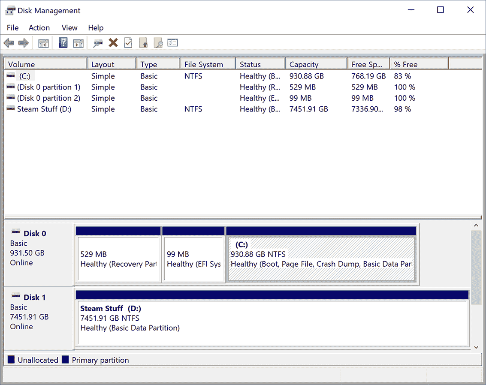
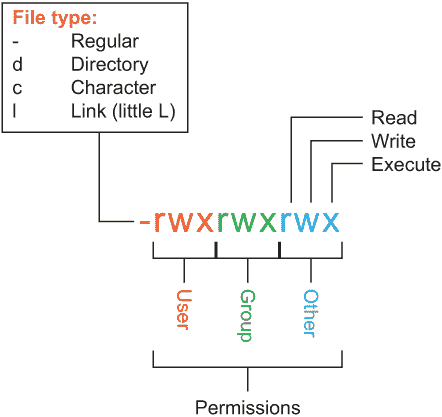
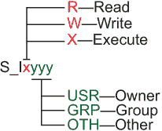
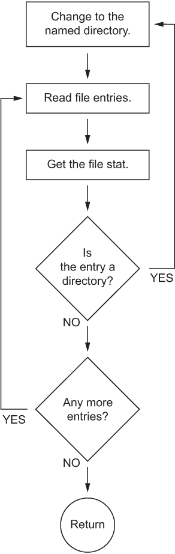
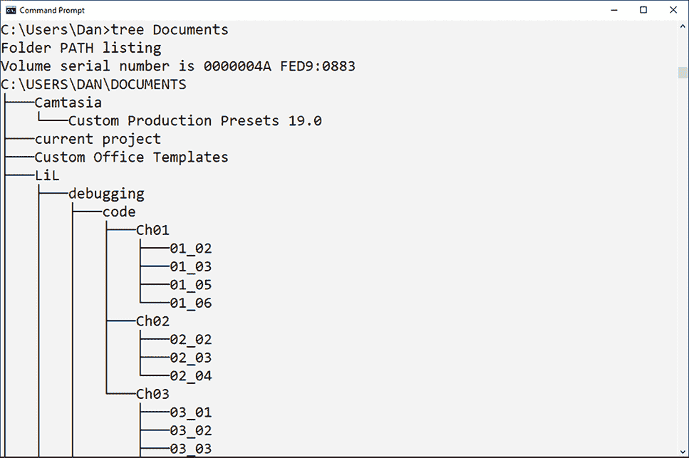

# 10 目录树

在所有编程任务中，我羞于承认我最喜欢编写文件实用程序。普通用户不知道操作系统提供的关于文件的大量信息。这些信息非常详细，触手可及，渴望被摘取。此外，探索文件和目录可以打开你对计算机存储工作原理的理解。探索这个领域可能会激发你编写自己有趣的文件实用程序。如果不行，你可以继续阅读本章——这是你对文件系统和存储的入门。

这里的目标是创建一个目录树程序。输出显示了子目录在分层文件系统中的位置。除了接触到单词 *hierarchical*（我竟然能神奇地既拼对又打出来）之外，在本章中你还将学习如何：

+   检查文件信息

+   解码文件模式和权限

+   读取目录条目

+   使用递归来探索目录结构

+   从完整路径名中提取目录名

+   输出目录树

+   避免将单词 *hierarchical* 与 *hieroglyphical* 混淆

在深入了解细节之前，请注意，GUI 术语更喜欢使用术语 *folder* 而不是 *directory*。作为一名 C 程序员，你必须使用术语 *directory*，而不是 *folder*。所有处理文件和目录的 C 函数都使用 *directory* 或包含缩写“dir。”不要退缩，使用术语 *folder*。

目录树实用程序的目的在于输出目录结构的地图。地图详细说明了哪些目录是彼此的父目录和子目录。与多年前相比，今天的目录结构充满了许多组织。当涉及到保存文件时，用户更加关注。程序针对这种类型的组织，并提供提示以帮助用户使用子目录概念。

即使目录地图看似微不足道，探索目录树的过程非常适合其他有用的磁盘实用程序。例如，第十一章涵盖了文件查找实用程序，它严重依赖于本章提供的信息，以使实用程序真正有用。

## 10.1 文件系统

所有媒体存储的核心是文件系统。*文件系统*描述了数据在媒体上的存储方式，如何访问文件，以及关于文件本身的许多技术细节。

大多数用户唯一一次处理文件系统概念的情况是在格式化媒体时。选择文件系统是格式化过程的一部分，因为它决定了媒体如何格式化以及需要遵循哪些协议。这一步对于兼容性是必要的：并非每个文件系统都与每个计算机操作系统兼容。因此，用户可以选择媒体格式所用的文件系统，以便在操作系统之间进行共享，例如 Linux 和 PC 或 Macintosh。

文件系统的职责是组织存储。它将文件的数据写入媒体的一个或多个位置。这些信息与其他文件详细信息（如文件名、大小、日期（创建、修改、访问）、权限等）一起记录。

一些文件详细信息可以通过现有实用程序或各种 C 库函数轻松获取。但大多数文件系统的机制都是针对在媒体上保存、检索和更新文件数据的。所有这些操作都在操作系统的监督下自动进行。

对于大多数程序员来说，好消息是无需了解文件在媒体上存储的细节。即使你完全成为技术宅，理解各种文件系统之间的细微差别，并在技术聚会上吹嘘高性能文件系统（HPFS）的好处，但操作文件系统所需的媒体访问级别超出了典型 C 程序操作的范围。有函数可用于探索文件的详细信息。这些函数将在下一节中介绍。

除了了解文件系统的名称以及可能的一些关于文件系统工作方式的细节外，如果您好奇，可以使用计算机上的常用工具来查看正在使用哪些文件系统。在 Linux 终端窗口中，使用 **man fs** 命令查看 Linux 如何使用文件系统以及可用的不同文件系统。/proc/filesystems 目录列出了您的 Linux 安装中可用的文件系统。

Windows 将其文件系统信息隐藏在磁盘管理控制台中。要访问此窗口，请按照以下步骤操作：

1.  按下键盘上的 Windows 键以打开开始菜单。

1.  输入**磁盘管理**。

1.  从搜索结果列表中，选择创建和格式化硬盘分区。

图 10.1 展示了我的一台 Windows 电脑上的磁盘管理控制台。可用媒体以表格形式呈现，其中文件系统列列出了所使用的文件系统；图中只显示了 NTFS。



图 10.1 磁盘管理控制台显示了 PC 可用媒体所使用的文件系统。

在 Macintosh 上，您可以使用磁盘实用程序浏览可用媒体以了解正在使用哪种文件系统。此应用程序位于实用程序目录中：在 Finder 中，点击“前往”>“实用程序”以查看目录并访问磁盘实用程序应用程序。

如果编写文件系统既容易又必要，我会进一步探讨这个主题。目前，请理解文件系统是计算机中存储在媒体上的数据的宿主。例如，目录树程序使用文件系统，但在 C 语言中，此类实用程序无需了解文件系统类型即可完成其工作。

## 10.2 文件和目录详细信息

要在命令提示符下收集目录详细信息，请使用 ls 命令。它在所有 shell 中都有，可以追溯到古希腊人使用的第一个史前 Unix 版本，当时该命令被称为λσ。输出是当前目录中文件名的列表：

```
$ ls
changecwd.c  dirtree04.c   fileinfo03.c  readdir01.c  subdir01.c  subdir05.c
dirtree01.c  extractor.c   fileinfo04.c  readdir02.c  subdir02.c  subdir06.c
dirtree02.c  fileinfo01.c  fileinfo05.c  readdir03.c  subdir03.c
dirtree03.c  fileinfo02.c  getcwd.c  readdir04.c  subdir04.c
```

要获取更多详细信息，请指定-l（长）开关：

```
$ ls -l
total 68
-rwxrwxrwx 1 dang dang  292 Oct 31 16:26 changecwd.c
-rwxrwxrwx 1 dang dang 1561 Nov  4 21:14 dirtree01.c
-rwxrwxrwx 1 dang dang 1633 Nov  5 10:39 dirtree02.c
...
```

此输出显示了每个文件的详细信息，包括权限、所有权、大小、日期以及其他你可以用来吓唬那些电脑文盲朋友的琐事。这不是秘密信息；ls -l 命令输出的详细信息就像数据库一样存储在目录中。实际上，存储介质上的目录真的是数据库。它们的记录不是特定的文件，而是 inode。

*inode* 不是一个苹果产品。不，它是一组描述文件的数据集合。尽管你的 C 程序不能轻易访问低级文件系统细节，但你可以轻松检查文件 inode 数据。inode 的名称与文件名相同。但除了名称之外，inode 还包含大量关于文件的详细信息。

### 10.2.1 收集文件信息

要获取文件详细信息以及读取目录，你需要访问 inode 数据。执行此操作的命令行程序称为 *stat*。以下是在 *stat* 程序文件 fileinfo 上的部分输出示例：

```
  File: fileinfo
  Size: 8464        Blocks: 24         IO Block: 4096   regular file
Device: eh/14d  Inode: 11258999068563657  Links: 1
Access: (0777/-rwxrwxrwx)  Uid: ( 1000/    dang)   Gid: ( 1000/    dang)
Access: 2021-10-23 21:11:17.457919300 -0700
Modify: 2021-10-23 21:11:00.071527400 -0700
Change: 2021-10-23 21:11:00.071527400 -0700
```

这些详细信息存储在目录数据库中。实际上，输出的一部分显示了文件的 inode 编号：11258999068563657\. 当然，fileinfo 这个名字作为参考要容易得多。

要在你的 C 程序中读取相同的信息，你使用 *stat()* 函数。它在 sys/stat.h 头文件中声明。以下是 *man* 页面格式：

```
int stat(const char *pathname, struct stat *statbuf);
```

路径名是一个文件名或完整路径名。statbuf 参数是 stat 结构的地址。以下是一个典型的 stat()函数语句，其中包含文件名 char 指针、fs 作为 stat 结构，以及 int 变量 r 捕获返回值：

```
r = stat(filename,&fs);
```

在失败的情况下，返回值是-1。否则，返回 0，并且 stat 结构 fs 充满有关文件的详细信息——inode 数据。表 10.1 列出了 stat 结构的常见成员，尽管不同的文件系统和操作系统可能会添加或更改特定成员。

表 10.1 *stat()*函数的 statbuf 结构成员

| 成员 | 数据类型（占位符） | 详细信息 |
| --- | --- | --- |
| st_dev | dev_t (%lu) | 包含文件的媒体（设备）ID |
| st_ino | ino_t (%lu) | Inode 编号 |
| st_mode | mode_t (%u) | 文件类型、模式、权限 |
| st_nlink | nlink_t (%lu) | 链接数量 |
| st_uid | uid_t (%u) | 文件所有者的用户 ID |
| st_gid | gid_t (%u) | 组的用户 ID |
| st_rdev | dev_t (%lu) | 特殊文件类型的设备 ID |
| st_size | off_t (%lu) | 文件大小（字节） |
| st_blksize | blksize_t (%lu) | 文件系统的块大小 |
| st_blocks | blkcnt_t (%lu) | 分配的文件块（512 字节块） |
| st_atime | struct timespec | 文件最后访问时间 |
| st_mtime | struct timespec | 文件最后修改时间 |
| st_ctime | struct timespec | 文件状态最后更改的时间 |

大多数 stat 结构体成员都是整数；我在表 10.1 中指定了*printf()*占位符类型。它们都是*unsigned*，尽管一些值是*unsigned long*。注意*long unsigned*值，因为编译器会哀叹使用不正确的占位符来表示这些值。

The timespec 结构体作为*time_t*指针访问。它包含两个成员：tv_sec 和 tv_nsec，分别代表秒和纳秒。稍后将会展示如何使用*ctime()*函数访问这个结构体的示例。

下面的列表展示了一个示例程序，fileinfo01.c，该程序输出文件（或 inode）的详细信息。stat 结构体的每个成员都会访问作为命令行参数提供的文件。大部分代码都是错误检查——例如，确认是否提供了文件名参数，并检查*stat()*函数的返回状态。

列表 10.1 文件 info01.c 的源代码

```
#include <stdio.h>
#include <stdlib.h>
#include <sys/stat.h>
#include <time.h>

int main(int argc, char *argv[])                         ❶
{
    char *filename;
    struct stat fs;
    int r;

    if( argc<2 )                                         ❷
    {
        fprintf(stderr,"Specify a filename\n");
        exit(1);
    }

    filename = argv[1];                                  ❸
    printf("Info for file '%s'\n",filename);
    r = stat(filename,&fs);                              ❹
    if( r==-1 )                                          ❺
    {
        fprintf(stderr,"Error reading '%s'\n",filename);
        exit(1);
    }

    printf("Media ID: %lu\n",fs.st_dev);                 ❻
    printf("Inode #%lu\n",fs.st_ino);                    ❻
    printf("Type and mode: %u\n",fs.st_mode);            ❻
    printf("Hard links = %lu\n",fs.st_nlink);            ❻
    printf("Owner ID: %u\n",fs.st_uid);                  ❻
    printf("Group ID: %u\n",fs.st_gid);                  ❻
    printf("Device ID: %lu\n",fs.st_rdev);               ❻
    printf("File size %lu bytes\n",fs.st_size);          ❻
    printf("Block size = %lu\n",fs.st_blksize);          ❻
    printf("Allocated blocks = %lu\n",fs.st_blocks);     ❻
    printf("Access: %s",ctime(&fs.st_atime));            ❼
    printf("Modification: %s",ctime(&fs.st_mtime));      ❼
    printf("Changed: %s",ctime(&fs.st_ctime));           ❼
    return(0);
}
```

❶ 文件名作为程序参数提供。

❷ 确认第一个参数

❸ 使用字符指针 filename 引用参数有助于提高可读性。

❹ 调用*stat()*函数

❺ 检查错误

❻ 输出 stat 结构体 fs 的成员

❼ 时间结构使用*ctime()*函数输出它们的值。

fileinfo01.c 程序输出的信息与命令行 stat 实用工具输出的信息相匹配。以下是在同一文件 fileinfo 上运行此代码程序的示例输出：

```
Info for file 'fileinfo'
Media ID: 14
Inode #7318349394555950
Type and mode: 33279
Hard links = 1
Owner ID: 1000
Group ID: 1000
Device ID: 0
File size 8464 bytes
Block size = 4096
Allocated blocks = 24
Access: Tue Oct 26 15:55:10 2021
Modification: Tue Oct 26 15:55:10 2021
Changed: Tue Oct 26 15:55:10 2021
```

这些细节与本章前面展示的*stat*命令的输出相同。*stat*命令确实会查找设备 ID、所有者 ID 和组 ID 的详细信息，你的代码也可以做到这一点。但有一个有趣的项目是结构成员 st_mode，类型和模式值。上面输出显示的值是 33279。这个整数值包含了很多细节——位字段，你可以在*stat*命令的输出中看到这些细节的解释。你的代码也可以检查这个值以确定文件类型及其权限。

### 10.2.2 探索文件类型和权限

检查文件（或 inode）的 st_mode 值是确定文件是普通文件、目录或其他特殊类型文件的方法。记住，在 Linux 环境中，一切都是文件。使用*stat()*函数是确定 inode 表示哪种类型文件的方法。

stat 结构体中 st_mode 成员的位字段也描述了文件的权限。虽然你可以编写一系列复杂的位运算逻辑操作来找出 st_mode 值位中的具体细节，但我建议你使用 sys/stat.h 头文件中可用的便捷宏。

例如，S_ISREG()宏对于普通文件返回 TRUE。为了更新 fileinfo01.c 代码以测试普通文件，添加以下语句：

```
printf("Type and mode: %X\n",fs.st_mode);
if( S_ISREG(fs.st_mode) )
    printf("%s is a regular file\n",filename);
else
    printf("%s is not a regular file\n",filename);
```

如果 fs.st_mode 变量上的 S_ISREG()测试返回 TRUE，则属于*if*语句的*printf()*语句会输出确认文件是常规文件的文本。*else*条件处理其他类型的文件，例如目录。

在我对代码的更新中，从在线存档中可获得的 fieinfo02.c，我移除了原始代码中的所有*printf()*语句。前面显示的五个语句替换了原始的 printf()语句，因为这次更新的重点是确定文件类型。以下是关于 fileinfo02.c 源代码文件的示例输出：

```
Info for file 'fileinfo02.c'
Type and mode: 81FF
Fileinfo02.c is a regular file
```

如果我指定单个点（.），代表当前目录，我会看到以下输出：

```
Info for file '.'
Type and mode: 41FF
. is a directory
```

在上面的输出中，st_mode 值以及 S_ISREG()宏的返回值都会发生变化；目录不是常规文件。实际上，你可以通过使用 S_ISDIR()宏来专门测试目录：

```
printf("Type and mode: %X\n",fs.st_mode);
if( S_ISREG(fs.st_mode) )
    printf("%s is a regular file\n",filename);
else if( S_ISDIR(fs.st_mode) )
    printf("%s is a directory\n",filename);
else
   printf("%s is some other type of file\n",filename);
```

我已经对文件 info02.c 中的代码进行了这些修改和添加，改进后的代码保存在 fileinfo03.c 中，可在本书的在线仓库中找到。

可以通过使用文件模式宏的全套，在代码中进行进一步的修改，这些宏列在表 10.2 中。这些是常见的宏，尽管你的 C 编译器和操作系统可能提供更多。使用这些宏通过文件类型来识别文件。

表 10.2 sys/stat.h 中定义的宏，用于帮助确定文件类型

| 宏 | 对此类文件为真 |
| --- | --- |
| S_ISBLK() | 块特殊设备，例如/dev 目录中的大容量存储 |
| S_ISCHR() | 字符特殊设备，例如管道或/dev/null 设备 |
| S_ISDIR() | 目录 |
| S_ISFIFO() | FIFO（命名管道）或套接字 |
| S_ISREG() | 常规文件 |
| S_ISLNK() | 符号链接 |
| S_ISSOCK() | 套接字 |

文件类型细节并不是 stat 结构体中 st_mode 成员包含的唯一信息。此值还揭示了文件的权限。文件权限是指确定谁可以做什么的访问位。有三个访问位，称为八进制位，是可用的：

+   读取（r）

+   写入（w）

+   执行（x）

读取权限意味着文件以只读方式访问：可以读取文件的数据但不能修改。写入权限允许读取和写入文件。执行权限用于程序文件，例如你的 C 程序（由编译器或链接器自动设置），shell 脚本（手动设置）和目录。这些都是标准的 Linux 内容，所以如果你需要更多信息，可以查找一本关于 Linux 的糟糕书籍以获取详细信息。

在 Linux 中，*chmod*命令设置和重置文件权限。这些权限可以在使用带有-l（小写的 L）开关的*ls*命令的文件的长列表中看到：

```
$ ls -l fileinfo
-rwxrwxrwx 1 dang dang 8464 Oct 26 15:55 fileinfo
```

第一部分信息，-rwxrwxrwx，表示文件类型和权限，这些在图 10.2 中有详细说明。接下来是硬链接数（1），所有者（dang）和组（dang）。值 8,464 是字节数，然后是日期和时间戳，最后是文件名。



图 10.2 在长目录列表中解码文件权限位

文件使用三组文件权限八进制值。这些集合基于用户分类：

+   拥有者

+   组

+   其他

你是所创建文件的拥有者。作为计算机上的用户，你也是某个组的成员。使用 *id* 命令查看你的用户名和 ID 号，以及你所属的组（名称和 ID）。查看 /etc/group 文件以查看系统上的完整组列表。

文件所有者授予自己对其文件的完全访问权限。设置组权限是一次性授予多个系统用户访问权限的一种方法。第三个字段，其他，适用于不是所有者或不在指定组中的任何人。

在长目录列表中，文件的所有者和组如前所述显示。此值是从文件的 stat 结构的 st_mode 成员中解释的。与获取文件类型一样，你可以使用 sys/stat.h 头文件中可用的定义常量和宏来测试每个用户分类的权限。

我计算了 sys/stat.h 中可用的九个权限定义常量，这涵盖了每个权限八进制值（三个）和三种权限类型：读、写和执行。这些在表 10.3 中显示。

表 10.3 用于权限的 sys/stat.h 头文件中定义的常量

| 定义常量 | 权限八进制值 |
| --- | --- |
| S_IRUSR | 拥有者读权限 |
| S_IWUSR | 拥有者写权限 |
| S_IXUSR | 拥有者执行权限 |
| S_IRGRP | 组读权限 |
| S_IWGRP | 组写权限 |
| S_IXGRP | 组执行权限 |
| S_IROTH | 其他读权限 |
| S_IWOTH | 其他写权限 |
| S_IXOTH | 其他执行权限 |

好消息是这些定义的常量遵循一个命名模式：每个定义的常量都以 S_I 开头。I 后面跟着 R、W 或 X，分别代表读、写或执行。这个字母后面跟着 USR、GRP、OTH，分别代表拥有者（用户）、组和其他。这种命名约定总结在图 10.3 中。



图 10.3 sys/stat.h 中定义的权限常量的命名约定

例如，如果你想测试组用户的读权限，你使用 S_IRGRP 定义常量：S_I 加 R 代表读，GRP 代表组。这个定义常量用于与位运算符进行 *if* 测试，以测试 st_mode 成员上的权限位：

```
 If( fs.st_mode & S_IRGRP )
```

fs_st_mode（文件的模式，包括类型和权限）中的值与 S_IRGRP 定义常量中的位进行比较。如果测试为真，意味着位被设置，则文件为“其他”组设置了只读权限。

列表 10.2 使用测试宏和定义的常量为命令行参数提供的文件工作。这个更新版本的 *fileinfo* 系列程序输出指定文件的文件类型和权限。一个 *if else-if else* 结构处理表 10.2 中列出的不同文件类型。三组 *if* 测试输出三个不同组的权限。你看到本节中讨论的所有宏和定义的常量都在代码中使用。代码看起来很长，但它包含了很多复制粘贴的信息。

列表 10.2 fileinfo04.c 的源代码

```
#include <stdio.h>
#include <stdlib.h>
#include <sys/stat.h>
#include <time.h>

int main(int argc, char *argv[])
{
    char *filename;
    struct stat fs;
    int r;

    if( argc<2 )
    {
        fprintf(stderr,"Specify a filename\n");
        exit(1);
    }

    filename = argv[1];
    r = stat(filename,&fs);
    if( r==-1 )
    {
        fprintf(stderr,"Error reading '%s'\n",filename);
        exit(1);
    }
                                         ❶
    printf("File '%s' is a ",filename);
    if( S_ISBLK(fs.st_mode) )            ❷
        printf("block special\n");
    else if( S_ISCHR(fs.st_mode) )
        printf("character special\n");
    else if( S_ISDIR(fs.st_mode) )
        printf("directory\n");
    else if( S_ISFIFO(fs.st_mode) )
        printf("named pipe or socket\n");
    else if( S_ISREG(fs.st_mode) )
        printf("regular file\n");
    else if( S_ISLNK(fs.st_mode) )
        printf("symbolic link\n");
    else if( S_ISSOCK(fs.st_mode) )
        printf("socket\n");
    else
        printf("type unknown\n");

    printf("Owner permissions: ");       ❸
    if( fs.st_mode & S_IRUSR )
        printf("read ");
    if( fs.st_mode & S_IWUSR )
        printf("write ");
    if( fs.st_mode & S_IXUSR )
        printf("execute");
    putchar('\n');

    printf("Group permissions: ");       ❹
    if( fs.st_mode & S_IRGRP )
        printf("read ");
    if( fs.st_mode & S_IWGRP )
        printf("write ");
    if( fs.st_mode & S_IXGRP )
        printf("execute");
    putchar('\n');

    printf("Other permissions: ");       ❺
    if( fs.st_mode & S_IROTH )
        printf("read ");
    if( fs.st_mode & S_IWOTH )
        printf("write ");
    if( fs.st_mode & S_IXOTH )
        printf("execute");
    putchar('\n');

    return(0);
}
```

❶ 新内容从这里开始。

❷ 确定文件类型，一个长的 *if-else* 结构

❸ 测试所有者权限位

❹ 测试组权限位

❺ 测试其他权限位

我从列表 10.2 中的源代码创建的程序命名为 a.out，这是默认的。以下是原始 *fileinfo* 程序的示例运行：

```
$ ./a.out fileinfo
File 'fileinfo' is a regular file
Owner permissions: read write execute
Group permissions: read write execute
Other permissions: read write execute
```

这里显示的信息对应于 ls -l 列表输出的 -rwxrwxrwx。

这里是系统目录 /etc 的输出：

```
$ ./a.out /etc
File '/etc' is a directory
Owner permissions: read write execute
Group permissions: read execute
Other permissions: read execute
```

从这个输出中，文件类型被正确地识别为目录。所有者权限是 rwx（所有者是 root）。组和其它权限是 r-x，这意味着计算机上的任何人都可以读取和访问（执行）目录。

练习 10.1

列表 10.2（fileinfo04.c）中的 *if-else* 结构包含了很多重复。看到代码中的重复语句，我强烈建议使用一个函数。这个练习的任务是编写一个输出文件权限的函数。

调用函数 *permissions_out()*。它接受一个 *mode_t* 参数，该参数是 stat 结构中的 st_mode 成员。以下是原型：

```
void permissions_out(mode_t stm);
```

使用该函数输出三个访问级别（所有者、组、其它）的权限字符串。如果设置了位，使用字符 r、w、x 表示读取、写入和执行访问；对于未设置的项目，使用破折号 (-)。这个输出与 ls -l 列表显示的相同，但没有标识文件类型的开头字符。

对于这个函数，存在一个简单的方法，我希望你能找到它。如果找不到，你可以在源代码文件 fileinfo05.c 中查看我的解决方案，该文件可在在线仓库中找到。请在查看我的解决方案之前自己尝试这个练习；我的代码中的注释解释了我的哲学。如果你更喜欢，可以使用 *fileinfo* 系列程序来执行 *stat()* 函数的基本操作。

### 10.2.3 阅读目录

目录是一个文件数据库，但如果你想吸引一个书呆子，你可以称它们为 inode。就像文件一样，目录数据库存储在媒体上。但是你不能使用 *fopen()* 函数来打开和读取目录的内容。不，相反，你使用 *opendir()* 函数。以下是它的 *man* 页面格式：

```
DIR *opendir(const char *filename);
```

*opendir()* 函数接受一个单一参数，一个表示要检查的目录路径名的字符串。指定当前目录和父目录的快捷方式 . 和 .. 也是有效的。

函数返回一个指向 *DIR* 处理句柄的指针，类似于 *fopen()* 命令使用的 *FILE* 处理句柄。由于 *FILE* 处理句柄代表一个文件流，*DIR* 处理句柄代表一个目录流。

发生错误时，返回 NULL 指针。全局 errno 值被设置，指示函数遇到的具体错误。

*opendir()* 函数有一个配套的 *closedir()* 函数，类似于 *fclose()* 函数是 *fopen()* 的配套。*closedir()* 函数需要一个参数，即打开的目录流的 *DIR* 处理句柄，在 *man* 页面格式示例中幽默地称为“dirp”：

```
int closedir(DIR *dirp);
```

是的，我知道互联网上拼作“derp”。

成功时，*closedir()* 函数返回 0。否则，返回值 -1，并设置全局 errno 变量，等等。

*opendir()* 和 *closedir()* 函数都在 dirent.h 头文件中进行了原型声明。

在以下列表中，你可以看到 *opendir()* 和 *closedir()* 函数被投入使用。当前目录 "." 被打开，因为它始终有效。

列表 10.3 readdir01.c 的源代码

```
#include <stdio.h>
#include <stdlib.h>
#include <dirent.h>

int main()
{
    DIR *dp;                         ❶

    dp = opendir(".");               ❷
    if(dp == NULL)                   ❸
    {
        puts("Unable to read directory");
        exit(1);
    }

    puts("Directory is opened!");

    closedir(dp);                    ❹
    puts("Directory is closed!");

    return(0);
}
```

❶ 目录句柄

❷ 打开当前目录，无论是什么目录

❸ 打开失败时退出程序

❹ 然后将其关闭

列表 10.3 中的代码只是打开和关闭当前目录。无聊！要访问目录中存储的文件，你使用另一个函数，*readdir()*。这个函数也在 dirent.h 头文件中进行了原型声明。以下是 *man* 页面格式：

```
struct dirent *readdir(DIR *dirp);
```

函数接受一个打开的 *DIR* 处理句柄作为其唯一参数。返回值是 dirent 结构的地址，其中包含有关目录条目的详细信息。这个函数被反复调用以从目录流中读取文件条目（inode）。在读取目录中的最后一个条目后，返回 NULL 值。

很遗憾，dirent 结构不像我希望的那样丰富。表 10.4 列出了两个一致的成员，尽管一些 C 库提供了更多成员。任何额外的成员都是特定于编译器或操作系统的，不应依赖于你计划发布到野外的代码。POSIX.1 标准仅要求两个必需的成员：d_ino 用于条目的 inode 和 d_name 用于条目的文件名。

表 10.4 dirent 结构的常见成员

| 成员 | 数据类型（占位符） | 描述 |
| --- | --- | --- |
| d_ino | *ino_t* (%lu) | Inode 编号 |
| d_reclen | *unsigned short* (%u) | 记录长度 |

最好的结构成员是 d_name，它在所有编译器和平台上都一致可用。这个成员在 readdir02.c 的源代码中使用，如下一列表所示。对 readdir01.c 的这次更新删除了两个愚蠢的 *puts()* 语句。添加了一个 *readdir()* 语句，以及一个 *printf()* 函数来输出当前目录中找到的第一个文件的名称。

列表 10.4 readdir02.c 的源代码

```
#include <stdio.h>
#include <stdlib.h>
#include <dirent.h>

int main()
{
    DIR *dp;
    struct dirent *entry;                   ❶

    dp = opendir(".");
    if(dp == NULL)
    {
        puts("Unable to read directory");
        exit(1);
    }

    entry = readdir(dp);                    ❷

    printf("File %s\n",entry->d_name);      ❸

    closedir(dp);

    return(0);
}
```

❶ dirent 结构被创建为一个指针，一个内存地址。

❷ 该条目被读取并存储在 dirent 结构体中的 entry 成员。

❸ 输出 d_name 成员。

由 readdir02.c 源代码生成的程序只输出一个文件——很可能是当前目录本身的条目，即单个点。显然，如果你想要一个真正的目录读取程序，你必须修改代码。

与使用 fread()函数从常规文件读取数据一样，readdir()函数会被反复调用。当函数返回指向 dirent 结构的指针时，目录中就有另一个条目可用。只有当函数返回 NULL 时，才表示已读取完整目录。

要将代码从 readdir02.c 更新到 readdir03.c，你必须将*readdir()*语句改为 while 循环的条件。然后，将*printf()*语句设置在*while*循环内。以下是更改的行：

```
while( (entry = readdir(dp)) != NULL )
{
    printf("File %s\n",entry->d_name);
}
```

*while*循环会一直重复，直到*readdir()*返回的值不是 NULL。通过这次更新，程序现在会输出当前目录中的所有文件。

要获取目录中文件的更多信息，请使用本章之前介绍过的*stat()*函数。*readdir()*函数的 dirent 结构体包含文件名，位于 d_name 成员中。当知道这个细节时，你使用*stat()*函数来获取文件类型以及其他信息。

下一个示例展示了*readdir*系列程序的最终版本。它结合了本章之前介绍过的代码，创建了一个粗糙的目录列表程序。条目逐个读取，*stat()*函数返回文件类型、大小和访问日期的特定值。

列表 10.5 readdir04.c 的源代码

```
#include <stdio.h>
#include <stdlib.h>
#include <sys/stat.h>
#include <dirent.h>
#include <time.h>

int main()
{
    DIR *dp;
    struct dirent *entry;
    struct stat fs;
    int r;
    char *filename;

    dp = opendir(".");
    if(dp == NULL)
    {
        puts("Unable to read directory");
        exit(1);
    }

    while( (entry = readdir(dp)) != NULL )
    {
        filename = entry->d_name;              ❶
        r = stat( filename,&fs );              ❷
        if( r==-1 )
        {
            fprintf(stderr,"Error reading '%s'\n",filename);
            exit(1);
        }
        if( S_ISDIR(fs.st_mode) )              ❸
            printf(" Dir %-16s ",filename);    ❹
        else
            printf("File %-16s ",filename);    ❺

        printf("%8lu bytes ",fs.st_size);      ❻

        printf("%s",ctime(&fs.st_atime));      ❼
    }

    closedir(dp);

    return(0);
}
```

❶ 保存目录条目的名称以提高可读性和易于访问

❷ 为当前文件名/目录条目填充 stat 结构

❸ 从其他文件类型中调用目录

❹ 以 16 字符宽度左对齐输出目录文件名

❺ 将标准文件名与目录文件名对齐

❻ 以 8 字符宽度输出文件大小

❼ 输出访问时间，这会自动添加换行符

此代码表明，要真正读取目录，你需要*readdir()*和*stat()*函数。它们一起获取目录中文件的详细信息——如果你计划探索目录或编写类似文件工具（如目录树），这将是有用的信息。

以下是 readdir04.c 源代码生成的程序示例输出：

```
 Dir .                    4096 bytes Sat Oct 30 16:44:34 2021
 Dir ..                   4096 bytes Fri Oct 29 21:55:05 2021
File a.out                8672 bytes Sat Oct 30 16:44:34 2021
File fileinfo             8464 bytes Tue Oct 26 15:55:22 2021
File fileinfo01.c          966 bytes Sat Oct 30 16:24:49 2021
File readdir01.c           268 bytes Fri Oct 29 19:30:10 2021
```

顺便提一下，目录条目出现的顺序取决于操作系统。一些操作系统按字母顺序排序条目，因此*readdir()*函数按该顺序获取文件名。这种行为并不一致，因此不要依赖它来输出你的目录读取程序。

## 10.3 子目录探索

目录可以通过三种方式引用：

+   作为命名路径

+   作为指向父目录的..快捷方式

+   作为当前目录中的一个目录条目，一个子目录

无论采用何种方法，路径名要么是直接的，要么是相对的。直接路径是一个完全命名的路径，从根目录、您的家目录或当前目录开始。相对路径名使用 .. 快捷方式表示父目录——有时，很多。

As an example, a full pathname could be:

```
/home/dang/documents/finances/bank/statements
```

这个直接路径显示了从根目录分支的目录，通过我的家目录，直到 statements 目录。

如果我还有一个目录，/home/dang/documents/vacations，但我使用的是前面的语句目录，从语句到 vacations 的相对路径是：

```
../../../vacations
```

第一个 .. 代表 bank 目录。第二个 .. 代表 finances 目录。第三个 .. 代表 documents 目录，其中 vacations 存在作为一个子目录。这种结构演示了一个相对路径。

这些关于路径的细节是使用 Linux 命令提示符的基本部分。当涉及到您的 C 程序以及它们如何探索和访问目录时，理解这些项目至关重要。

### 10.3.1 使用目录探索工具

除了使用 *opendir()* 函数读取目录和 *readdir()* 检查目录条目外，您的代码可能需要更改目录。此外，程序可能想知道它当前正在哪个目录中运行。有两个 C 库函数可以满足这些需求：*chdir()* 和 *getcwd()*。我首先介绍 *getcwd()*，因为它可以用来确认 *chdir()* 函数是否完成了其工作。

The *getcwd()* function obtains the directory in which the program is operating. Think of the name as Get the Current Working Directory. It works like the *pwd* command in the terminal window. This function is prototyped in the unistd.h header file. Here is the *man* page format:

```
char *getcwd(char *buf, size_t size);
```

缓冲区 buf 是一个大小为字符的字符数组或缓冲区。它用于保存当前目录字符串，一个从根目录的绝对路径。这里有一个提示：您可以使用定义的常量 BUFSIZ 作为缓冲区的大小，以及 *getcwd()* 的第二个参数。一些 C 库定义了常量 PATH_MAX，它可以从 limits.h 头文件中获取。由于其可用性不一致，我建议使用 BUFSIZ。 (PATH_MAX 定义常量在第十一章中介绍。)

The return value from getcwd() is the same character string saved in buf, or NULL upon an error. For the specific error, check the global errno variable.

以下列表显示了一个小型演示程序，getcwd.c，它输出当前工作目录。我使用定义的常量 BUFSIZ 为字符数组 cwd[] 设置大小。函数被调用，然后输出字符串。

列表 10.6 getcwd.c 的源代码

```
#include <stdio.h>
#include <unistd.h>

int main()
{
    char cwd[BUFSIZ];                                      ❶
    getcwd(cwd,BUFSIZ);
    printf("The current working directory is %s\n",cwd);   ❷

    return(0);
}
```

❶ 定义常量 BUFSIZ 在 stdio.h 头文件中定义。

❷ 输出当前工作目录

当运行时，程序以完整路径名输出当前工作目录。缓冲区填充了您从 *pwd* 命令中看到的相同文本。

第二个有用的目录函数是`*chdir()*`。这个函数的工作方式类似于 Linux 中的`*cd*`命令。如果你支付了看电影的“高级价格”，你可能在 MS-DOS 中使用了`*chdir*`命令，尽管`*cd*`也是可用的，并且输入更快。

与`*getcwd()*`一样，`*chdir()*`函数在`unistd.h`头文件中进行了原型化。以下是`*man*`页面格式：

```
int chdir(const char *path);
```

唯一的参数是一个表示要更改到的目录（路径）的字符串。成功时返回值为 0，-1 表示错误。正如你可能已经猜到的，全局变量`errno`被设置为指示具体出了什么问题。

我在下一列表中展示的`changecwd.c`源代码中使用了两个目录遍历函数。`*chdir()*`函数将目录更改为由双点表示的父目录。`*getcwd()*`函数获取新目录的完整路径名，并输出结果。

列表 10.7 `changecwd.c`的源代码

```
#include <stdio.h>
#include <stdlib.h>
#include <unistd.h>

int main()
{
    char cwd[BUFSIZ];
    int r;

    r = chdir("..");                                        ❶
    if( r==-1 )
    {
        fprintf(stderr,"Unable to change directories\n");
        exit(1);
    }

    getcwd(cwd,BUFSIZ);                                     ❷
    printf("The current working directory is %s\n",cwd);    ❸

    return(0);
}
```

❶ 更改为父目录

❷ 获取父目录的路径

❸ 输出父目录的路径

生成的程序输出程序运行的目录的父目录的路径名。

你会在`changecwd.c`的源代码中注意到，我没有麻烦返回到原始目录。这样的编码是不必要的。在使用`*chdir()*`函数时，需要记住的一个重要事情是目录更改仅在程序的环境中发生。程序可能更改到媒体上的所有目录，但当它完成后，目录与程序开始时相同。

### 10.3.2 深入子目录

当你知道子目录的完整路径时，更改到子目录很容易。用户可以提供绝对路径，或者可以将它硬编码到程序中。但是，当程序不知道其目录位置时会发生什么？

父目录始终是已知的；你可以使用双点缩写（..）来访问除了顶级目录之外每个目录的父目录。向上移动很容易。向下移动需要做更多的工作。

通过使用本章前面介绍的工具找到子目录：扫描当前目录以查找子目录条目。一旦知道，将子目录名称插入到`*chdir()*`函数中，以访问该子目录。

下一列表中的`subdir01.c`的代码构建了一个程序，该程序列出命名目录中的潜在子目录。代码的一部分是从本章前面列出的其他示例中提取的：需要并检查目录参数。然后打开命名目录并读取其条目。如果找到任何子目录，则列出它们。

列表 10.8 `subdir01.c`的源代码

```
#include <stdio.h>
#include <stdlib.h>
#include <sys/stat.h>
#include <dirent.h>

int main(int argc, char *argv[])
{
    DIR *dp;
    struct dirent *entry;
    struct stat fs;
    int r;
    char *dirname,*filename;

    if( argc<2 )                                       ❶
    {
        fprintf(stderr,"Missing directory name\n");
        exit(1);
    }
    dirname = argv[1];                                 ❷

    dp = opendir(dirname);                             ❸
    if(dp == NULL)
    {
        fprintf(stderr,"Unable to read directory '%s'\n",
                dirname
               );
        exit(1);
    }

    while( (entry = readdir(dp)) != NULL )             ❹
    {
        filename = entry->d_name;                      ❺
        r = stat( filename,&fs );                      ❻
        if( r==-1 )                                    ❼
        {
            fprintf(stderr,"Error on '%s'\n",filename);
            exit(1);
        }

        if( S_ISDIR(fs.st_mode) )                      ❽
            printf("Found directory: %s\n",filename);  ❾
    }

    closedir(dp);

    return(0);
}
```

❶ 确认存在命令行参数（目录名）

❷ 为第一个参数分配一个指针`dirname`以提高可读性

❸ 打开目录并检查错误

❹ 读取目录中的条目

❺ 为每个条目分配一个指针`filename`以提高可读性

❻ 获取 inode 详细信息

❼ 检查错误

❽ 测试文件是否为目录（子目录）

❾ 输出目录的名称

从源代码 subdir01.c 生成的程序读取作为命令行参数提供的目录，然后输出在该目录中找到的任何子目录。以下是使用我的主目录进行的示例运行输出：

```
$ ./subdir /home/dang
Found directory: .
Found directory: ..
Error on '.bash_history'
```

下面是根目录的输出：

```
$ ./subdir /home/dang
Found directory: .
Found directory: ..
Error on 'bin'
```

在这两个示例中，*stat()* 函数失败了。你的代码可以检查 errno 变量，该变量在函数返回 -1 时设置，但我可以立即告诉你错误是什么：传递给 *stat()* 函数的第一个参数必须是路径名。在程序中，只提供了目录的名称，而不是路径名。例如，在前面示例运行中找到的 .bash_history 子目录和 bin 目录在当前目录中并不存在。

解决方案是程序切换到指定的目录。只有当你切换到目录时，代码才能正确读取文件——除非你费力地构建完整的路径名。我太懒了，不想这么做，所以为了修改代码，我在 dirname = argv[1] 语句之后添加了以下语句：

```
r = chdir(dirname);
if( r==-1 )
{
    fprintf(stderr,"Unable to change to %s\n",dirname);
    exit(1);
}
```

此外，你必须包含 unistd.h 头文件，这样编译器就不会对 *chdir()* 函数提出抱怨。

通过对代码的这些更新，这些更新可在在线存储库的子目录 subdir02.c 中找到，程序现在可以正常运行：

```
$ ./subdir /home/dang
Found directory: .
Found directory: ..
Found directory: .cache
Found directory: .config
Found directory: .ddd
Found directory: .lldb
Found directory: .ssh
Found directory: Dan
Found directory: bin
Found directory: prog
Found directory: sto
```

记住：要从目录中读取文件，你必须要么切换到该目录（容易），要么手动为文件构造完整的路径名（不那么容易）。

练习 10.2

每个目录都有点和点点的条目。此外，许多目录还包含隐藏的子目录。Linux 中的所有隐藏文件都以单个点开头。本练习的任务是修改 subdir02.c 的源代码，使程序不输出任何以单个点开头的文件。我的解决方案可在在线存储库中找到，作为 subdir03.c。

### 10.3.3 使用递归进行更深入的挖掘

直到我编写了我的第一个目录树探索程序，我才完全理解和欣赏递归的概念。事实上，目录探险是向任何程序员教授递归的机制以及它如何有益的绝佳方式。

作为复习，*递归* 是函数调用自身的惊人能力。它看起来很愚蠢，就像一个无限循环。然而，在函数内部存在一个逃生门，它允许递归函数展开。只要展开机制正常工作，递归在编程中就用于解决各种奇妙的问题，而不仅仅是让初学者感到困惑。

当 *subdir* 程序遇到子目录时，它可以切换到该目录以继续挖掘更多目录。为此，调用读取当前目录的相同函数，但使用子目录的路径。这个过程在图 10.4 中展示。一旦目录中的条目数用尽，过程将以返回父目录结束。最终，函数返回，回溯到原始目录，程序完成。



图 10.4 递归发现目录的过程

我对递归的问题总是如何展开它。深入子目录的探索让我意识到，一旦所有目录都处理完毕，控制权会返回父目录。即使如此，作为一个习惯于在内存紧张的环境中工作的经验丰富的汇编语言程序员，我担心会崩溃堆栈。到目前为止还没有发生——好吧，至少在我正确编码的时候没有。

要将 *subdir* 系列程序修改为递归目录探险者，你必须移除程序的核心，即探索子目录的部分，并将其设置为函数。我称这样的函数为 *dir()*. 它的参数是目录名：

```
void dir(const char *dirname);
```

*dir()* 函数使用 *while* 循环来处理目录条目，寻找子目录。当找到时，函数再次被调用（在自身内部）以继续处理目录条目，寻找另一个子目录。当条目用尽时，函数返回，最终回到原始目录。

以下列表实现了图 10.4 中的程序流程，以及 *subdir* 程序的早期版本，以创建一个单独的 *dir()* 函数。当找到子目录时，它会递归调用（在函数的 *while* 循环内）。同时修改了 *main()* 函数，以便在没有提供命令行参数时假定当前目录（"."）。

列表 10.9 subdir04.c 的源代码

```
#include <stdio.h>
#include <stdlib.h>
#include <sys/stat.h>
#include <dirent.h>
#include <unistd.h>
#include <string.h>

void dir(const char *dirname)                     ❶
{
    DIR *dp;
    struct dirent *entry;
    struct stat fs;
    char *filename;
    char directory[BUFSIZ];

    if( chdir(dirname)==-1 )                      ❷
    {
        fprintf(stderr,"Unable to change to %s\n",dirname);
        exit(1);
    }

    getcwd(directory,BUFSIZ);                     ❸

    dp = opendir(directory);                      ❹
    if( dp==NULL )
    {
        fprintf(stderr,"Unable to read directory '%s'\n",
                directory
               );
        exit(1);
    }

    printf("%s\n",directory);                     ❺
    while( (entry=readdir(dp)) != NULL )          ❻
    {
        filename = entry->d_name;                 ❼
        if( strncmp( filename,".",1)==0 )         ❽
            continue;

        stat(filename,&fs);                       ❾
        if( S_ISDIR(fs.st_mode) )                 ❿
            dir(filename);                        ⓫
    }

    closedir(dp);
}

int main(int argc, char *argv[])
{
    if( argc<2 )
    {
        dir(".");                                 ⓬
    }
    else
        dir(argv[1]);                             ⓭

    return(0);
}
```

❶ 函数的唯一参数是目录名，dirname。

❷ 确认程序可以切换到命名目录

❸ 获取完整路径名

❹ 确认目录可以打开

❺ 输出目录的名称

❻ 遍历目录的条目，寻找子目录

❼ 保存找到的文件名以提高可读性

❽ 忽略点（.）和点点（..）条目以及隐藏文件

❾ 获取找到的目录条目的详细信息（inode）

❿ 检查子目录

⓫ 递归地再次调用 *dir()* 函数

⓬ 如果没有提供参数，则假定当前目录

⓭ 使用参数作为命名目录

不要费心输入 subdir04.c 的代码。（还有谁会从书中输入代码吗？）甚至不要费心从在线仓库中获取源代码。程序不会让你的电脑崩溃，但它包含几个缺陷。

例如，以下是在我的主目录上的一个示例运行：

```
$ ./subdir ~
/home/dang
/mnt/c/Users/Dan
/mnt/c/Users/Dan/3D Objects
Unable to change to AppData
```

你可以看到起始目录的输出是正确的，/home/dang。接下来，程序跳转到 Windows 中我的用户配置文件目录的符号链接（从 Linux 命令行）。到目前为止，一切顺利；它跟随符号链接到 /mnt/c/Users/Dan。它成功进入 3D Objects 目录，但随后它迷路了。存在 AppData 目录，但它不是代码应该分支的下一个合适的子目录。

问题是什么？

缺陷存在于图 10.4 以及列表 10.9 中显示的源代码中：当 *dir()* 函数开始时，它发出 *chdir()* 函数来更改到命名的目录 dirname。但是，当 *dir()* 函数完成处理子目录后，它并没有将目录改回到父目录/原始目录。

要更新代码并使程序返回父目录，请在 *dir()* 函数的末尾添加以下语句：

```
if( chdir("..")==-1 )
{
    fprintf(stderr,"Parent directory lost\n");
    exit(1);
}
```

更新后的代码可以在在线存储库中找到，作为 subdir05.c。在我的主目录上的一次示例运行输出了许多页的目录，几乎正确。

几乎。

结果表明，从 subdir05.c 创建的程序可能会迷路，特别是与符号链接相关。代码跟随符号链接，但当它尝试返回父目录时，它要么丢失了位置，要么去了错误的父目录。问题在于在 *dir()* 函数末尾添加到代码中的 *chdir()* 语句块。父目录并不具体：

```
chdir("..");
```

这条语句更改到父目录，但使用父目录的完整路径会更好。事实上，当我玩弄代码时，我发现最好在整个 *dir()* 函数中处理完整路径名。一些更改是必要的。

我最后的更新将 *dir()* 函数重新定义为以下内容：

```
void dir(const char *dirpath, const char *parentpath);
```

为了提高可读性，我将参数名称更改为反映这两个都是完整路径名。第一个是扫描目录的完整路径名。第二个是父目录的完整路径名。两者都是 *const char* 类型，因为在函数内部不会修改这两个字符串。

列表 10.10 显示了更新的 *dir()* 函数。大多数更改涉及删除 *char* 变量 directory 并将其替换为参数 dirpath。现在也不再需要在函数中更改到命名的目录，现在假设 dirpath 参数代表当前目录。进一步的注释可以在代码中找到。

列表 10.10 subdir06.c 中的更新 *dir()* 函数

```
void dir(const char *dirpath,const char *parentpath)
{
    DIR *dp;
    struct dirent *entry;
    struct stat fs;
    char subdirpath[BUFSIZ];                         ❶

    dp = opendir(dirpath);                           ❷
    if( dp==NULL )
    {
        fprintf(stderr,"Unable to read directory '%s'\n",
                dirpath
               );
        exit(1);
    }

    printf("%s\n",dirpath);                          ❸
    while( (entry=readdir(dp)) != NULL )             ❹
    {
        if( strncmp( entry->d_name,".",1)==0 )       ❺
            continue;

        stat(entry->d_name,&fs);                     ❻
        if( S_ISDIR(fs.st_mode) )                    ❼
        {
            if( chdir(entry->d_name)==-1 )           ❽
            {
                fprintf(stderr,"Unable to change to %s\n",
                        entry->d_name
                       );
                exit(1);
            }

            getcwd(subdirpath,BUFSIZ);               ❾
            dir(subdirpath,dirpath);                 ❿
        }
    }

    closedir(dp);                                    ⓫

    if( chdir(parentpath)==-1 )                      ⓬
    {
        if( parentpath==NULL )                       ⓭
            return;
        fprintf(stderr,"Parent directory lost\n");
        exit(1);
    }
}
```

❶ 存储要更改的新目录，存储完整路径名

❷ 程序已经在所需的目录中，因此而不是改变到它，代码尝试打开目录并读取条目。

❸ 输出当前目录路径

❹ 读取目录中的所有条目

❺ 避免任何点条目

❻ 获取每个目录条目（inode）的信息

❼ 检查子目录条目

❽ 更改到子目录

❾ 获取递归调用中子目录的完整路径名

❿ 递归地以子目录和当前目录作为参数调用函数

⓫ 在读取所有条目后关闭当前目录

⓬ 返回到父目录——完整路径名

⓭ 检查 NULL，如果是，则直接返回

更新 *dir()* 函数需要更新 *main()* 函数。它需要做更多的工作：*main()* 函数必须获取当前目录的完整路径名或 argv[1] 的值，以及目录的父目录。这里展示了 main() 函数的更新。

列表 10.11 subdir06.c 的更新后的 *main()* 函数

```
int main(int argc, char *argv[])
{
    char current[BUFSIZ];

    if( argc<2 )
    {
        getcwd(current,BUFSIZ);      ❶
    }
    else
    {
        strcpy(current,argv[1]);     ❷
        if( chdir(current)==-1 )     ❸
        {
            fprintf(stderr,"Unable to access directory %s\n",
                    current
                   );
            exit(1);
        }
        getcwd(current,BUFSIZ);      ❹
    }

    dir(current,NULL);               ❺

    return(0);
}
```

❶ 对于没有参数的情况，获取并存储当前目录的完整路径

❷ 复制第一个参数；希望是一个目录

❸ 切换到目录并检查错误

❹ 获取目录的完整路径名

❺ 调用函数；在 *dir()* 中检查 NULL。

完整的源代码文件可在在线仓库中找到，文件名为 subdir06.c。它接受目录参数或无参数，如果没有参数，则当前目录会被追踪。

尽管程序使用完整路径名，但它仍然可能会迷路。特别是对于符号链接，代码可能会偏离你预期的位置。某些类型的链接，如 Mac OS X 中的别名，不被识别为目录，因此会被跳过。并且在处理系统目录时，特别是包含块或字符文件的目录，程序的堆栈可能会溢出并生成段错误。

## 10.4 目录树

古老的 MS-DOS 操作系统具有 TREE 工具。它以节日般、图形化的方式（对于文本屏幕）显示当前目录结构的地图。此命令在 Windows 中仍然可用。在 Windows 的 CMD（命令提示符）程序中，键入 **TREE**，你会看到如图 10.5 所示的输出：目录以层次结构的形式出现，以节日般的方式用线条连接父目录和子目录，同时通过缩进来显示目录深度。



图 10.5 TREE 命令的输出

创建目录树程序的机制你已经知道了。subdir06.c 的源代码以与图 10.5 所示的输出相同的方式处理目录和子目录。缺少的是缩短的目录名、文本模式图形和缩进。你可以添加这些项目，创建自己的目录树工具。

### 10.4.1 提取目录名

为了模仿旧的 TREE 工具，*dir()* 函数必须从完整路径名中提取目录名。因为使用了完整路径名，并且字符串不以反斜杠结尾，所以从字符串中的最后一个反斜杠到最后一个空字符之间的所有内容都符合目录名的条件。

从完整的路径名中提取当前目录名的简单方法是保存在父目录中找到的名称：entry->d_name 结构成员包含目录的名称，正如它在父目录列表中显示的那样。为了进行这种修改，*dir()* 函数需要另一个参数，即短目录名。这种修改简单易编码，这就是为什么这种方法被称为简单方法。

容易方法的缺点是 *main()* 函数在程序启动时没有参数时获取完整的目录路径。因此，即使你选择容易的方法，你仍然必须在 *main()* 函数中从完整的路径名中提取目录名。因此，我的方法是为从路径末尾提取目录名（或文件名）编写一个新函数。

当我为程序添加新功能时，例如从路径末尾提取目录名时，我会编写测试代码。在下一个列表中，你可以看到 *extract()* 函数的测试代码。它的任务是遍历路径名以提取最后一部分——假设字符串的最后一部分（在最后的/分隔符字符之后）是目录名。哦，该函数还假设环境是 Linux；如果你使用 Windows，则指定反斜杠（两个：\\）作为路径分隔符，尽管 Windows 10 也可能识别正斜杠。

列表 10.12 extractor.c 的源代码

```
#include <stdio.h>
#include <string.h>

const char *extract(char *path)
{
    const char *p;
    int len;

    len = strlen(path);
    if( len==0 )                      ❶
        return(NULL);
    if( len==1 & *(path+0)=='/' )     ❷
        return(path);

    p = path+len;                     ❸
    while( *p != '/' )                ❹
    {
        p--;
        if( p==path )                 ❺
            return(NULL);
    }
    p++;                              ❻

    if( *p == '\0' )                  ❼
        return(NULL);
    else
        return(p);                    ❽
}

int main()
{
    const int count=4;
    const char *pathname[count] =  {  ❾
        "/home/dang",
        "/usr/local/this/that",
        "/",
        "nothing here"
    };
    int x;

    for(x=0; x<count; x++)
    {
        printf("%s -> %s\n",
                pathname[x],
                extract(pathname[x])
              );
    }

    return(0);
}
```

❶ 如果字符串为空，则返回 NULL

❷ 对根目录执行特殊测试

❸ 将指针 p 定位在字符串 path 的末尾

❹ 回退 p 以找到分隔符；对于 Windows，使用 \\ 作为分隔符

❺ 如果 p 回退得太远，则返回 NULL

❻ 在分隔符字符上递增 p

❼ 测试字符串是否为空或格式不正确，并返回 NULL

❽ 返回最终目录名开始的地址

❾ 测试字符串的各种配置

*extract()* 函数在传递的路径名字符串中回退。指针 p 搜索 / 分隔符。它离开函数时引用字符串 path 中最终目录名开始的位置。在出现错误时，返回 NULL。*main()* 函数中的一系列测试字符串使 *extract()* 函数发挥作用。以下是输出：

```
/home/dang -> dang
/usr/local/this/that -> that
/ -> /
nothing here -> (null)
```

*extract()* 函数成功处理每个字符串，返回最后一部分，即目录名。它甚至可以捕获格式不正确的字符串，正确地返回 NULL。

对于我的第一个目录树程序版本，我在对 *subdir* 系列程序的最后更新 subdir06.c 中添加了 *extract()* 函数。*extract()* 函数在 *dir()* 函数内部调用，就在读取目录条目的主要 *while* 循环之前，替换了该行上的现有 *printf()* 语句：

```
printf("%s\n",extract(dirpath));
```

这个更新被保存为 dirtree01.c。生成的程序 *dirtree* 输出目录，但只输出它们的名称，而不是完整的路径名。输出几乎是一个目录树程序，但没有为每个子目录级别进行适当的缩进。

### 10.4.2 监控目录深度

从旧 TREE 命令中获取的复杂输出，如图 10.5 所示，看起来比实际复杂。要完全模拟它，代码需要使用宽字符输出（在第八章中介绍）。此外，还需要监控目录的深度，以及输出目录中的最后一个子目录时。实际上，要完全模拟 TREE 命令，需要对 *dirtree* 程序进行大量重构，主要是为了保存目录条目以便稍后输出。

是的，所以我不会去那里——不会完全去。

而不是重构整个代码，我想添加一些缩进，使我的 *dirtree* 系列目录输出看起来更“树形”。这个添加需要监控目录深度，以便每个子目录都缩进一点。为了监控目录深度，更新了 *dir()* 函数的定义：

```
void dir(const char *dirpath,const char *parentpath, int depth);
```

我认为三个参数对于一个函数来说是最大的。如果参数更多，对我来说很明显，真正应该传递给函数的是结构体。实际上，我编写了一个版本的 *dirtree* 程序，它将目录条目存储在结构体数组中。然而，这段代码变得过于复杂，所以我决定只修改前面显示的 *dir()* 函数。

为了完成代码的修改，还需要进行三个更改。首先，在 *main()* 函数中，*dir()* 函数最初调用时第三个参数为零：

```
dir(current,NULL,0);
```

零将缩进深度设置为程序开始时的值；第一个目录是顶级目录。

其次，必须修改 *dir()* 函数内的递归调用，添加第三个参数深度：

```
dir(subdirpath,dirpath,depth+1);
```

对于递归调用，这意味着程序正在深入一个目录级别，缩进级别深度增加一。

最后，必须在 *dir()* 函数内部对深度变量进行处理。我选择添加一个循环，为每个深度级别输出三个空格。这个循环需要为 *dir()* 函数声明一个新的变量，整数 i（用于缩进）：

```
for( i=0; i<depth; i++ )
    printf("   ");
```

这个循环出现在输出目录名称的 *printf()* 语句之前，就在 *while* 循环之前。结果是，每个子目录在输出目录树时都缩进了三个空格。

dirtree02.c 的源代码可在在线仓库中找到。以下是程序对我 prog（编程）目录的输出：

```
prog
   asm
   c
      blog
      clock
      debug
      jpeg
      opengl
      wchar
      xmljson
      zlib
   python
```

每个子目录缩进了三个空格。c 目录的子子目录进一步缩进。

练习 10.3

修改 dirtree02.c 的源代码，使其不是使用空格缩进，而是使用文本模式图形显示子目录。例如：

```
prog
+--asm
+--c
|  +--blog
|  +--clock
|  +--debug
|  +--jpeg
|  +--opengl
|  +--wchar
|  +--xmljson
|  +--zlib
+--python
```

这些图形不如 MS-DOS TREE 命令中的那些花哨（或精确），但它们是一个改进。这个修改只需要几行代码。我的解决方案可以在在线仓库中找到，文件名为 dirtree03.c。
