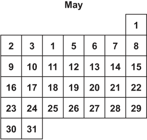

# 12 假日检测器

无论何时，似乎总有一个假日即将到来。这可能是一个宗教假日、国庆日或某些其他节日活动。许多人可能会从工作中得到一天假期来庆祝。对于程序员来说，假日也是一个庆祝活动，但不是从工作中：编码者仍然在编码，但这是一个更加愉快的体验，因为其他人都在度假，这意味着更少的干扰。

你的电脑不在乎一天是否是假日。它并不是无知的；它只是不知道。为了帮助电脑理解哪一天是假日，以及帮助你完成其他依赖于知道哪些天是假日的编程项目，你必须：

+   理解操作系统如何使用返回值

+   在 C 中处理日期编程

+   回顾主要假日

+   计算常规假日

+   处理不规则假日

+   确定复活节何时到来

+   测试你的假日函数

这些任务有助于构建检测和报告特定年份某一天假日的例行程序。这种实用工具本身可能并不特别有用，但在编程日期或执行其他需要知道假日何时到来的任务时，它就派上用场了。例如，我编写了一个股票追踪器，其中知道哪些天不要获取股票数据是有用的，因为市场关闭。我的垃圾回收提醒 shell 脚本使用我的假日程序来查看垃圾回收日是否已改变。

本章中介绍的例程在第十三章介绍的日历程序中也发挥作用。

## 12.1 操作系统想要它的手续费

你是否曾好奇为什么 `main()` 是一个整数函数？多年前，C 程序员随意地将其声明为 `void` 函数。真是令人震惊！老程序员可能仍然会在他们的代码中使用 `void main()`。哎呀，即使是备受尊敬的 K&R 第一版——《C 程序设计语言》（Prentice-Hall）——甚至都没有费心去强制转换 `main()` 函数。尽量别让自己陷入混乱。

将 `main()` 函数强制转换为 `int` 的原因是它必须向操作系统返回一个值。就像任何高利贷者一样，当操作系统将其一些资源（内存和处理器时间）释放给另一个程序时，它希望得到一些回报，比如利息——手续费，或“手续费”。这个回报就是一个整数值。这个值通常被忽略（只是别错过付款），或者被用于某些巧妙和创新的方式。无论如何，这个值是必需的。

### 12.1.1 理解退出状态与终止状态

停止程序的方式不止一种。最自然的方式是程序正常结束，在 `main()` 函数的末尾使用返回语句将其值传递回操作系统。这个值官方上被称为程序的退出状态。

如果程序在`main()`函数退出之前停止，它有一个终止状态。例如，在`main()`函数之外嵌套的`exit()`语句会停止程序。在这种情况下，`exit()`传递给操作系统的值被称为终止状态。

终止状态。退出状态。是的，那些书呆子喜欢挑刺。关键是程序退出的方式会影响返回值的解释。许多生成其他程序（进程）的函数使用终止状态而不是退出状态。终止状态通常是 0 表示成功，否则为-1。这个值与可能的退出状态不同。在编写程序时要注意这个差异，尤其是在你选择与书呆子对话时。

### 12.1.2 设置返回值

在`main()`函数中的`return`语句负责将一个值发送回操作系统。将一个整数值发送到母舰对于`main()`函数至关重要：错过它，编译器就会用它的瘦手指指着你说，就像唐纳德·萨瑟兰在《人体互换》结尾时的尖叫。

下一个列表显示了`return01.c`的源代码。这个程序只有一个任务：向操作系统返回一个值。如果没有指定命令行参数，则返回零。

列表 12.1 `return01.c`的源代码

```
#include <stdlib.h>                            ❶

int main(int argc, char *argv[])
{
    if( argc>1 )                               ❷
    {
        return( strtol(argv[1],NULL,10) );     ❸
    }
    else
    {
        return(0);                             ❹
    }
}
```

❶ 不需要`stdio.h`头文件，因为代码中没有使用 I/O 函数。

❷ 如果存在命令行选项，尝试将其转换为整数

❸ 将字符串`argv[1]`转换为整数（*长整型*）值

❹ 当没有参数时，返回零

`return01.c`中的`strtol()`函数将命令提示符中持有的字符串`argv[1]`，第一个参数，转换为十进制整数。如果字符串无法转换（它不包含数字），则返回值 0。

程序通过`return`语句放弃其值。也可以使用`exit()`函数，但这个值是退出状态，而不是终止状态。（我写那是为了那些书呆子；别担心这里的差异。）

这里是一个示例运行：

是的，代码没有输出，即使你指定了参数。而且，是的，返回的值被操作系统消耗。它可供 shell 解释。尽管操作系统像高利贷者一样，但很少或几乎不做任何关于程序返回值的事情。这项工作可以由其他程序完成，但具体来说，退出状态可供 shell 脚本使用。

### 12.1.3 解释返回值

程序输出的值留在了操作系统的门口。尽管不需要对这个值做任何事情，但它仍然可供 shell 使用——直到另一个程序存入另一个值。

要演示如何从 shell 访问返回值，重新运行`return01.c`程序，输入程序名称，假设为`return01`，以及一个作为参数的值，例如：

```
$ ./return01 27
```

程序将值 27 返回给操作系统。这个值通过 shell 脚本变量$?访问。要查看它，请输入 *echo* 命令后跟 $?:

```
$ echo $?
27
```

Shell 脚本可以使用这个值来确定某些操作的结果。唉，在 Linux 中，非 shell 脚本程序很难读取它所启动的另一个程序的返回值。这样的任务是有可能的，我本可以轻易地偏离主题来描述这些激动人心的细节，但这超出了本章的范围。

下面的列表中的 return02.c 的源代码试图捕获 *return01* 程序返回的值。使用 *system()* 函数以返回值 99 执行 *return01*。程序的目的在于展示 *system()* 函数不会捕获程序的返回值。

列表 12.2 return02.c 的源代码

```
#include <stdio.h>
#include <stdlib.h>

int main()
{
    int r;

    r = system("./return01 99");            ❶
    printf("The return value is %d\n",r);   ❷

    return(r);
}
```

❶ 运行 *return01* 程序并设置返回值为 99

❷ 报告 *system()* 函数返回的值

*system()* 函数的单个参数是你会在命令提示符中输入的内容。该函数可以返回各种值，尽管如果调用成功，返回的值是启动来运行程序的 shell 的终止状态。这个值不是运行程序的返回值。以下是一个示例运行：

```
The return value is 25344
```

执行 *system()* 函数后，shell 将值 25344 返回给操作系统。

在 Windows 中，*system()* 函数的行为不同。与 Linux 不同，它返回运行任何程序生成的值。以下是同一代码在 Windows 中构建的示例输出，指定了选项 99：

```
The return value is 99
```

作为一位资深的 MS-DOS/Windows 程序员，我记得很久以前在各种程序中使用这个技巧与 *system()* 函数。因为 system()在 Linux 中的行为不同，依赖于该函数来报告程序的返回值并不是你应该做的事情。

是的，我知道：Linux 中的 *system()* 函数确实返回运行程序的退出状态——shell 的。我想要表达的观点是，该函数不能用来检查另一个程序的返回值。

其他启动进程的函数——*fork()*, *popen()*, 等等——的行为与 *system()* 类似：启动的程序可能生成退出状态，但这个值不会被调用该函数的报告。

如我之前所述，可以启动一个进程并捕获其返回值。如果你对过程好奇，请访问我的博客并搜索 wait()函数：[`c-for-dummies.com/blog`](https://c-for-dummies.com/blog/).

### 12.1.4 使用预设的返回值

C 语言的大佬们想让你知道，退出状态为 0 表示成功；一切按计划进行。退出状态为 1 表示出了问题。我在我的代码中使用这种一致性，但不要使用在 stdlib.h 头文件中可用的定义常量：

```
EXIT_FAILURE
EXIT_SUCCESS
```

这两个值分别定义为 1 和 0，代表失败和成功。定义的常量是一致的——对所有编译器和平台都相同。

下面的列表显示了 return03.c 的源代码，它生成一个随机整数，0 或 1。这个值用于确定返回的退出状态是 EXIT_FAILURE 还是 EXIT_SUCCESS。

列表 12.3 return03.c 的源代码

```
#include <stdio.h>
#include <stdlib.h>
#include <time.h>

int main()
{
    int r;

    srand( (unsigned)time(NULL) );                                ❶

    r = rand() % 2;                                               ❷
    if(r)                                                         ❸
    {
        fprintf(stderr,"Welp, this program screwed [CA]up!\n");   ❹
        return(EXIT_FAILURE);
    }
    else
    {
        printf("Everything went ducky!\n");                       ❺
        return(EXIT_SUCCESS);
    }
}
```

❶ 初始化随机数生成器

❷ 生成一个随机值并将其存储在 r 中

❸ 使用 r 测试成功（零）或失败（一）

❹ 将错误输出到标准错误设备——出于传统

❺ 将非错误消息发送到标准输出。

程序的输出取决于生成的随机数。为了确认值，你可以在命令提示符下使用$?变量：

```
$ ./a.out
Welp, this program screwed up!
$ echo $?
1
```

还有：

```
$ ./a.out
Everything went ducky!
$ echo $?
0
```

记住，返回值不必局限于 0 和 1。许多程序和实用程序返回不同的值，每个值都可以由 shell 脚本解释以确定发生了什么。这些值的解释取决于程序的目的，以帮助它完成其功能。

## 12.2 所有关于今天

很久以前，美国的国庆节在特定的日子。我记得，当我年轻的时候，我可以在林肯的生日*和*乔治·华盛顿的生日都放假。作为一个孩子，我会在二月份为了任天堂 Switch 而放弃两天学校假期。

嗯，也许不是。

在你确定哪一天是假日之前，你需要一个参考点。这个点就是今天，从操作系统获取的当前日期。或者你也可以用任何旧日期填充 tm 结构，并从这里开始工作。通过调用适当的 C 语言函数，这两项内容都很容易获得。

### 12.2.1 获取今天的日期

早期个人电脑时代的标志之一是提示：

```
The current date is: Tue 1-01-1980
Enter the new date: (mm-dd-yy)
```

MS-DOS 不知道今天是否是假日，因为它甚至不知道今天是星期几！用户必须输入当前日期。最终，技术被添加到主板上以保留当前日期和时间。这种设置就是现代计算机的工作方式，但有了互联网时间服务器来保持时钟准确。你的 C 代码可以使用这些信息来获取计算机所知的当前日期和时间。

下面的列表显示了 C 语言的典型时间代码。当前纪元值——自 1970 年 1 月 1 日以来的秒数——通过*time()*函数获取并存储在*time_t*变量中。这个变量用于*localtime()*函数填充 tm 结构，即今天。tm 结构的成员包含个别的时间 tidbits 值，这些值被输出。

列表 12.4 getdate01.c 的源代码

```
#include <stdio.h>
#include <time.h>

int main()
{
    time_t now;
    struct tm *today;
    int month,day,year,weekday;

    now = time(NULL);                    ❶
    today = localtime(&now);             ❷

    month = today->tm_mon+1;             ❸
    day = today->tm_mday;
    weekday = today->tm_wday;
    year = today->tm_year+1900;          ❹

    printf("Today is %d, %d %d, %d\n",   ❺
            weekday,
            month,
            day,
            year
          );

    return(0);
}
```

❶ 获取自 1970 年 1 月 1 日以来的秒数——Unix 纪元

❷ 将今天的 tidbits 填充到 tm 结构中

❸ tm_mon 成员从 1 月为 0 开始。

❹ tm_year 成员从 1901 年开始。

❺ 输出从 tm 结构获得的价值

如果你编写过任何与时间相关的程序，这个代码的方法应该很熟悉。输出显示了当前日期的以下格式：

```
Today is 1, 12 6, 2021
```

当然，输出可以通过人类来使其可读。除非您是真正的极客，否则您可能不会将“1”识别为星期一的价值。

练习 12.1

将 getdate01.c 的代码更新为输出星期几和月份的字符串。这个改进需要向代码中添加两个字符串数组，以及其他更新，包括对*printf()*函数的更新。

我的解决方案在在线仓库中作为 getdate02.c 提供。请在您看到我是如何做到的之前，自己尝试这个练习。我代码中的注释解释了正在发生的事情——包括您可能会忘记的一个重要观点。

### 12.2.2 获取任何旧日期

*time()*函数获取当前时间，一个包含从 1970 年 1 月 1 日以来经过的秒数的*time_t*值。这个值本身没有用，这就是为什么像*localtime()*这样的函数可以帮助您整理细节的原因。但除了今天之外的其他日期怎么办？

可以回填一个 tm 结构体。您为各种成员分配值，然后使用*mktime()*函数将这些时间片段转换为*time_t*值。此外，*mktime()*函数会为您填充未知细节，例如星期几。如果您计划确定假日是哪一天，这些信息至关重要。

这是*mktime()*函数的*man*页格式：

```
time_t mktime(struct tm *tm);
```

函数传递了一个部分填充的 tm 结构体的地址。返回一个*time_t*值，但更重要的是，剩余的 tm 结构体被填充了关键细节。

*mktime()*函数在 time.h 头文件中声明。

作为快速参考，表 12.1 显示了 tm 结构体的常见成员。

表 12.1 tm 结构体的成员

| 成员 | 参考 | 范围/备注 |
| --- | --- | --- |
| tm_sec | 秒 | 0 到 60（60 允许闰秒） |
| tm_min | 分钟 | 0 到 59 |
| tm_hour | 小时 | 0 到 23 |
| tm_mday | 月份中的天数 | 1 到 31 |
| tm_mon | 月份 | 0 到 11 |
| tm_year | 年 | 当前年份减去 1900 |
| tm_wday | 星期 | 0 到 6，星期日到星期六 |
| tm_yday | 一年中的天数 | 0 到 365；0 代表 1 月 1 日 |
| tm_isdst | 夏令时 | 正值表示夏令时；零表示不是；负值表示数据不可用 |

假设您想找出 2022 年 4 月 12 日的星期几。下一列表中显示的代码尝试通过填充 tm 结构体的三个成员：tm_mon、tm_day 和 tm_year 来实现这一点。对 tm_mon 成员进行了调整，它使用 0 代表 1 月，对 tm_year 成员进行了调整，它从 1900 年开始计数。一个*printf()*语句以 mm/dd/yyyy 格式输出结果，同时也访问了新填充的 tm_wday 成员以输出星期几字符串。

列表 12.5 getdate03.c 的源代码

```
#include <stdio.h>
#include <time.h>

int main()
{
    struct tm day;
    const char *days[] = {
        "Sunday", "Monday", "Tuesday", "Wednesday",
        "Thursday", "Friday", "Saturday", "Sunday"
    };

    day.tm_mon = 4-1;                         ❶
    day.tm_mday = 12;                         ❷
    day.tm_year = 2022-1900;                  ❸

    mktime(&day);                             ❹

    printf("%02d/%02d/%04d is on a %s\n",     ❺
            day.tm_mon+1,
            day.tm_mday,
            day.tm_year+1900,
            days[day.tm_wday]
          );

    return(0);
}
```

❶ 我使用这种格式是因为 0 代表 1 月，所以 4（四月）减去 1 促使我再次检查。

❷ 月份的第 12 天

❸ 这种格式使得我想要的日期 2022 年可读。

❹ 转换部分填充的 tm 结构体

❺ 输出结果

这是程序的输出：

```
09/11/0122 is on a Tuesday
```

啊，122 年的 9 月 11 日，无论那天是星期二与否，都是意料之外的。这是我 Linux 机器的输出。在 Macintosh 上，我看到了这样的输出：

```
08/22/5839 is on a Thursday
```

奇怪的是，5839 年的 8 月 22 日是在星期四。计算机很神奇，不仅知道确切的日期，而且我们的爬行动物统治者将继续使用公历。显然，出了点问题。这类错误很令人沮丧，尤其是在代码干净编译的情况下。

问题在于 tm 结构中包含垃圾数据，这些数据被错误地解释或与预设的三个值冲突。我的解决方案是在设置日期、月份和年份的语句下方也设置小时、分钟和秒的值，添加以下三行代码：

```
day.tm_hour = 0;
day.tm_min = 0;
day.tm_sec = 0;
```

这种更改可以在源代码文件 getdate04.c 中找到，该文件可在在线仓库中找到。构建后，这是输出：

```
04/12/2022 is on a Tuesday
```

我使用了一个油腻的老车库日历来确认，2022 年 4 月 12 日确实是一个星期二。

学到的教训是，如果你知道月份、日期和年份，就可以通过填充六个 tm 结构成员，如这里概述的那样，并调用*mktime()*函数来获取日期的详细信息。然而，即使如此，你也可能得到错误的日期。

## 12.3 祝大家节日快乐

看起来每一天都是假日、节日、圣人日，或者是为了某个原因、名人、英雄或历史人物而宣布的日子。你可能在当地电视上看到发胶娃娃欢快地宣布，“嗯，今天是全国模仿猫头鹰叫声日……”或者类似的胡言乱语。这种填充内容之所以可能，是因为每一天都是某种庆祝活动——而且这是新闻淡季。

为了本章的目的，假日必须是一件大事，比如全国假日，每个人都放假。我个人的重大假日标志是邮件不送。排除每个星期日，这些假日很少，通常每月只有一个。这就是我想要我的假日检测器报告的假日类型，尽管你可以自由地修改代码以列出任何假日——包括每个星期日。

### 12.3.1 回顾美国的假日

美国有一些假日，尽管并非每个国家假日都对每个人都是休息日。相反，我考虑表 12.2 中显示的具体假日。对于这些假日，大多数人都有休息日，政府办公室关闭，银行关闭，学校放假，邮件不送，人们也不会像平时那样频繁地打电话和发电子邮件。

表 12.2 美国国家假日

| 假日 | 日期 | 备注 |
| --- | --- | --- |
| 新年 | 1 月 1 日 | 如果这个假日发生在周末，则为周五或周一的假日。 |
| 马丁·路德·金纪念日 | 一月的第三个星期一 |  |
| 华盛顿诞辰 | 二月第三个星期一 | 非正式称为总统日。 |
| 复活节 | 三月或四月的星期日 | 由于是根据农历计算，所以日期会有所变化。 |
| 阵亡将士纪念日 | 五月的最后一个星期一 |  |
| 黑奴解放日 | 6 月 19 日 | 当这个假日落在周末时，为周五/周一假日。 |
| 独立日 | 7 月 4 日 | 当这个假日落在周末时，为周五/周一假日。 |
| 劳动节 | 九月的第一个星期一 |  |
| 哥伦布日 | 十月的第二个星期一 | 也被称为原住民日。并非所有政府办公室都放假。 |
| 退伍军人节 | 11 月 11 日 | 当这个假日落在周末时，为周五/周一假日。 |
| 感恩节 | 11 月的第四个星期四 |  |
| 圣诞节 | 12 月 25 日 | 当这个假日落在周末时，为周五/周一假日。 |

一些假日，如独立日和圣诞节，是特定于某一天和日期的，尽管假日通常在周末之后的周五或周一庆祝。其他假日则根据月份的周数或其他因素变动，如表 12.2 所示。

在计算假日时，你可以设置两个日期：假日的实际日期和假日被观察的日期。我所见到的多数日历都显示了这两个日期，例如圣诞节和圣诞节观察日。在本章后面将展示如何添加此类编程，例如当假日落在星期日时，庆祝活动在星期一。

### 12.3.2 在英国发现假日

作为一名叛乱者，我并不知道在英国（或者任何其他国家，实际上）哪些日子被庆祝为假日。从狄更斯的作品中，我知道在英格兰圣诞节至少是一个节日。我怀疑英国人不会像我们在美国那样庆祝乔治·华盛顿的生日——好吧，也许不是以同样的方式。其他英国的假日似乎都是银行假日，很可能是为了庆祝英国最大的银行。即使不在银行工作的人也能得到一天的休息，据说是这样。

表 12.3 列出了互联网上报道的英国国家假日。其中只有三个与特定日期相关：新年、圣诞节和节礼日。如果这些假日中的任何一个是星期六或星期日，那么放假日将是下一个星期一。如果圣诞节或节礼日发生在周末，可能会看到星期一和星期二都放假，不知何故，星期二通常是圣诞节的放假日。

表 12.3 英国国家假日

| 假日 | 日期 |
| --- | --- |
| 新年 | 1 月 1 日 |
| 耶稣受难日 | 复活节前的星期五 |
| 复活节星期一 | 复活节后的星期一 |
| 五一银行假日 | 五月的第一个星期一 |
| 春季银行假日 | 五月的最后一个星期一 |
| 夏季银行假日 | 八月的最后一个星期一 |
| 圣诞节 | 12 月 25 日 |
| 节礼日 | 12 月 26 日 |

复活节假日会根据复活节的日期而变动。你必须使用算法来计算这些假日：复活节和耶稣受难日。此类代码将在本章后面展示。

别担心，我的英国、爱尔兰、苏格兰和威尔士的朋友们：我不会编写任何代码来检测英国的假日。那是你们的工作。根据本章提供的信息，这项任务是可以完成的。

## 12.4 今天是假日吗？

人类对即将到来的假日有很多线索。例如，每年八月，Costco 的购物者都会兴奋地看到圣诞节的装饰品上架。还有谁能忘记三月初，到处都是绿色的三叶草和快乐的精灵提醒我们复活节呢？这些文化线索对计算机来说毫无意义——除非你，程序员，愿意帮忙。

对于一个计算机假日检测器来说，需要三个及时的小贴士：

+   月份编号

+   月份中的某一天

+   星期几

知道这三个项目后，计算机可以识别一个日期为假日。

在本章的剩余部分，我将使用美国的假日。所展示的相同技术也可以用来检测其他国家的假日，前提是它们遵循太阳历的一致性。我不会介绍如何将农历假日映射到太阳历假日，除了在本章后面的复活节。

### 12.4.1 报告常规日期假日

最容易报告的假日是可预测的——我称之为常规日期假日。每个这样的假日都固定在特定的月份和日期：

+   元旦，1 月 1 日

+   独立日，6 月 19 日

+   独立日，7 月 4 日

+   退伍军人节，11 月 11 日

+   圣诞节，12 月 25 日

报告这些日期，我使用 *isholiday()* 函数。下面是这个函数的原型：

```
int isholiday(struct tm *d)
```

函数的唯一参数是一个 tm 结构的地址，这个结构是由 *localtime()* 函数返回并由 *mktime()* 函数使用的。在 *isholiday()* 函数的这个阶段重用这个结构很方便。

下面的 *isholiday()* 函数返回一个整数值：非假日为 0，假日为 1。该函数直接比较月份和日期值来报告常规日期假日，如列表所示。请注意，所使用的月份值从 1 月开始为零。

列表 12.6 *isholiday()* 函数

```
int isholiday(struct tm *d)
{
    if( d->tm_mon==0 && d->tm_mday==1)          ❶
        return(1);

    if( d->tm_mon==5 && d->tm_mday==19)         ❷
    return(1);

    if( d->tm_mon==6 && d->tm_mday==4)          ❸
        return(1);

    if( d->tm_mon==10 && d->tm_mday==11)        ❹
        return(1);

    if( d->tm_mon == 11 && d->tm_mday == 25)    ❺
        return(1);

    return(0);
}
```

❶ 元旦

❷ 独立日

❸ 独立日

❹ 退伍军人节

❺ 圣诞节

*main()* 函数调用 *time()* 和 *localtime()* 函数来获取当前时间信息并将其打包到 tm 结构中。这个结构被传递给 *isholiday()* 并报告结果。你可以在在线仓库中找到完整的源代码，即 isholiday01.c。下面是一个示例运行：

```
Today is 12/09/2021, not a holiday
```

对于我对 *isholiday()* 函数的第一个更新，我希望该函数能够报告假日的名称。为了实现这个改进，必须放弃使用 tm 结构作为 *isholiday()* 函数的参数。相反，我使用了一个新的结构 holiday，它具有以下成员：

```
struct holiday {
    int month;
    int day;
    char *name;
};
```

月份和日期成员与 tm 结构的 tm_mon 和 tm_mday 成员相匹配。名称成员是一个 *char* 指针，用于存储假日的名称。分配给这个指针的字符串在 *isholiday()* 函数中声明，如下所示。在那里，你还可以看到对每个 *if* 判断的更新，现在它将 holiday 结构的名称成员分配过去。

列表 12.7 更新后的 *isholiday()* 函数以返回假日名称

```
int isholiday(struct holiday *h)     ❶
{
    char *n[] = {                    ❷
        "New Years Day",
        "Juneteenth",
        "Independence Day",
        "Veterans Day",
        "Christmas"
    };

    if( h->month==0 && h->day==1)
    {
        h->name = n[0];              ❸
        return(1);                   ❹
    }

    if( h->month==5 && h->day==19)   ❺
    {
        h->name = n[1];
        return(1);
    }

    if( h->month==6 && h->day==4)
    {
        h->name = n[2];
        return(1);
    }

    if( h->month==10 && h->day==11)
    {
        h->name = n[3];
        return(1);
    }

    if( h->month== 11 && h->day == 25)
    {
        h->name = n[4];
        return(1);
    }

    return(0);                       ❻
}
```

❶ 假期结构必须作为指针传递，因为在这个函数中修改了名称成员。

❷ 按时间顺序分配给假日的字符串

❸ 分配名称成员

❹ 对于真正的假期返回 1

❺ 对五个假日中的每一个重复此模式。

❻ 当日期不是假日时返回 0

*main()* 函数也进行了更新，以分配那里声明的假期结构中的值。输出语句也进行了修改，以输出命名的假期。例如：

```
Today is 12/25/2021, Christmas
```

此更新的完整源代码可在在线存储库中找到，即 isholiday02.c。

目前检测到的假日是绝对的。如果你在创建日历（见第十三章）并想用红色标记假日，*isholiday()* 函数会正确报告值。但如果你想记录假日是如何庆祝的，就需要更多的编码。

特别地，当这些假日中的任何一个落在周末时，通常是那个周末的前一个星期五或后一个星期一，大家都会休息一天：当独立日（7 月 4 日）在星期日时，国家会在 7 月 5 日星期一休息。尽管当这种类型的假日落在星期二、星期三或星期四时，前一天或后一天并不被视为假日，尽管有些人，主要是懒惰的人，会额外休息几天。

为了更新 isholiday02.c 的代码，并改进 *isholiday()* 函数，需要进行一些更改。这些更改考虑了假日落在周末的情况。

首先是对假期结构进行更新，它添加了一个新成员 wday。这个成员与 tm 结构中的 tm_wday 成员相呼应。它表示一周中的某一天——0 代表星期日，6 代表星期六。以下是更新的定义：

```
struct holiday {
    int month;
    int day;
    int wday;
    char *name;
};
```

因为测试只需要两天，所以我添加了两个定义的常量：

```
#define FRIDAY 5
#define MONDAY 1
```

当新年假日在星期五庆祝时，日期是前一年的 12 月 31 日。这种差异使得新年假日的测试比其他星期五/星期一测试要复杂一些。下面的列表显示了进行新年假日测试所需的代码，由于前一年的重叠，这个测试并不像其他假日测试那样优雅。

列表 12.8 检测新年假日和任何星期五/星期一庆祝的语句

```
if( h->month==11 && h->day==31 && h->wday==FRIDAY )   ❶
{
    h->name = n[0];
    return(2);                                        ❷
}
if( h->month==0 && h->day==1 )                        ❸
{
    h->name = n[0];
    return(1);                                        ❹
}
if( h->month==0 && h->day==2 && h->wday==MONDAY )     ❺
{
    h->name = n[0];
    return(2);                                        ❻
}
```

❶ 特别检查 12 月 31 日星期五

❷ 对于“庆祝”假期返回 2

❸ 检查新年假日

❹ 对于实际假期返回 1

❺ 特别检查 1 月 2 日星期一

❻ 对于“庆祝”假期返回 2

*isholiday()* 函数的新返回代码是 2，如列表 12.8 所示。这个值在 *main()* 函数中被独特处理，该函数位于完整的更新源代码文件 isholiday03.c 中。以下是一个非假日的示例运行：

```
Today is 12/09/2021, not a holiday
```

对于一个假日：

```
Today is 12/25/2021, Christmas
```

周一假期：

```
Today is 12/26/2022, Christmas observed
```

然而，在代码中，我发现了一些让我烦恼的事情：确定新年之后，接下来的四个假日都使用了类似的表达式。例如，Juneteenth 的构造在下一个列表中显示。这段代码的结构与测试下一个三个假日的结构相同。唯一不同的是具体的日期值。这有很多重复的代码。

列表 12.9 检测 Juneteenth 和其他假日的语句

```
if( h->month==5 )                              ❶
{
    if( h->day>17 && h->day<21 )               ❷
    {
        if( h->day==18 && h->wday==FRIDAY )    ❸
        {
            h->name = n[1];
            return(2);                         ❹
        }
        if( h->day==20 && h->wday==MONDAY )    ❺
        {
            h->name = n[1];
            return(2);                         ❻
        }
        if( h->day==19 )                       ❼
        {
            h->name = n[1];
            return(1);                         ❽
        }
    }
}
```

❶ Juneteenth 总是在六月。

❷ 关注相关日期，包括之前（18），当天（19）和之后（20）

❸ 检查庆祝日之前的日期

❹ 对于庆祝日返回 2

❺ 检查庆祝日之后的日期

❻ 对于庆祝日返回 2

❼ 检查实际假日

❽ 对于假日返回 1

每当我看到我的代码中有这样的重复时，它都会大声呼吁创建一个函数。我创建的函数名为*weekend()*。以下是它的原型：

```
int weekend(int holiday, int mday, int wday)
```

函数有三个参数。整数 holiday 是假日发生的月份中的日期。整数 mday 和 wday 分别是月份中的日期和星期中的日期值。这三个项目代表了*isholiday()*函数中每个假日测试从源代码文件 isholiday03.c 中变化的不同值。

下面的列表显示了*weekend()*函数。它包含了列表 12.9 中显示的大部分代码，重复的语句，但已修改为使用变量而不是具体的月份日期值。此代码评估假日之前和之后的日期，星期五和星期一，以确定庆祝日。函数中没有处理的是假日名称的字符串赋值。

列表 12.10 isholiday04.c 中的*weekend()*函数

```
int weekend(int holiday, int mday, int wday)
{
  if( mday>holiday-2 && mday<holiday+2 )      ❶
  {
    if( mday==holiday-1 && wday==FRIDAY )     ❷
      return(2);
    if( mday==holiday+1 && wday==MONDAY )     ❸
      return(2);
    if( mday==holiday )                       ❹
      return(1);
  }
  return(0);                                  ❺
}
```

❶ 窄化搜索的日期

❷ 测试假日之前的星期五

❸ 测试假日之后的星期一

❹ 测试假日日期本身

❺ 对于没有匹配项返回 0

这个函数的更新可以在在线仓库中找到，文件名为 isholiday04.c。*isholiday()*函数也进行了更新，以便将大部分工作传递给*weekend()*函数。代码比之前读起来更清晰。

可以对*isholiday()*函数进行进一步的改进。但首先，必须处理不规则假日。

### 12.4.2 处理不规则假日

与具体日期的假日不同，不规则假日发生在每月的特定周和日。除了感恩节在星期四之外，这些假日都是星期一。这些假日是不规则的，因为它们每年都落在日期范围内，所以程序必须更深入地思考这些假日发生的时间。作为回顾，以下是美国的非规则假日：

+   马丁·路德·金纪念日，一月的第三个星期一

+   国庆日，二月的第三个星期一

+   阵亡将士纪念日，五月的最后一个星期一

+   劳动节，九月的第一个星期一

+   哥伦布日，十月的第二个星期一

+   感恩节，十一月的第四个星期四

与常规的日期假日不同，你不需要担心观察日的变动；这些都是特定星期的假日。这种一致性意味着可以为每个假日计算一个月中的日期范围。我已经在表 12.4 中总结了每周的日期范围。

表 12.4 某周星期一假日的日期范围

| 月份中的周 | 周一范围 |
| --- | --- |
| 第一 | 1 至 7 |
| 第二 | 8 至 14 |
| 第三 | 15 至 21 |
| 第四 | 22 至 28 |
| 最后 | 25 及以上 |

第四周和最后一周之间的差异出现在那些有五个周一的月份中，例如 5 月，如图 12.1 所示：当 5 月 31 日是星期一时，它是第五个周一。5 月 24 日仍然在第四周（参见表 12.3），但在这种月份配置中，由于 31 日是星期一，它是最后一天。这就是为什么最后一周的日期范围与第四周不同的原因。



图 12.1 五个周一的 5 月配置

对于感恩节，该月的最后一个星期四可能从 22 日到 28 日的任何一天。这个值在表 12.3 的第四行中显示，也适用于星期四。

当这些最终的不规则假日被编码时，*isholiday()* 函数几乎完成。为了帮助这样做，我创建了一些宏并添加了定义的常量 THURSDAY：

```
#define FRIDAY 5
#define MONDAY 1
#define THURSDAY 4
#define FIRST_WEEK h->day<8
#define SECOND_WEEK h->day>7&&h->day<15
#define THIRD_WEEK h->day>14&&h->day<22
#define FOURTH_WEEK h->day>21&&h->day<29
#define LAST_WEEK h->day>24&&h->day<32
```

工作日假日落在星期五、星期一或星期四，因此定义的常量增加了代码的可读性。

这里显示的宏与表 12.3 中呈现的日期值相关。变量 h->day 在 *isholiday()* 函数中使用。这些宏增加了函数的可读性。例如，此代码没有使用宏：

```
if( h->day>14&&h->day<22 )
{
    h->name = n[1];
    return(1);
}
```

但这段代码与之前的代码片段做的是同样的事情，但可读性要好得多：

```
if( THIRD_WEEK )
{
    h->name = n[1];
    return(1);
}
```

为了避免任何混淆，*isholiday()* 函数的整个更新代码在下一个列表中显示。我承认它有点长，但它显示了捕获美国 12 个年度假日的所有代码，除了复活节，它将在下一节中介绍。除了元旦之外，请注意常规和不规则假日使用的模式。列表中没有显示 *weekend()* 和 *main()* 函数。

列表 12.11 *isholiday()* 函数

```
int isholiday(struct holiday *h)
{
    char *n[] = {
        "New Years Day",
        "Martin Luther King Day",
        "Presidents Day",
        "Memorial Day",
        "Juneteenth",
        "Independence Day",
        "Labor Day",
        "Columbus Day",
        "Veterans Day",
        "Thanksgiving",
        "Christmas"
    };
    int r;

    if( h->month==11 && h->day==31 && h->wday==FRIDAY )    ❶
    {
        h->name = n[0];
        return(2);
    }
    if( h->month==0 && h->day==1 )
    {
        h->name = n[0];
        return(1);
    }
    if( h->month==0 && h->day==2 && h->wday==MONDAY )
    {
        h->name = n[0];
        return(2);
    }

    if( h->month==0 && h->wday==MONDAY )                   ❷
    {
        if( THIRD_WEEK )
        {
            h->name = n[1];
            return(1);
        }
    }

    if( h->month==1 && h->wday==MONDAY )                   ❸
    {
        if( THIRD_WEEK )
        {
            h->name = n[2];
            return(1);
        }
    }

    if( h->month==4 && h->wday==MONDAY )                   ❹
    {
        if( LAST_WEEK )
        {
            h->name = n[3];
            return(1);
        }
    }

    if( h->month==5 )                                      ❺
    {
        r = weekend(19,h->day,h->wday);
        h->name = n[4];
        return(r);
    }

    if( h->month==6 )                                      ❻
    {
        r = weekend(4,h->day,h->wday);
        h->name = n[5];
        return(r);
    }

    if( h->month==8 && h->wday==MONDAY )                   ❼
    {
        if( FIRST_WEEK )
        {
            h->name = n[6];
            return(1);
        }
    }
    if( h->month==9 && h->wday==MONDAY)                   ❽
    {
        if( SECOND_WEEK )
        {
            h->name = n[7];
            return(1);
        }
    }

    if( h->month==10 )                                    ❾
    {
        r = weekend(11,h->day,h->wday);
        h->name = n[8];
        return(r);
    }

    if( h->month==10 && h->wday==THURSDAY )               ❿
    {
        if( FOURTH_WEEK )
        {
            h->name = n[9];
            return(1);
        }
    }

    if( h->month==11 )                                    ⓫
    {
        r = weekend(25,h->day,h->wday);
        h->name = n[10];
        return(r);
    }

    return(0);
}
```

❶ 元旦

❷ 马丁·路德·金纪念日

❸ 国庆日

❹ 阵亡将士纪念日

❺ 美国解放日

❻ 独立日

❼ 劳动节

❽ 哥伦布日

❾ 退伍军人节

❿ 感恩节

⓫ 圣诞节

这里是程序非假日运行的一个示例：

```
Today is 2/20/2022, not a holiday
```

以及假日的一个示例：

```
Today is 2/21/2022, Presidents Day
```

在更彻底地测试这段代码后，我发现了一个计算退伍军人节和感恩节的缺陷，这两个节日都发生在 11 月。以下是相关的代码片段：

```
    if( h->month==10 )
    {
        r = weekend(11,h->day,h->wday);
        h->name = n[8];
        return(r);
    }

    if( h->month==10 && h->wday==THURSDAY )
    {
        if( FOURTH_WEEK )
        {
            h->name = n[9];
            return(1);
        }
    }
```

第一个 *if* 测试捕获了 11 月所有的日期并返回。这种退出意味着下一个针对 11 月的 *if* 测试 h->month==10 永远不会发生。哎呀。

为了解决这个问题，必须对 11 月进行单个*if*测试。然后可以对感恩节和退伍军人节进行测试。以下是更新的代码：

```
if( h->month==10 )
{
    if( h->wday==THURSDAY && FOURTH_WEEK )
    {
        h->name = n[9];
        return(1);
    }
    r = weekend(11,h->day,h->wday);
    h->name = n[8];
    return(r);
}
```

进行了此更改后，代码现在忠实地报告了感恩节和退伍军人节。所有这些更新和添加都可以在完整的源代码列表 isholiday05.c 中找到，该列表可在在线存储库中找到。

剩下的唯一假日是最难计算的：复活节。

练习 12.2

在代码的主要更新中，添加了代表一年中各月份的常量。在*isholiday()*函数中使用这些常量，以便进行此比较

```
if( h->month==0 && h->wday==MONDAY )
```

现在看起来是这样的：

```
if( h->month==JANUARY && h->wday==MONDAY )
```

我的解决方案在在线存储库中作为 isholiday06.c 提供。为了加分，看看你是否可以使用枚举常量，这是我所做的事情。

### 12.4.3 计算复活节

复活节每年都在不同的日期，因为它是在西方文化中基于农历的最后一个剩余假日。在阳历中，复活节的日期可以是 3 月 22 日或 4 月 25 日，总是在星期日。

对于农历，复活节是春分后的第一个新月后的第一个星期日。这个日期基于犹太人的逾越节。所以，首先是春分，当太阳返回北半球，哈迪斯从冥界释放珀耳塞福涅。下一个满月——可能要过几周——必须过去，然后下一个星期五是逾越节，复活节在星期日。

在我多年前编写的原始假日检测程序中，我硬编码了复活节的日期。这很容易，但不是一种持久的解决方案。

与确定月亮相位（参见第二章）一样，复活节的日期最好通过算法来计算。与月亮算法一样，我对我的复活节算法正在发生什么一无所知；我只是把它记下来。但与月亮相位算法不同，复活节算法非常精确。

只是一个猜测：在接下来的列表中，你看到的大部分内容都与将月亮的周期映射到太阳年以及计算闰年有关。多么奇妙！传递给 easter()函数的值代表一个年份。没有返回值，因为函数本身输出复活节的日期。构建此代码需要包含 math.h 头文件，这意味着你需要在许多平台上链接数学库：在命令提示符构建时使用-lm（小写的 L）开关，指定在构建时最后使用。

列表 12.12 来自源代码文件 easter01.c 的*easter()*函数

```
void easter(int year)                  ❶
{
    int Y,a,c,e,h,k,L;                 ❷
    double b,d,f,g,i,m,month,day;      ❸

    Y = year;                          ❹
    a = Y%19;
    b = floor(Y/100);
    c = Y%100;
    d = floor(b/4);
    e = (int)b%4;
    f = floor((b+8)/25);
    g = floor((b-f+1)/3);
    h = (19*a+(int)b-(int)d-(int)g+15)%30;
    i = floor(c/4);
    k = c%4;
    L = (32+2*e+2*(int)i-h-k)%7;
    m = floor((a+11*h+22*L)/451);
    month = floor((h+L-7*m+114)/31);   ❺
    day = ((h+L-7*(int)m+114)%31)+1;   ❻

    printf("In %d, Easter is ",Y);     ❼
    if(month == 3)
        printf("March %d\n",(int)day);
    else
        printf("April %d\n",(int)day);
}
```

❶ 仅接受年份值作为唯一参数

❷ 许多整型变量

❸ 许多双变量

❹ 数学运算持续了一段时间。

❺ 获取复活节的月份，即 3 月（三月）或 4 月（四月）

❻ 获取月份

❼ 输出结果

包含 *easter()* 函数的完整源代码文件 easter01.c 可在在线仓库中找到。列表 12.13 中缺少的是 *main()* 函数。它包含一个循环，该循环使用从 2018 年到 2035 年的年份值调用 *easter()* 函数：

```
In 2018, Easter is April 1
In 2019, Easter is April 21
In 2020, Easter is April 12
In 2021, Easter is April 4
In 2022, Easter is April 17
In 2023, Easter is April 9
In 2024, Easter is March 31
In 2025, Easter is April 20
In 2026, Easter is April 5
In 2027, Easter is March 28
In 2028, Easter is April 16
In 2029, Easter is April 1
In 2030, Easter is April 21
In 2031, Easter is April 13
In 2032, Easter is March 28
In 2033, Easter is April 17
In 2034, Easter is April 9
In 2035, Easter is March 25
```

将 *easter()* 合并到 *isholiday()* 函数中需要太多的工作。相反，我寻求将其作为由 *isholiday()* 调用的伴随函数包含进来——就像代码中已经存在的 *weekend()* 函数一样。

必须修改 *easter()* 函数以接受一个日期值，并根据给定的年份返回 1 或 0，表示日期是否与复活节匹配。为了开始这段旅程，需要对现有的 *isholiday* 代码进行一些更改。首先，必须修改假日结构以包括一个年份成员：

```
struct holiday {
  int month;
  int day;
  int year;
  int wday;
  char *name;
};
```

第二，必须在 *main()* 函数中分配年份成员的值：

```
h.year = today->tm_yeari+1900;
```

记得将 1900 加到年份值上！

第三，必须在 *isholiday()* 函数中调用 *easter()*。在函数开始时，将复活节字符串添加到 n[] 指针数组中。我选择将其添加到末尾，这样不会影响函数其他部分的现有数组编号。"Easter" 字符串是数组声明中的最后一个，即 n[11]。

在 *isholiday()* 函数中的这些语句调用 *easter()* 函数。它们是函数中的最后几条语句，就在最终返回之前：

```
r = easter(h);
if( r==1 )
{
    h->name = n[10];
    return(r);
}
```

下一个列表显示了更新的 *easter()* 函数，该函数已修改以接受一个假日结构指针作为参数，并返回 1 或 0，分别表示当前日期是否为复活节。

列表 12.13：更新后的 *easter()* 函数，如源代码文件 isholiday07.c 中的样子

```
int easter(struct holiday *hday)                  ❶
{
    int Y,a,c,e,h,k,L;                            ❷
    double b,d,f,g,i,m,month,day;

    Y = hday->year;
    a = Y%19;
    b = floor(Y/100);
    c = Y%100;
    d = floor(b/4);
    e = (int)b%4;
    f = floor((b+8)/25);
    g = floor((b-f+1)/3);
    h = (19*a+(int)b-(int)d-(int)g+15)%30;
    i = floor(c/4);
    k = c%4;
    L = (32+2*e+2*(int)i-h-k)%7;
    m = floor((a+11*h+22*L)/451);
    month = floor((h+L-7*m+114)/31)-1;            ❸
    day = ((h+L-7*(int)m+114)%31)+1;

    if( hday->month==month && hday->day==day )    ❹
        return(1);                                ❺
    else
        return(0);                                ❻
}
```

❶ 函数定义已更改，接受结构指针 hday 并返回一个整型值。

❷ 我不能使用变量 h 作为函数的参数，因为它已经在算法中使用，并且我不想对其进行修改。

❸ 从最终月份值中减去 1，因为在这段代码中 1 月份是 0

❹ 测试今天是否是复活节

❺ 如果是，则返回 1

❻ 否则返回 0

最后，记得添加 math.h 头文件，以免编译器因为 *easter()* 函数中使用的 *floor()* 函数而出错。并且确保在构建代码时链接 math 库，-lm（小写的 L）。所有这些更改和更新都可以在源代码文件 isholiday07.c 中找到，该文件可在本书的在线仓库中获取。

代码运行方式与之前相同，但现在它能够识别复活节。以下是对 2022 年复活节的示例运行：

```
Today is 4/17/2022, Easter
```

### 12.4.4 运行日期关卡

为了测试 *isholiday()* 函数，必须运行它通过日期关卡。这个测试是指一个程序，它为给定年份生成从 1 月 1 日到 12 月 31 日的日期。目标是确保 *isholiday()* 函数能够正确反应，报告国家假日。

下一个列表显示了 gauntlet01.c 的代码。它包含两个字符串常量数组，用于表示月份和星期。mdays[]数组列出了每个月的天数，假设年份不是闰年；代码中二月只有 28 天。日期通过嵌套循环输出：外循环处理月份，内循环处理月份中的天数。

列表 12.14 gauntlet01.c 的源代码

```
#include <stdio.h>

int main()
{
    const char *month[] = {
        "January", "February", "March", "April",
        "May", "June", "July", "August",
        "September", "October", "November", "December"
    };
    const char *weekday[] = {
        "Sunday", "Monday", "Tuesday", "Wednesday",
        "Thursday", "Friday", "Saturday"
    };
    int mdays[] = { 31, 28, 31, 30, 31, 30, 31, 31,      ❶
        30, 31, 30, 31 };
    enum { SU, MO, TU, WE, TH, FR, SA };                 ❷
    int start_day,dom,doy,year,m;

    start_day = SA;                                      ❸
    doy = 1;                                             ❹
    year = 2022;                                         ❺
    for( m=0; m<12; m++ )                                ❻
    {
        for( dom=1; dom<=mdays[m]; dom++ )               ❼
        {
            printf("%s, %s %d, %d\n",
                    weekday[ (doy+start_day-1) % 7],     ❽
                    month[m],
                    dom,
                    year
                  );
            doy++;                                       ❾
        }
    }

    return(0);
}
```

❶ 确定每个月的天数，假设不是闰年

❷ 1 月 1 日的快捷方式，星期几的起始日

❸ 设置 2022 年的起始日，星期六

❹ 年的第一天

❺ 要输出的年份（非闰年）

❻ 遍历一年的 12 个月

❼ 遍历每个月的每一天

❽ 用于确定正确星期几的恐怖数学

❾ 增加年份的天数

代码中的数学确定正确的星期几。这个细节基于设置为 1 月 1 日正确星期几的 start_day 变量，即星期六——代码中的枚举常量 SA。年中的日子变量 doy 用于这个计算，在内循环中递增以跟踪每年的每一天。

gauntlet01.c 的源代码可在在线仓库中找到。以下是简化的输出：

```
Saturday, January 1, 2022
Sunday, January 2, 2022
Monday, January 3, 2022
Tuesday, January 4, 2022
...
Tuesday, December 27, 2022
Wednesday, December 28, 2022
Thursday, December 29, 2022
Friday, December 30, 2022
Saturday, December 31, 2022
```

这些日期都经过验证，与 2022 年的日期和星期完全匹配。我还更改了一些代码中的变量来测试其他年份，并且一切正常。

下一步是将 *isholiday()*, *weekend()*, 和 *easter()* 函数添加到代码中——整个 *isholiday* 包——以确认全年都能正确跟踪所有假日。随着 gauntlet 代码遍历每年的每一天，*isholiday()* 函数被调用。只有假日会被输出。作为复习，以下是 2022 年美国的全国假日及其日期：

+   新年：星期六，1 月 1 日

+   马丁·路德·金纪念日：星期一，1 月 17 日

+   乔治·华盛顿诞辰/总统日：星期一，2 月 21 日

+   复活节：星期日，4 月 17 日

+   阵亡将士纪念日：星期一，5 月 30 日

+   独立日：星期日，6 月 19 日

+   独立日观察日：星期一，6 月 20 日

+   独立日：星期一，7 月 4 日

+   劳动节：星期一，9 月 5 日

+   哥伦布日：星期一，10 月 10 日

+   退伍军人节：星期五，11 月 11 日

+   感恩节：星期四，11 月 24 日

+   圣诞节：星期日，12 月 25 日

+   圣诞节观察日：星期一，12 月 26 日

代码的更新可以在在线仓库中找到，作为 gauntlet02.c。它只对*main()*函数的输出格式进行了细微的更改。请记住，此代码需要链接数学库，-lm（小写的 L），以便复活节中的数学函数表现良好。以下是输出：

```
Saturday, January 1, 2022 is New Years Day
Monday, January 17, 2022 is Martin Luther King Day
Monday, February 21, 2022 is Presidents Day
Sunday, April 17, 2022 is Easter
Monday, May 30, 2022 is Memorial Day
Sunday, June 19, 2022 is Juneteenth
Monday, June 20, 2022 Juneteenth is observed
Monday, July 4, 2022 is Independence Day
Monday, September 5, 2022 is Labor Day
Monday, October 10, 2022 is Columbus Day
Friday, November 11, 2022 is Veterans Day
Thursday, November 24, 2022 is Thanksgiving
Sunday, December 25, 2022 is Christmas
Monday, December 26, 2022 Christmas is observed
```

*isholiday()* 函数可以集成到您的各种源代码文件中，或者您可以将其作为单独的模块链接到特殊程序中。这个过程在第十三章中有详细说明，该章节涵盖了输出彩色日历。
