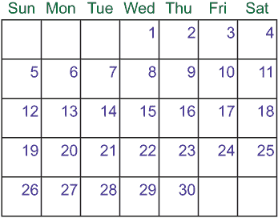
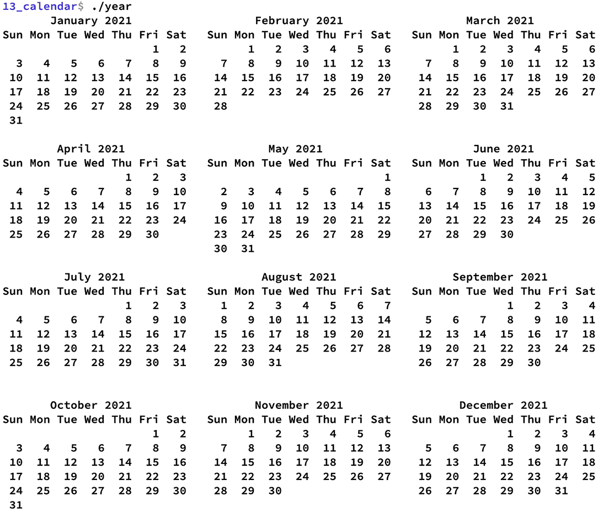
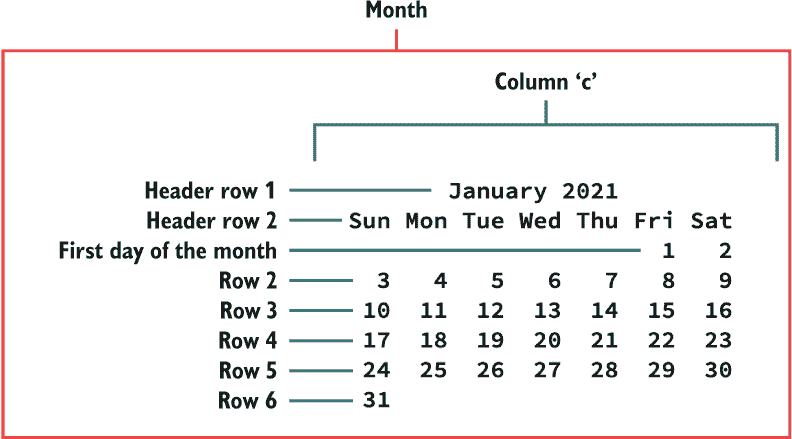
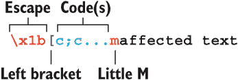
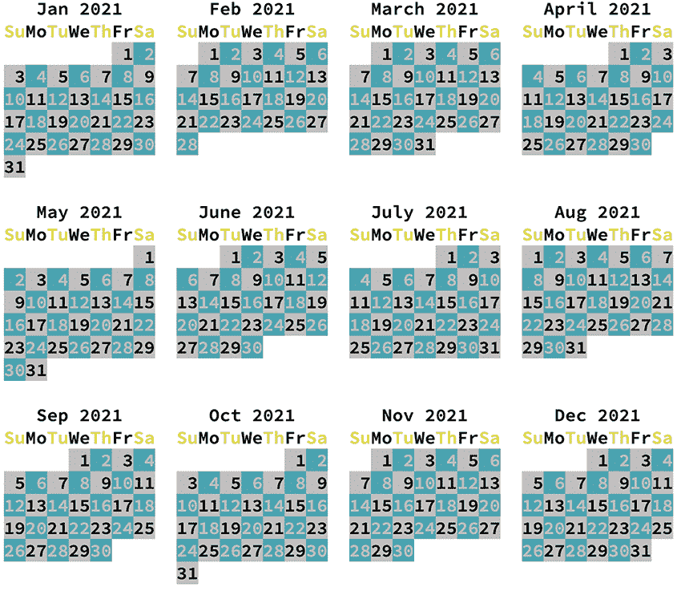

# 13 日历

不仅玛雅人发明了自己的日历。几乎每一种早期文化都为日子的流逝提供了一种分类形式。玛雅人在 2012 年获得了知名度，因为那是他们伟大的日历周期之一——长计数，或称 *b’ak’tun* 的结束。这并不是世界的末日——更像是翻过了一页那种廉价的保险公司日历。真糟糕。

大多数文化最初使用阴历，最终转向阳历，要么完全转向，要么不情愿地转向。希伯来、穆斯林、东正教和中国日历至今仍在使用，具有不同的年份值和阴历特征。尤利乌斯·凯撒试图更新罗马日历系统——在参议院多次对他进行攻击之前。教皇格里高利在 1582 年引入了我们的现代日历系统。

即使有日历工具在手，编写自己的日历工具也有助于磨练你在 C 语言中的时间编程技能。在本章中，你将学习到：

+   欣赏 `cal` 程序

+   计算假日

+   编写周、月和年实用工具的代码

+   输出彩色文本

+   使用颜色编码重要日期

是的，Unix 自蒸汽动力时代起就提供了 `cal` 程序。然而，对于所有 C 语言程序员来说，理解日期和时间编程非常重要。通过在这些工具上练习，你可以更好地编写自己的定制日期程序。你还可以将这些技术应用于任何依赖于日期计算的程序。

## 13.1 日历程序

为 AT&T Unix（System V）开发的日历程序称为 `cal`。Linux 继承了这个优秀的工具。在不指定任何选项的情况下，默认输出显示当前月份的格式：

```
$ cal
   December 2021
Su Mo Tu We Th Fr Sa
          1  2  3  4
 5  6  7  8  9 10 11
12 13 14 15 16 17 18
19 *20* 21 22 23 24 25
26 27 28 29 30 31
```

当前日期以反相显示，例如上面的第 20 天。

你可以在 `cal` 后面加上年份参数，以获取给定年份的完整 12 个月份日历：

```
$ cal 1993
```

你可以添加月份参数，以查看特定年份特定月份的日历：

```
$ cal 10 1960
```

月份可以用数字或名称指定。要查看接下来三个月的输出，请指定 -A2 参数：

```
$ cal -A2
```

像许多经典的 Unix 工具一样，`cal` 程序被许多容易忘记的选项和难以记忆的开关所累赘。

程序的输出是一致的：第一行是完整的月份名称和年份。下一行是星期几的标题。然后程序输出六行文本作为日历。当某个月没有第六周时，输出行的最后一行是空的。

`cal` 程序唯一不做的就是以横向输出日历。这项工作由更新的版本 `ncal` 程序处理：

```
$ ncal
    December 2021
Su     5 12 19 26
Mo     6 13 *20* 27
Tu     7 14 21 28
We  1  8 15 22 29
Th  2  9 16 23 30
Fr  3 10 17 24 31
Sa  4 11 18 25
```

`ncal` 程序的优势在于它以四个月宽的网格输出整个年份，这使得在文本屏幕上阅读更加容易。当 `cal` 程序输出整个年份时，它使用三个月宽的网格。

你可以使用这些实用程序，继续你的 Linux 冒险之旅，但这样你又能学到什么呢？此外，你可以自定义日历输出，以满足你的偏好。就像任何编程项目一样，可能性是无限的——只要咖啡和薯片不耗尽。

日历趣闻

+   当尤利乌斯·凯撒在公元前 46 年采用日历时，这一年变成了 445 天。这次改变是为了使新历法与太阳年对齐。它成为了历史上最长的一年。

+   英文月份名称源自古老的罗马历法：Ianuarius（一月），Februarius（二月），Martius（三月），Aprilis（四月），Maius（五月），Iunius（六月），Quintilis（七月），Sextilis（八月），September，October，November，和 December。

+   一些宗教仪式仍然基于儒略历日期——特别是在东正教中。

+   当教皇格列高利在 1582 年采用当前的格里高利历法时，10 月 4 日紧接着就是 10 月 15 日。

+   大不列颠采用格里高利历的影响反映在*cal*程序 9 月 1752 年的输出中。输入**cal 9 1752**可以看到缩短的月份，因为旧历法已经调整为新历法。

+   即使是改进后的格里高利历，每年也会偶尔添加闰秒。

+   在特定月份中，星期五落在 13 号的出现次数每年从一次到三次不等。

+   在非闰年中，二月和三月共享相同的日期模式——当然，直到 3 月 29 日为止。

+   一个恒星年基于地球绕太阳一周所需的时间。它的值是 365.256363 天。

+   阴历年由 12 个月亮周期组成。它长 354.37 天。

+   每过几年，阴历就会增加闰月，以重新同步月亮周期与阳历。

+   一个银河年有 230,000,000（太阳）年那么长。这是太阳绕银河系运行的时间——或者是一个学步儿童找到一双匹配的袜子所需的时间。

## 13.2 应知的好日期

熟悉库中时间函数的 C 程序员知道，可以从操作系统的当前时间戳中轻松提取日期和时间信息：有年份、月份、月份中的天数和星期中的天数等值。这些就是你需要构建当前周或月日历的所有信息。但下个月怎么办？1978 年的 7 月怎么办？为了这些细节，你的代码必须更加努力工作。

进行日期计算很困难，因为有些月份有 30 天，有些有 31 天。每四年一次，二月决定再增加一天——但即使是这个闰日也不是一致的。为了正确编程日期，你必须编写一些工具。

### 13.2.1 创建常量和枚举日期

与我的大多数编程相比，日期编程似乎引入了大量的常量——特别是星期和月份名称的字符串和符号常量。对于我的日期编程，我使用这两种类型的常量，并试图在所有与日期和时间相关的函数中保持一致性。

对于星期和月份名称，我使用 `const char*` 指针——字符串常量。星期常量是：

```
const char *weekday[] = {
    "Sunday", "Monday", "Tuesday", "Wednesday",
    "Thursday", "Friday", "Saturday"
};
```

也可以使用简短版本：

```
const char *weekday[] = {
    "Sun", "Mon", "Tue", "Wed",
    "Thu", "Fri", "Sat"
};
```

这里是我的最喜欢的月份常量：

```
const char *month[] = {
    "January", "February", "March", "April",
    "May", "June", "July", "August",
    "September", "October", "November", "December"
};
```

每个语句创建一个指针数组；每个字符串的存储在程序运行时由程序分配。剩下的是一个地址数组。每个数组与从 `localtime()` 函数返回的 `tm_wday` 和 `tm_mon` 结构体成员的顺序相匹配。例如，一月的 `tm_mon` 成员编号为 0，月份数组 `month[]` 的零元素是一月的字符串。

`const` 分类器将这些数组声明为不可变，这防止了它们在代码的其他地方被意外更改。字符串可以传递给函数，但不要更改它们！这样做会导致不可预测的行为，但不是当它们被分类为常量时。

与这两个数组配对，我也使用枚举常量来表示星期和月份值。C 语言的 `enum` 关键字使得创建这些常量变得容易。

不要告诉我你因为觉得它奇怪而避免了 `enum` 关键字。我这样做太久了。然而，`enum` 帮助你定义常量，类似于数组以相同的数据类型定义变量组的方式。对于星期和月份名称，`enum` 提供了一个有用的工具来创建这些常量，并使你的代码更易于阅读。

作为复习，枚举关键字后面跟着一组大括号，其中包含枚举（编号）常量。值是按顺序分配的，从 0 开始：

```
enum { FALSE, TRUE };
```

在这里，常量 `FALSE` 被定义为 0；`TRUE` 被定义为 1。

你可以使用赋值运算符来改变数字顺序：

```
enum { ALPHA=1, GAMMA=5, DELTA, EPSILON, THETA };
```

此语句将常量 `ALPHA` 定义为 1。常量 `GAMMA` 被设置为 5，其余的常量按顺序编号：`DELTA` 是 6，`EPSILON` 是 7，`THETA` 是 8。

从 `localtime()` 函数报告的星期值从 0 开始，代表星期日。以下是用于在代码中声明星期值使用的 `enum` 语句：

```
enum { SUNDAY, MONDAY, TUESDAY, WEDNESDAY, THURSDAY, FRIDAY, SATURDAY };
```

对于 12 个月份，你可以将 `enum` 语句拆分到多行，就像你可以将任何语句拆分到 C 语言中的多行一样：

```
enum { JANUARY, FEBRUARY, MARCH, APRIL,
    MAY, JUNE, JULY, AUGUST,
    SEPTEMBER, OCTOBER, NOVEMBER, DECEMBER };
```

就像星期一样，`localtime()` 函数使用 0 来表示一月。这些枚举常量可以随时在你的代码中使用。例如：

```
printf(“%s\n”,month[JANUARY]);
```

使用本节之前定义的 `month[]` 数组，以及枚举常量 `JANUARY`，前面的语句输出文本“一月”。这种结构是自我文档化的，比使用 `month[0]` 或其他同样模糊的引用没有说明 0 可能意味着的内容更容易阅读。

### 13.2.2 查找星期几

到达目的地后，时间旅行者首先问的问题是，“现在是哪一年？”这个问题提供了一个宏观的答案，但它也帮助制作设计团队了解如何视觉上误解历史上的各个时代。它还允许当地人可预测地回答，“你在说什么，穿着银色睡衣的陌生人？”

对于日历编程来说，知道当前年份很重要。绘制日历还需要知道月份、日期，以及至关重要的星期几。日期和星期几的信息是解锁月份第一天的关键。其他时间片段可以很容易地从 *time()* 和 *localtime()* 函数报告的数据中获得。

在下一个列表中，*time()* 函数获取当前的纪元值，一个 *time_t* 数据类型。*localtime()* 函数使用这个值填充一个 tm 结构，date。然后解释并输出月份、月份日、年份和星期几的值，显示当前的日期和星期。

列表 13.1 weekday01.c 的源代码

```
#include <stdio.h>
#include <time.h>

int main()
{
    const char *weekday[] = {                         ❶
        "Sunday", "Monday", "Tuesday", "Wednesday",
        "Thursday", "Friday", "Saturday"
    };
    const char *month[] = {                           ❷
        "January", "February", "March", "April",
        "May", "June", "July", "August",
        "September", "October", "November", "December"
    };
    time_t now;                                       ❸
    struct tm *date;                                  ❹

    time(&now);                                       ❺
    date = localtime(&now);                           ❻

    printf("Today is %s %d, %d, a %s\n",              ❼
            month[ date->tm_mon ],
            date->tm_mday,
            date->tm_year+1900,
            weekday[ date->tm_wday ]
          );

    return(0);
}
```

❶ 星期的字符串常量

❷ 年份的月份字符串常量

❸ 存储时钟滴答的变量

❹ 存储时间片段的变量

❺ 获取当前时钟滴答值

❻ 将 tm 日期结构填充为单独的时间值

❼ 输出结果

weekday01.c 中声明的字符串常量在本章中会被使用。请记住将它们定义为 *const char* 变量；你不想与字符串的内容纠缠，否则可能会引发各种混乱。

从列表 13.1 中的代码构建的程序输出一个简单的字符串，反映了当前的日期和星期：

```
Today is May 1, 2022, a Sunday
```

你可以使用程序生成的日期信息绘制日历——当前月份的日历。为了了解接下来的七月如何在日历上布局，你必须应用一些数学知识。为了帮助你，并避免所有那些无聊的试错，你可以从互联网上偷取一个算法。

在台式计算机出现之前，我记得我的小学老师演示了一个算法，用于找到任何日期、月份和年份的星期几。这个算法足够简单，以至于你可以在脑海中完成数学运算而不会爆炸。我忘记了老师写在黑板上的内容，但这里是从互联网上新鲜偷来的算法：

```
int t[] = { 0, 3, 2, 5, 0, 3, 5, 1, 4, 6, 2, 4 };
year -= month<3;
r = ( year + year/4 - year/100 + year/400 + t[month-1] + day) % 7
```

数组 t[] 包含算法的魔法。我不确定数据引用的是什么，尽管我的猜测是它可能是一种月份模式索引。对于一月份和二月份，年份值减去 1。然后变量 r 捕获星期几，星期日为 0。我假设表达式中的大部分年份操作都是为了补偿闰年。此外，此算法假定一月份的值为 1，而不是 0。这些差异可以根据以下列表中的 *dayoftheweek()* 函数进行调整。

列表 13.2 The *dayoftheweek()* 函数

```
int dayoftheweek(int m,int d,int y)                   ❶
{
    int t[] = {                                       ❷
        0, 3, 2, 5, 0, 3,
        5, 1, 4, 6, 2, 4
    };
    int r;

    y -= m<2;                                         ❸
    r = ( y + y/4 - y/100 + y/400 + t[m] + d) % 7;    ❹
    return(r);
}
```

❶ 月份值 m 从 0 到 11，对应于从一月到十二月；d 是月份中的日期，y 是完整的年份值（tm_year+1900）。

❷ 魔法数组

❸ m<2 的评估结果是 1 或 0，这被添加到年份变量中。

❹ 算法的其余部分，其中 m 作为元素编号使用，没有修改

我将 weekday01.c 中的 *main()* 函数更新为调用 *dayoftheweek()* 函数。为月份、日期和年份变量设置了特定值，这些值被传递给函数。然后输出结果。这些修改可在在线仓库中找到，作为源代码文件 weekday02.c。以下是一些示例输出：

```
February 3, 1993 is a Wednesday
```

获取这些四个日期细节——年、月、日和星期几——对于创建日历至关重要。下一步是计算月份的第一天，其余日期随后流动。

练习 13.1

如果你像我一样，你可能出于好奇玩过 weekday02.c 的源代码，输入你的生日或其他重要日期。但为什么还要不断更新源代码呢？

本练习的任务是修改 weekday02.c 的源代码，以便将命令行参数解释为要查找星期几的月份、日期和年份。如果你的地区不喜欢这种参数顺序——你可以更改它！以下是我解决方案的示例运行，我称之为 *weekday*：

```
$ weekday 10 19 1987
October 19, 1987 is a Monday
```

我的解决方案可在在线仓库中找到，作为 weekday03.c。

### 13.2.3 计算月份的第一天

今天是这个月的第 20 天——任何月份。它是一个星期一。这个月的第一天是星期几？

噢……

快点！使用图 13.1 中的便捷插图来帮助你计算。如果今天是 20 日星期一，那么对于任何一个月，如果 20 日是星期一，那么这个月的第一天总是星期三。



图 13.1 20 日是星期一的月份

当给定月份的某一天及其星期几时，计算机可以轻松地计算出这个月的第一天是星期几。以下是我设计的公式，用于在给定当前星期几和月份的日期的情况下确定月份的第一天的星期几：

```
first = weekday - ( day % 7 ) + 1;
```

为了与图 13.1 中的公式一起工作，假设今天是 23 日——正如我写这篇文本的时候。它是一个星期四，数字值为 4：

```
first = 4 - ( 23 % 7 ) + 1
first = 4 - ( 2 ) + 1
first = 3
```

当一个月的 23 日落在星期四时，第一天是星期三（值为 3）。请参考图 13.1 以确认。

为了测试我的月份第一天算法，下一个列表显示了获取当前日期的代码。它使用星期几和月份的日期值来执行算法，输出月份的第一天是星期几。

列表 13.3 first01.c 的源代码

```
#include <stdio.h>
#include <time.h>

int main()
{
    const char *weekday[] = {
        "Sunday", "Monday", "Tuesday", "Wednesday",
        "Thursday", "Friday", "Saturday"
    };
    time_t now;
    struct tm *date;
    int first;

    time(&now);                                           ❶
    date = localtime(&now);                               ❷

    first = date->tm_wday - ( date->tm_mday % 7 ) + 1;    ❸

    printf("The first of this month was on a %s\n",       ❹
            weekday[first]
          );

    return(0);
}
```

❶ 获取当前时钟滴答值

❷ 填充 tm 结构的日期

❸ 执行算法

❹ 输出结果

`first01.c` 的源代码可在在线仓库中找到，但不要为此兴奋。如果当前工作日值大于月初的工作日值，程序将正常工作，就像在我的电脑上一样：

```
The first of this month was on a Wednesday
```

如果当前工作日值小于月初的工作日值，代码将失败。例如，如果今天是星期二（2）而月初是星期五（5），你会看到如下令人愉快的输出：

```
Segmentation fault (core dumped)
```

核心转储的原因是第一个存储的值低于 0。可以通过检查第一个的负值来纠正这个错误：

```
first = WEDNESDAY - ( 12 % 7 ) + 1;
if( first < 0 )
    first += 7;
```

在这次代码更新中，我使用枚举常量 WEDNESDAY 作为工作日，12 作为月份的日期。月初是在星期六。以下是代码的输出：

```
The first of this month was on a Saturday
```

找出月初的星期几可能看起来很愚蠢。毕竟，从前面的部分中，你可以找到定位任何月份日期的星期几的代码。问题是，你通常不会给出月初的日期。当然，你可以编写更多的代码，在修改当前月份的日期后调用 `dayoftheweek()` 函数。但我发现使用算法对我来说效果最好。

练习 13.2

是时候编写另一个函数了！从源代码文件 `thefirst02.c` 中提取 `main()` 函数的算法部分，并将其设置为它自己的函数 `thefirst()`。此函数的原型如下：

```
int thefirst(int wday, int mday)
```

变量 `wday` 是星期几，`mday` 是月份的日期。返回的值是月初的工作日，范围是 0 到 6。

我的解决方案作为 `thefirst03.c` 可在在线仓库中找到。我在 `main()` 函数中编写了代码来报告当当前天是 25 号，星期六时的月初。代码中的注释解释了我的方法。

### 13.2.4 识别闰年

讨论日期编程时，不可避免地要提到关于闰年的棘手问题。二月天数的不同数量是宇宙试图告诉我们，如果一切都在完美的平衡中，那么什么都不会存在的另一个例子。

当我处理月份中的天数时，我通常会编写一个这样的数组：

```
int mdays[] = { 31, 28, 31, 30, 31, 30, 31, 31, 30, 31, 30, 31 };
```

此数组包含从一月到十二月的每月天数。对于二月，值为 28。但平均每四年中就有一个二月有 29 天——这是闰年中的额外闰日。

要确定哪些年份是闰年，并调整 `mdays[]`，你必须做一些数学计算。以下是按消除顺序排列的闰年规则：

+   如果年份既能被 100 整除也能被 400 整除，则它是闰年。

+   如果年份只能被 100 整除，则它不是闰年。

+   如果年份能被 4 整除，则它是闰年。

通常，闰年规则是按相反顺序列出的：如果年份能被 4 整除，则它是闰年，除非年份能被 100 整除，在这种情况下它不是闰年，除非年份也能被 400 整除，在这种情况下它是闰年。

明白了？

不，倒着列出规则更容易，这也有助于编写下一个显示的闰年函数*february()*。它的目的是返回二月的天数，然后将该值设置到一个数组，如 mdays[]（前面已显示）。计算闰年的规则以一系列基于传递的年份值的*if*测试的形式出现在函数中。

列表 13.4 *february()*函数

```
int february(int year)
{
    if( year%400==0 )     ❶
        return(29);

    if( year%100==0 )     ❷
        return(28);

    if( year%4!=0 )       ❸
        return(28);

    return(29);           ❹
}
```

❶ 如果年份能被 400（包括 100）整除，那么它是一个闰年。

❷ 如果年份能被 100 整除，那么它是一个闰年。

❸ 如果年份不是四的倍数，则它不是闰年。

❹ 否则，它是一个闰年。

我在源代码文件 leapyear01.c 中使用了*february()*函数，该文件可在在线仓库中找到。在*main()*函数中，一个循环测试了 1584 年至 2101 年的年份，这涵盖了从格里高利历开始到蜥蜴人最终入侵的时间。如果年份是闰年，即*february()*函数返回 29，则输出其值。以下是样本运行的末尾部分：

```
...
1996
2000
2004
2008
2012
2016
2020
2024
2028
2032
```

代码准确地识别了 2000 年是一个闰年。

*february()*函数将在本章后面演示的程序中使用，以更新 mdays[]数组，以反映给定年份二月应有的天数。

### 13.2.5 获取正确的时区

在处理日期时，需要考虑的一个奇怪问题是计算机的时区。这个值是根据系统的区域设置设置的。它反映了当地的白天时间，这是在 C 语言中编程日期和时间时访问的。

通常，时区细节会被忽略；你想要从*time()*函数获取的是计算机或其他设备的当前日期和时间。然而，如果你的代码没有考虑到格林威治标准时间（GMT）和你的本地时区之间的差异，你所进行的时间计算可能会不准确。

例如，我的时区是太平洋标准时间。如果不小心，八小时的时间差会导致结果偏差八小时。信不信由你，这种时间准确性对于程序输出准确的日历是必要的。

为了强调这一担忧，考虑以下列表中的源代码。它将一个 time_t 值初始化为 0，这是 Unix 纪元的黎明，或者说 1970 年 1 月 1 日的午夜。这个值通过一个*printf()*语句输出，该语句使用*ctime()*函数将*time_t*值转换为人类可读的字符串。

列表 13.5 timezone01.c 的源代码

```
#include <stdio.h>
#include <time.h>

int main()
{
    time_t epoch = 0;                         ❶

    printf("Time is %s\n",ctime(&epoch) );    ❷

    return(0);
}
```

❶ 将*time_t*值预设为零，Unix 纪元的黎明

❷ 输出纪元的时间字符串

当程序运行时，我在我的计算机上看到以下文本：

```
Time is Wed Dec 31 16:00:00 1969
```

输出显示在纪元开始前八小时（午夜，1 月 1 日），因为我的计算机时区设置为 GMT-8（格林威治标准时间减去八小时），或太平洋标准时间。输出是准确的：当英国 1 月 1 日午夜时，这里西海岸的美国是前一天下午 4:00。

在 Linux 中，您可以通过检查/etc/localtime 符号链接来检查计算机的时区信息。使用**ls -l**（连字符-L）命令：

```
ls -l /etc/localtime
```

下面是我系统上看到的相关输出部分：

```
/etc/localtime -> /usr/share/zoneinfo/America/Los_Angeles
```

我的时间区域设置与洛杉矶相同，尽管我住的地方人们要友好得多。您看到的输出是您系统的本地时间，这是 Linux 首次配置时设置的值。

您的代码无需查找/etc/localtime 符号链接来确定计算机的时区或尝试更改此设置。相反，您可以编写代码临时设置 TZ（时区）环境变量为 GMT。要更新 timezone01.c 的源代码，您必须添加两个函数：*putenv()*和*tzset()*。

*putenv()*向程序的本地环境添加一个环境变量；更改不会影响 shell，因此您不需要在代码的后续部分撤销它。*man*页面的格式是

```
int putenv(char *string);
```

字符串是要添加的环境条目。在这种情况下，它是 TZ=GMT，表示“时区等于格林威治标准时间”，即您想要的时区。此函数需要包含 stdlib.h 库。

*tzset()*函数设置程序的时间区域——但仅在运行期间。该函数不会以其他方式更改系统。以下是*man*页面的格式：

```
void tzset(void);
```

*tzset()*函数不需要任何参数，因为它使用 TZ 环境变量来设置程序的时间区域。为了使此函数正常工作，必须包含 time.h 头文件。

要更新 timezone01.c 的代码，请在*printf()*语句之前添加以下两个语句：

```
putenv("TZ=GMT");
tzset();
```

并且不要忘记包含 stdlib.h 头文件，以便于*putenv()*函数。这些更改可以在在线仓库中的源代码文件 timezone02.c 中找到。以下是程序的输出：

```
Time is Thu Jan  1 00:00:00 1970
```

现在的输出反映了真正的 Unix 纪元，因为程序内部将时区更改为 GMT。

此代码将在本章后面部分使用，当生成完整的年历表时。如果不进行此调整，日历将输出错误年份，根据您的本地时区，可能是在期望年份之前或之后。时区调整确保日历正确对齐。您也可以在其他依赖于精确时间日期计算的程序中使用这个技巧。

## 13.3 日历实用工具

Linux 的*cal*程序的功能比你想象的要多。它令人印象深刻。鉴于其丰富的选项和开关，*cal*可以以特定格式输出给定区域给定范围内的日期。与其他我模仿的 Linux 命令行程序一样，我的日历程序的目标是具体，而不是编写一个可以做所有事情的程序。

我最初编写日历程序是因为我想以比*cal*程序生成的更宽的格式看到当前月份的输出。此外，我只是想看看我是否可以为任何给定的月份编写日历。结果是我的*month*程序，我使用它的频率比*cal*高得多。

在任何日历工具中，立即需要做出的一个决定是周从星期一还是星期日开始。*cal* 程序（正如你可能猜到的）有设置周开始日的选项。在本章中我的日历程序系列中，假设周从星期日开始。

### 13.3.1 生成一周

我认为最简单的日历只会输出当前日期——类似于这样：

```
September 2022
Friday
23
```

大多数人都希望日历能提供更多功能。但我的第一个日历程序并不是从当前月份开始，而是显示当前周。这段代码依赖于知道当前月份的日期和星期几。这是我想要在最终程序中看到的输出：

```
December / January - Week 52
Sun Mon Tue Wed Thu Fri Sat
[26] 27  28  29  30  31   1
```

当前日期是 12 月 26 日。这个月（和年份）在星期五结束，星期六是 1 月的第一天，也是新年的开始。这是当年的第 52 周。

在输出所有这些信息之前，我想从小处着手，只输出当前周。一个循环输出了从星期日到星期六的每一天。无论当前是星期几，输出都从星期日开始。今天的日期用括号突出显示。

*localtime()* 函数会报告关于当前星期的详细信息。我用来确定星期日日期的公式是：

```
sunday = day_of_the_month - weekday;
```

月份的日期值可以在 tm 结构的 tm_mday 成员中找到。今天的星期值是 tm_wday 成员。例如，如果今天是星期四的 16 日，公式如下：

```
sunday = 16 - 4;
```

星期日的日期是 12 日，这在第 13.1 节中提到的月份日历中得到了验证。然后使用这个值在循环中输出一周的七天：

```
for( d=sunday; d<sunday+7; d++ )
```

我以四个字符宽的空间输出连续的日期。这个空间允许今天的日期被方括号包围输出。

我在 week01.c 程序中的完整代码将在下一部分列出。它从 *time()* 和 *localtime()* 函数读取数据，输出当前月份（但不包括年份），并输出当前周的日期。我使用变量 day、month 和 weekday 作为 tm 结构相关成员的可读性简写。

列表 13.6 week01.c 的源代码

```
#include <stdio.h>
#include <time.h>

int main()
{
    const char *months[] = {
        "January", "February", "March", "April",
        "May", "June", "July", "August",
        "September", "October", "November", "December"
    };
    time_t now;
    struct tm *date;
    int day,weekday,month,sunday,d;

    time(&now);                                 ❶
    date = localtime(&now);                     ❷

    day = date->tm_mday;                        ❸
    month = date->tm_mon;
    weekday = date->tm_wday;
    sunday = day - weekday;                     ❹

    printf("  %s\n",months[month]);             ❺
    printf("Sun Mon Tue Wed Thu Fri Sat\n");    ❻
    for( d=sunday; d<sunday+7; d++ )            ❼
    {
        if( d==day )                            ❽
            printf("[%2d]",d);
        else
            printf(" %2d ",d);                  ❾
    }
    putchar('\n');

    return(0);
}
```

❶ 获取当前时间的时钟滴答数

❷ 将 time_t 值转换为 tm 结构成员

❸ 为方便和可读性设置日期、月份和星期值

❹ 计算星期日的日期

❺ 输出第一行，当前月份

❻ 输出星期表头行

❼ 遍历从星期日到星期日 + 7 的每一天

❽ 对于当前日期，在括号中输出其值

❾ 输出每隔一天不带括号

列表 13.6 的源代码可以在在线仓库中找到，作为 week01.c。它的核心由三行输出组成，第三行由循环生成。循环从星期日开始输出星期，当前日期突出显示，如示例输出所示：

```
  September
Sun Mon Tue Wed Thu Fri Sat
 12  13  14  15 [16] 17  18
```

当然，这段代码并不完美。如果月初不是星期日，你会看到如下输出：

```
  September
Sun Mon Tue Wed Thu Fri Sat
 -3  -2  -1   0   1 [ 2]  3
```

同样，在月底，你可以看到如下输出：

```
  September
Sun Mon Tue Wed Thu Fri Sat
 26  27 [28] 29  30  31  32
```

对于我对代码的第一次更新，我在输出中添加了另一个决策：在*for*循环中，如果变量 d 的值小于 1，则输出空格而不是日期值。同样，当日期值大于当前月的天数时，也会输出空格。

确定月底需要更多的代码。具体来说，你必须添加一个 mdays[]数组，该数组列出了每个月的天数，还需要添加*february()*函数，这个函数在本章前面已经介绍过。这个函数是必要的，以确保当前年份二月的天数是正确的。

mdays[]数组被添加到*main()*函数的变量声明部分：

```
int mdays[] = { 31, 28, 31, 30, 31, 30, 31, 31, 30, 31, 30, 31 };
```

*february()*函数也被添加到源代码中。在调用*localtime()*函数之后，调用*february()*函数来更新 mdays[]数组，元素一：

```
mdays[1] = february(date->tm_year+1900);
```

以下代码显示了*main()*函数中更新的*for*循环。第一个*if*决策输出超出范围的日期的空格。*else*部分由代码的第一个版本的原始*if-else*决策组成。

列表 13.7 week02.c 中找到的更新后的*for*循环

```
for( d=sunday; d<sunday+7; d++ )
{
    if( d<1 || d>mdays[month] )    ❶
        printf("    ");
    else
    {
        if( d==day )               ❷
            printf("[%2d]",d);
        else
            printf(" %2d ",d);     ❸
    }
}
```

❶ 如果日期 d 超出范围，小于 1，或大于当前月的天数，则输出空格

❷ 输出带括号的当前日

❸ 输出其他天数时不加括号

这个源代码的更新可以在在线仓库中找到，作为 week02.c。它准确地解决了日期溢出问题，如下面的示例输出所示：

```
  September
Sun Mon Tue Wed Thu Fri Sat
                  1 [ 2]  3
```

月份结束时，输出现在看起来是这样的：

```
  September
Sun Mon Tue Wed Thu Fri Sat
 26  27 [28] 29  30
```

当今天是星期六且是第一天时，会出现令人愉快的尴尬输出：

```
  January
Sun Mon Tue Wed Thu Fri Sat
                        [ 1]
```

我不希望这个程序显示多周，这最终会使其变成一个月程。不，更希望的是输出前一个月的最后几天，如下所示：

```
  December / January
Sun Mon Tue Wed Thu Fri Sat
 26  27  28  29  30  31  [ 1]
```

由于两个月份的日期都出现在输出中，因此两个月份都列在标题中。当前日期被突出显示，以便精明的用户（也就是你）可以知道这个星期是去年最后一周，但今天的日期是新年第一天。

从 week02.c 中更新的代码需要添加一个新变量 pmonth，它包含上个月的值。pmonth 的计算发生在读取并存储当前月值的变量 month 之后：

```
pmonth = month-1;
if( pmonth<0 )
    pmonth=11;
```

上个月的值是当前月值的减一。如果是 1 月（0），则上个月的值是负数。*if*测试捕获了这个条件，在这种情况下，pmonth 的值被设置为 11，即 12 月。

接下来，进行一系列测试以确定要输出哪些月份名称：单个月份、当前和上个月，或者当前和下个月。这些测试在此处展示。

列表 13.8 确定要输出哪些月份的测试（来自 week03.c）

```
if( sunday<1 )                                                  ❶
    printf("  %s / %s\n",months[pmonth],months[month]);
else if( sunday+6 > mdays[month] )                              ❷
{
    if( month==11 )                                             ❸
        printf("  %s / %s\n",months[month],months[0]);
    else
        printf("  %s / %s\n",months[month],months[month+1]);    ❹
}
else
    printf("  %s\n",months[month]);                             ❺
```

❶ 当计算上个月的天数时，显示上个月和当前月

❷ 测试是否输出下个月的天数

❸ 对于十二月，直接输出十二月和一月

❹ 对于其他月份，输出当前月和下个月的名称

❺ 输出中不显示前一个月或下一个月的日期。

要输出前一个月或下个月的日期，必须在 *main()* 函数中的 *for* 循环进行修改。再次使用 *if else-if else* 结构，如下一列表所示。进行计算以生成前一个月的尾随日期和下一个月的后续日期。

列表 13.9 更新的 *for* 循环（来自 week03.c）

```
for( d=sunday; d<sunday+7; d++ )
{
    if( d<1 )                               ❶
        printf(" %2d ",mdays[pmonth]+d);    ❷
    else if( d>mdays[month] )               ❸
        printf(" %2d ",d-mdays[month]);     ❹
    else                                    ❺
    {
        if( d==day )
            printf("[%2d]",d);
        else
            printf(" %2d ",d);
    }
}
```

❶ 上个月仍有要输出的天数。

❷ 使用上个月的天数减去变量 d 的值来输出日期

❸ 如果变量 d 的值大于当前月份的天数 . . .

❹ . . . 使用 d 减去当前月的天数来输出下个月的天数

❺ 最终的 *else* 块以原样输出当前月的天数。

这些决策看起来很混乱，但它们是必要的，以填充重叠月份的正确日期。完整的源代码可以从在线仓库中获取，作为 week03.c。以下是一个示例运行：

```
  December / January
Sun Mon Tue Wed Thu Fri Sat
[26] 27  28  29  30  31   1
```

在上面，当今天是 12 月 26 日时，输出当前周的下一月和该月的第一天。当上个月的天数出现在该周时，也会显示类似的输出：

```
  November / December
Sun Mon Tue Wed Thu Fri Sat
 28  29 [30]  1   2   3   4
```

然后：

```
  November / December
Sun Mon Tue Wed Thu Fri Sat
 28  29  30   1   2 [ 3]  4
```

到目前为止，程序已经基本完成。然而，作为一个极客，我总是寻找改进代码的方法。我能想到的唯一要添加的功能是输出当前的周数。

每年有 52 周，尽管它们并不遵循固定的模式。毕竟，新年的第一周可能包含来自十二月的几天。据我所知，当 1 月 1 日在星期三或更早的时候，它就是新年的第一周。否则，1 月 1 日是上一年的第 52 周。

在闰年中，当 1 月 1 日在星期四时，会发生异常。尽管它可能是前一年的第 52 周，但闰年可以有 53 周。下一个有 53 周的年份是 2032 年——所以请保留这本书！

我第一次尝试计算当前周数的结果是这个公式：

```
weekno = (9 + day_of_the_year - weekday) / 7;
```

年内天数值存储在 tm 结构的成员 tm_yday 中。星期值是 tm 结构的成员 tm_wday，其中星期天为零。表达式除以 7，四舍五入为整数并存储在变量 weekno 中。

必须测试 weekno 的值，以确定新年的第一周——特别是当 1 月 1 日在周中较晚的时候。在这种情况下，由方程返回的 weekno 值为 0。它应该是 52，因为技术上它是上一年的最后一周。因此，在输出值之前需要进行一些调整：

```
if( weekno==0 )
    weekno = 52;
```

要完成来自 week03.c 的代码更新，你必须从输出当前月或一对月份的 *printf()* 语句中删除所有换行符。然后跟上一个新的 *printf()* 语句：

```
printf(" - Week %d\n",weekno);
```

最终程序以 week04.c 的形式存储在在线仓库中。以下是一个示例运行：

```
  December / January - Week 52
Sun Mon Tue Wed Thu Fri Sat
[26] 27  28  29  30  31   1
```

这是同一周 1 月 1 日的输出：

```
December / January - Week 52
Sun Mon Tue Wed Thu Fri Sat
 26  27  28  29  30  31 [ 1]
```

顺便说一句，你也可以使用*strftime()*函数来获取当前的周数。占位符是%W，但它将周一作为一周的第一天。周数值被设置到一个字符串中，必须将其转换为整数才能进行任何数学运算。就像我选择用于代码更新的公式一样，*strftime()*函数在年初的第一周返回 0。

### 13.3.2 显示月份

月份程序是我写的第一个日历程序。我使用它来帮助我的 C 编程博客文章（[`c-for-dummies.com/blog`](https://c-for-dummies.com/blog)），我提前写好并安排在以后发布。显然，我可以用*cal*程序，它默认输出当前月份：

```
   December 2021
Su Mo Tu We Th Fr Sa
          1  2  3  4
 5  6  7  8  9 10 11
12 13 14 15 16 17 18
19 20 21 22 23 24 25
26 *27* 28 29 30 31
```

哦，*cal*程序还能做很多事情。但我没有让它的高度灵活性阻止我。以下是我程序的输出，我称之为*month*：

```
       December 2021
Sun Mon Tue Wed Thu Fri Sat
              1   2   3   4
  5   6   7   8   9  10  11
 12  13  14  15  16  17  18
 19  20  21  22  23  24  25
 26 [27] 28  29  30  31
```

输出稍微宽一些，我觉得更易读——甚至在我需要阅读眼镜之前。毕竟，我的目标是输出当前月份。*cal*程序输出的尺寸设计得如此之好，以至于整个年份可以以三个月宽、三列深的方式显示。我的*month*程序可以输出三个月份，但文本无法适应 80 列屏幕。我在本章的后面会提到这个问题。

一个月的日期实际上是一个网格：行代表周，列代表星期。它不是一个完整的网格，因为起始点位于特定的列；输出的第一行是特殊的。其余的日期通过网格流动，直到最后一天，输出停止。

下面的列表展示了我的测试代码，以确保月份程序能够正常工作。它输出了 2021 年 12 月。重点是嵌套循环：*while*循环使用变量 day 遍历月份中的每一天。内层的*for*循环处理周。第一周是特殊的，它为上个月的天数输出空白。

列表 13.10 month01.c 的源代码

```
#include <stdio.h>

int main()
{
    int mdays,today,first,day,d;

    mdays = 31;                               ❶
    today = 27;                               ❷
    first = 3;                                ❸

    printf("December 2021\n");
    printf("Sun Mon Tue Wed Thu Fri Sat\n");

    day = 1;                                  ❹
    while( day<=mdays )                       ❺
    {
        for( d = 0; d < 7; d++)               ❻
        {
            if( d<first && day==1 )           ❼
            {
                printf("    ");               ❽
            }
            else                              ❾
            {
                if( day == today )            ❿
                    printf("[%2d]",day);
                else
                    printf(" %2d ",day);      ⓫
                day++;                        ⓬
                if( day>mdays )               ⓭
                    break;
            }
        }
        putchar('\n');
    }

    return(0);
}
```

❶ 预设本月的天数（例如十二月）

❷ 将今天设置为 27 号

❸ 本月的第一个星期三。

❹ 从 1 开始，即本月的第一天

❺ 遍历月份中的每一天

❻ 遍历一周，从周日（0）到周六（6）

❼ 检查月份的第一周

❽ 输出空白，并且不增加天数计数器！

❾ 在第一周/天过去后输出日期

❿ 突出显示今天

⓫ 正常输出日期

⓬ 增加天数计数器

⓭ 在月底的最后一天退出循环

从列表 13.10 中，在 *for* 循环中可以看到，这个月的第一周与其他周的处理方式不同。在月份的第一天之前不应有任何输出。变量 first 保存的是星期值——3 代表星期三——因此，在月份第一天之前的 *if* 测试是 TRUE：

```
if( d<first && day==1 )
{
    printf("    ");
}
```

变量 d 跟踪一周中的天数，从星期日到星期六（0 到 6）。变量 first 保存的是月份第一天的星期。变量 day 代表月份中的某一天。

当遇到月份的第一天时，*if* 决策的 *else* 部分接管，输出月份网格的其余部分。此版本月份程序的示例输出在前面已展示。源代码文件 month01.c 可在在线仓库中找到。

我对变量 mdays、today 和 first 进行了调整，以确保月份程序输出各种月份配置。改进代码的下一步是使用当前月份的数据。这一改进需要几个步骤。

首先，代码必须包含前面在本章中介绍的 *february()* 和 *thefirst()* 函数。您需要添加 *february()* 函数以完成包含当前年份每月天数的 mdays[] 数组。另一个函数可以告诉您月份的第一天是星期几。

第二，变量声明被更新，包括月份名称常量、mdays[] 数组和其他报告当前月份日期所需的变量：

```
const char *months[] = {
    "January", "February", "March", "April",
    "May", "June", "July", "August",
    "September", "October", "November", "December"
};
int mdays[] = { 31, 28, 31, 30, 31, 30, 31, 31, 30, 31, 30, 31 };
time_t now;
struct tm *date;
int month,today,weekday,year,first,day,d;
```

第三，调用了 *time()* 和 *localtime()* 函数以获取当前日期的详细信息：

```
time(&now);
date = localtime(&now);
```

第四，当前日期信息被打包到变量 month、today、weekday 和 year 中。通过调用 *february()* 函数更新了二月份的天数，并将变量 first 设置为月份第一天的星期：

```
month = date->tm_mon;
today = date->tm_mday;
weekday = date->tm_wday;
year = date->tm_year+1900;
mdays[1] = february(year);
first = thefirst(weekday,today);
```

第五，更新了输出当前月份和年份的 *printf()* 语句：

```
printf("%s %d\n",months[month],year);
```

最后，原始源代码文件中的 mdays 变量必须替换为最终版本中的 mdays[month]。

代码的这个更新版本被命名为 month02.c，可在在线仓库中找到。与原始的静态程序不同，这个版本会输出当前月份。

练习 13.3

*month* 程序的输出将当前月份和年份作为顶部标题列出，但右对齐。更新代码以创建一个新的函数，center()。该函数的目的是在特定宽度内输出文本字符串。以下是使用的原型：

```
void center(char *text,int width);
```

该函数计算字符串 text 的长度，然后进行复杂的数学计算以在给定的宽度内居中字符串。如果字符串比宽度长，则输出并截断到宽度。

对 month02.c 代码的这次更新不仅仅是编写 *center()* 函数。确保以正确的字符串参数调用该函数，并且结果应输出在日历的顶部。我的解决方案被命名为 month03.c，并且可在在线仓库中找到。

Exercise 13.4

No, you’re not quite done with the month program. Your final task is to modify the *main()* function from month03.c (see the preceding exercise) so that any command-line arguments are parsed as a month-and-year value. Both values must be present and valid; otherwise, the current month is output. My solution is available in the online repository as month04.c.

### 13.3.3 Displaying a full year

The issue with outputting a full year has nothing to do with fancy date coding; the math and functions required are already presented so far in this chapter. The problem is getting the output correct—rows and columns.

Figure 13.2 shows the output from a *year* program that uses the same format as the *months* program, shown earlier in this chapter. You see three columns by four rows of months. Steam output generates the text, one row at a time. Some coordination is required to produce the visual effect you see in the figure. Further, the output is far too wide for a typical 80-column text screen. So, while the math and functions might be known, fine-tuning the output is the big issue.



Figure 13.2 Output from a *year* program that uses the same format as the *month* program

Rather than go hog-wild and attempt to code a multicolumn year program all at once, I sought to first code a long vertical column for the current year. The code, year01.c, is available in the online repository. It uses the existing *center()* and *february()* functions.

The *main()* function consists of two parts. The first part initializes all variables to a specific year. I chose the year 2000\. The code sets the weekday for January 1, which starts the entire year. Once established, the second part of the *main()* function consists of a loop to output the months.

The following listing shows the initialization portion of the *main()* function. The code is cobbled together from the *month* series of programs, though the program doesn’t scan command-line input.

Listing 13.11 Initialization in the *main()* function from year01.c

```
const char *months[] = {                          ❶
    "January", "February", "March", "April",
    "May", "June", "July", "August",
    "September", "October", "November", "December"
};
int mdays[] = { 31, 28, 31, 30, 31, 30, 31, 31, 30, 31, 30, 31 };
struct tm date;
int month,weekday,year,day,dow;
const int output_width = 27;
char title[output_width];

date.tm_year = 2000-1900;                         ❷
date.tm_mon = 0;
date.tm_mday = 1;
date.tm_hour = 0;                                 ❸
date.tm_min = 0;
date.tm_sec = 0;
putenv("TZ=GMT");                                 ❹
tzset();
mktime(&date);                                    ❺

weekday = date.tm_wday;                           ❻
year = date.tm_year+1900;                         ❼
mdays[1] = february(year);                        ❽
```

❶ Constants and stuff from earlier date code

❷ Y2K is hardcoded here, minus 1900 for the tm structure.

❸ Remember to set hours, minute, and seconds.

❹ You must set the time zone, or else January 1 may fall in the previous year.

❺ Updates the tm date structure, specifically with the weekday value

❻ Uses weekday for readability and to save typing molecules

❼ Adjusts the year value

❽ Sets the proper number of days in February

It’s important that the time zone be set to GMT, as shown in listing 13.11\. In my original code, I forgot to do this step—even though I warned about doing so earlier in this chapter—and the oversight caused lots of grief. As I was testing the code late in the evening, the years and dates were off. Only by asserting GMT as the time zone does the calendar year properly render, no matter what your time zone.

下一个展示了 *main()* 函数的嵌套循环。它们由一个外部 *for* 循环处理月份和一个内部 while 循环处理月份中的天数组成。变量 dow 计算工作日。它是手动更新的，而不是在循环中，因为每个月的第一天工作日并不相同。

列表 13.12 year01.c 中 *main()* 函数的输出循环

```
dow = 0;                                         ❶
for( month=0; month<12; month++ )                ❷
{
    sprintf(title,"%s %d",months[month],year);   ❸
    center(title,output_width);
    printf("Sun Mon Tue Wed Thu Fri Sat\n");

    day = 1;                                     ❹
    while( day<=mdays[month] )                   ❺
    {
        if( dow<weekday && day==1 )              ❻
        {
            printf("    ");
            dow++;
        }
        else
        {
            printf(" %2d ",day);                 ❼
            dow++;                               ❽
            if( dow > 6 )                        ❾
            {
                dow = 0;                         ❿
                putchar('\n');                   ⓫
            }
            day++;                               ⓬
            if( day>mdays[month] )               ⓭
                break;
        }
    }
    weekday = dow;                               ⓮
    dow = 0;                                     ⓯
    printf("\n\n");
}
```

❶ 星期几循环变量，星期几

❷ 外部循环遍历年份的月份。

❸ 输出居中的月份和年份，以及星期几标题行

❹ 初始化月份的第一天

❺ 遍历月份中的每一天

❻ 第一周是特殊的；变量星期几持有该月的第一天工作日。在此之前的输出为空白。

❷ 输出日期

❽ 增加星期几的天数，从星期日（0）到星期六（6）

❾ 检查星期几溢出

❿ 将星期几重置为星期日（0）

⓫ 为下一周输出一个换行符

⓬ 增加月份的天数计数器

⓭ 测试月份的结束

⓮ 设置下一个月的第一天

⓯ 将星期几重置为下一个月的星期日

变量 dow 与变量 weekday 一起使用，以输出一月份的第一周。之后，变量 weekday 和 dow 被更新，以便正确设置下一个月的开始日。

完整代码可在在线仓库中找到，作为 year01.c。以下是输出的一部分：

```
       January 2000
Sun Mon Tue Wed Thu Fri Sat
                          1
  2   3   4   5   6   7   8
  9  10  11  12  13  14  15
 16  17  18  19  20  21  22
 23  24  25  26  27  28  29
 30  31

       February 2000
Sun Mon Tue Wed Thu Fri Sat
          1   2   3   4   5
  6   7   8   9  10  11  12
. . .
```

每个月都跟随，全部在一页长的文本中。输出对于 2000 年是准确的，但谁想重温那段时光呢？

练习 13.5

修改 year01.c 代码，使其接受一个命令行参数以输出年份。如果没有提供命令行参数，则输出当前年份。所有必要的更改都发生在 main() 函数中。记住，年份输入和 tm_year 值相差 1900。

我的解决方案命名为 year02.c，并可在在线仓库中找到。代码中的注释解释了我的方法。

### 13.3.4 将整年放入网格中

要在文本屏幕上以网格形式输出整年的月份，需要逐行输出。year01.c 代码中使用的这种方法不起作用；流输出不允许你在文本屏幕上回退或移动光标。每一行必须一次处理，输出不同月份的不同日期需要多个步骤。因此，我丢弃了 year01.c 代码的大部分内容，从头开始。

日历仍然按月递进。但月份被组织成列。对于每一列，输出每个月的单独行。图 13.3 阐述了这种方法，每个月一次输出一行：两个标题行，一个月的特殊第一周行，然后是该月的剩余周。每个月必须输出六周，即使该月只有五周的日期。



图 13.3 输出多列显示的方法

要开始编写代码，我从现有的 *year* 源代码文件中复制了 *center()* 和 *february()* 函数。*main()* 函数保留了大部分为更新 year02.c 以读取命令行参数所需的设置。在此基础上，我构建了其余的代码。

从上到下，第一个更改是添加一个定义的常量，COLUMNS：

```
#define COLUMNS 3
```

这个符号常量设置了输出列的宽度，但用户不应该更改这个值：COLUMNS 的有效值限于 12 的因子。你可以将其定义为 2、3、4、6 或甚至 12。但如果你使用其他值，代码中的数组将会溢出。

下一个需要更新的函数是 *center()*。如本章前面所述，该函数在给定的宽度内居中月份和年份，但不填充文本的其余部分。为了使月份在网格中对齐，标题行一必须以一致的大小输出。下一个列表显示了为逐行输出所需的 *center()* 函数更新。宽度参数居中文本并设置两侧填充的空格数。

列表 13.13 更新的 *center()* 函数

```
void center(char *text,int width)
{
    int s,length,indent;

    length = strlen(text);
    if( length < width )
    {
        indent = (width-length)/2;
        for(s=0;s<indent;s++)
            putchar(' ');
        while( *text )         ❶
        {
            putchar(*text);    ❷
            text++;            ❸
            s++;               ❹
        }
        for(;s<width;s++)      ❺
            putchar(' ');
    }
    else
    {
        for(s=0;s<width;s++)
            putchar(*text++);
    }
}
```

❶ 用输出字符串的每个字符代替 *puts()* 函数

❷ 输出每个字符

❸ 增加指针

❹ 跟踪变量 s 以确定最终输出宽度

❺ 输出空格以匹配宽度值

在更新 *center()* 函数后，我的方法是通过单独输出第一行来测试——只是为了看看它是否工作。程序输出了标题行一，月份和年份。我使用了以下代码：

```
for( month=0; month<12; month+=COLUMNS )    ❶
{
    for( c=0; c<COLUMNS; c++ )
    {
        sprintf(title,"%s %d",months[month+c],year);
        center(title,output_width);
        printf("   ");                      ❷
    }
    putchar('\n');
}
```

❶ 跳过每个 COLUMN 月份以输出行

❷ 三个空格

*prntf()* 语句输出三个空格，以保持每个月/年标题在网格中分开。这个程序作为测试，以确保网格按我想要的顺序输出。以下是一个示例运行，减去一些空格以适应这一页：

```
   January 2021              February 2021              March 2021
    April 2021                 May 2021                  June 2021
     July 2021                August 2021             September 2021
   October 2021              November 2021             December 2021
```

添加星期标题行是下一步。它需要在外部月份循环内部添加第二个 *for* 循环。实际上，输出中的每一行代表代码中的一个 *for* 循环。这些语句插入在结束上一个 *for* 循环的 putchar('\n') 语句之后，这也为分隔列添加了空格：

```
for( c=0; c<COLUMNS; c++ )
{
    printf("Sun Mon Tue Wed Thu Fri Sat   ");
}
```

到这一点，我对自己有信心，可以以网格的形式输出年日历。关键是使用顺序的 *for* 循环，每个月一行。每个 *for* 循环中的最后一个语句填充空格，以保持每个月网格在每列中分开。

最难输出的行是月份的第一周。与其他章节中的其他日历程序一样，月份的第一天从特定的星期几开始。我可以用 *first()* 函数确定每个月的起始星期几，但相反，我在 *main()* 函数中创建了一个数组：

```
int dotm[12];
```

dotm[]（月份的日期）数组保存了每年每个月的起始日。它的值与 weekday 变量相同，0 到 6。weekday 变量已经保存了 1 月 1 日的周几，存储在 dotm[] 数组的第 0 个元素中。然后一个 *for* 循环填充剩余月份的值：

```
dotm[0] = weekday;

for( month=1; month<12; month++ )
{
    dotm[month] = (mdays[month-1]+dotm[month-1]) % 7;
}
```

*for* 循环中的语句将上个月的天数 mdays[month-1] 与上个月每周的起始日 dotm[month-1] 相加。这个总和模 7，得到变量 month 表示的月份的每周起始日。当循环完成后，dotm[] 数组将保存给定年份每个月第一天的起始周几。

列表 13.14 显示了生成每年每个月第一行的下一个嵌套 *for* 循环。dotm[] 数组中的起始值决定了哪一天开始这个月。从 1 开始，月份的日期存储在变量 day 中。

列表 13.14 第三层嵌套 *for* 循环，输出每年每个月的第一周

```
for( c=0; c<COLUMNS; c++ )
{
    day = 1;                       ❶
    for( dow=0; dow<7; dow++ )     ❷
    {
        if( dow<dotm[month+c] )    ❸
        {
            printf("    ");
        }
        else
        {
            printf(" %2d ",day);   ❹
            day++;                 ❺
        }
    }
    printf("  ");                  ❻
    dotm[month+c] = day;           ❼
}
putchar('\n');
```

❶ 初始化月份的日期

❷ 遍历每周的日期

❸ 如果月份的第一天周几尚未发生，则输出一个空格

❹ 否则，输出日期，就像在其他日历程序中做的那样

❺ 增加月份的日期

❻ 在输出月份的周之后，填充两个空格

❼ 保存下个行星期日位置的月份日期

列表 13.14 中显示的大多数 *for* 循环是从本章前面展示的代码中借用的。不同的是，保存下一天数的月份输出：dotm[month+c] = day。这个值，可用变量 day，替换了 dotm[] 数组中的月份起始日。它用于输出下一行，设置下个星期日的月份值。

最后的 *for* 循环负责输出每个月的 2 到 6 行。它包括一个嵌套的 *for* 循环，用于处理每周的每一天，外部的 *for* 循环处理每一周。以下列表显示了详细信息，它再次使用 dotm[] 数组来保存每个后续周的起始日。

列表 13.15 *main()* 函数的最终 *for* 循环

```
for( week=1; week<6; week++ )               ❶
{
    for( c=0; c<COLUMNS; c++ )              ❷
    {
        day = dotm[month+c];                ❸
        for( dow=0; dow<7; dow++ )          ❹
        {
            if( day <= mdays[month+c] )     ❺
                printf(" %2d ",day);
            else
                printf("    ");             ❻
            day++;
        }
        printf("  ");                       ❼
        dotm[month+c] = day;                ❽
    }
    putchar('\n');                          ❾
}
putchar('\n');                              ❿
```

❶ 每个月 6 周，无论该月是否有第六周

❷ 首先按列输出——每个列然后每个周（外部循环）。

❸ 更新星期日输出的月份日期

❹ 最内层（第四层嵌套）的循环输出工作日。

❺ 对于当前月份的有效日期，输出日期数字

❻ 输出超过最后一天日期的空白

❼ 在周之间填充两个空格

❽ 更新下个星期日的日期

❾ 行周结束

❿ 月份结束——本行月份与下一行月份之间的空格

因为每周的起始日已经保存在 dotm[] 数组中，所以列表 13.15 中显示的三层嵌套循环很容易输出每行的周和更大网格行中的每个月的周。

*year* 程序的更新代码可在在线仓库中找到，文件名为 year03.c。输出结果如图 13.2 所示。我已经调整了 COLUMNS 值为 2 和 4，代码仍然表现良好。它还能处理命令行参数中的年份。但它的宽度太宽了！

是的，你可以调整操作系统的终端窗口。尽管如此，我还是喜欢像爷爷那样舒适的 80 行 x 24 列的窗口。尽管我可以调整星期的输出宽度，使其像 *cal* 程序一样变窄，但可能更好的方法是通过颜色编码输出。

## 13.4 彩色日历

文本模式不必像在 20 世纪 80 年代初其不受欢迎的高峰期那样无聊。是的，许多人因为便宜而使用纯文本显示。早期的图形系统，按照今天的标准来看，是如此原始，以至于价格昂贵。早期的 PC 单色显示器可以输出正常或高强度的文本（亮度），反色和下划线。一些数据终端以彩色输出文本，一些家用电脑也是如此。

随着成本的降低，彩色文本变得更加常见。早期的文字处理器以各种颜色突出显示屏幕上的文本，以显示不同的属性和字体。彩色文本程序、数据库、电子表格等都非常流行——直到图形操作系统接管。然后彩色文本退居次要位置，一直如此。

彩色文本可以有助于程序的可视化。当文本以不同颜色显示时，更容易识别屏幕上的不同部分。再加上 Unicode 的花哨字符，文本终端的输出潜力就不仅仅是字母和数字了。

### 13.4.1 理解终端颜色

终端窗口中的文本输出可以是任何无聊的默认设置，例如绿色背景，但你的选项不仅限于终端窗口的设置。你的程序可以生成各种颜色——最多 64 种组合，包括 8 种前景色和 8 种背景色，其中许多令人烦恼或看不见。要实现这种彩虹魔法，程序需要输出 ANSI 颜色序列。由于大多数终端都兼容 ANSI 颜色，你只需要知道正确的 ANSI 转义序列。

ANSI 转义序列是一系列字符，第一个是转义字符，ASCII 27，十六进制 1B。这个字符必须直接输出；你不能按键盘的 Esc 键来完成这个技巧。其余的字符遵循一个模式，这些是代表各种颜色的数字代码。最后的字符是 m，它表示转义序列的结束，如图 13.4 所示。



图 13.4 ANSI 颜色文本转义序列的格式

按照 ANSI 顺序输出的文本将显示为指定的属性或颜色。要更改颜色，发出一个新的转义序列。要恢复终端颜色，给出一个重置转义序列。

表 13.1 列出了使用 ANSI 转义序列可用的基本字符效果或属性。转义字符列为例值 \x1b，以及它在 C 中的字符表示。

表 13.1 ANSI 文本效果

| 效果 | 代码 | 序列 |
| --- | --- | --- |
| 重置 | 0 | \x1b0m |
| 粗体 | 1 | \x1b[1m |
| 细体 | 2 | \x1b[2m |
| 下划线 | 4 | \x1b[4m |
| 闪烁 | 5 | \x1b[5m |
| 反白显示 | 7 | \x1b[7m |

表 13.1 中显示的并非所有属性在所有终端窗口中都可用。为了以防万一，下一个列表中显示的测试程序为转义序列创建定义的常量字符串，然后逐行输出每个字符串。

列表 13.16 ansi01.c 的源代码

```
#include <stdio.h>

#define RESET "\x1b[0m"
#define BOLD "\x1b[1m"
#define FAINT "\x1b[2m"
#define UNDERLINE "\x1b[4m"
#define BLINK "\x1b[5m"
#define INVERSE "\x1b[7m"

int main()
{
    printf("%sBold text%s\n",BOLD,RESET);
    printf("%sFaint text%s\n",FAINT,RESET);
    printf("%sUnderline text%s\n",UNDERLINE,RESET);
    printf("%sBlinking text%s\n",BLINK,RESET);
    printf("%sInverse text%s\n",INVERSE,RESET);

    return(0);
}
```

在我的各种计算机上运行 ansi01.c 得到了混合的结果。Mac 终端窗口显示的输出最好，包括闪烁的文本，这非常令人烦恼。Windows 10/11 中的 Ubuntu Linux 很好地显示了下划线文本。其余的计算机则是一个混合体。再次提醒，如果你的操作系统提供的终端程序显示的结果不够出色，你可以获取另一个终端程序。

ANSI 颜色代码序列显示在第 13.2 表中。30s 代码表示前景颜色；40s 代码表示背景颜色。

表 13.2 ANSI 颜色代码转义序列

| 颜色 | 前景代码 | 背景代码 | 前景序列 | 背景序列 |
| --- | --- | --- | --- | --- |
| 黑色 | 30 | 40 | \x1b[30m | \x1b[40m |
| 红色 | 31 | 41 | \x1b[31m | \x1b[41m |
| 绿色 | 32 | 42 | \x1b[32m | \x1b[42m |
| 黄色 | 33 | 43 | \x1b[33m | \x1b[43m |
| 蓝色 | 34 | 44 | \x1b[34m | \x1b[44m |
| 品红色 | 35 | 45 | \x1b[35m | \x1b[45m |
| 青色 | 36 | 46 | \x1b[36m | \x1b[46m |
| 白色 | 37 | 47 | \x1b[37m | \x1b[47m |

代码可以组合在一个序列中，如图 13.4 所示。例如，如果你想在蓝色背景上显示红色文本，可以使用序列 \x1b[31;44m，其中 31 是红色前景的代码，44 是蓝色背景的代码。

下一个代码列表中的 ansi02.c 代码遍历了所有前景和背景颜色的排列组合。运行程序以确保终端窗口能够输出颜色，并查看在 C 中进行颜色文本输出的巧妙之处。（好吧，这是一个终端功能，而不是 C 编程语言的一部分。）

列表 13.17 ansi02.c 的源代码

```
#include <stdio.h>

int main()
{
    int f,b;

    for( f=0 ; f<8; f++ )                   ❶
    {
        for( b=0; b<8; b++ )                ❷
        {
            printf("\x1b[%d;%dm %d:%d ",    ❸
                    f+30,b+40,f+30,b+40     ❹
                  );
        }
        printf("\x1b[0m\n");                ❺
    }

    return(0);
}
```

❶ 遍历前景值

❷ 遍历背景值

❸ 输出转义序列和两个值

❹ 更新这里的数字

❺ 重置并开始新的一行

从 ansi02.c 生成的输出——这里不展示，因为这本书不是彩色的——是一个所有颜色组合的网格。具有相同前景和背景颜色的输出使文本不可见，但它确实存在。

这种颜色输出可以用于你的文本模式程序中，以使屏幕更加生动，或者吸引对输出中某个部分的注意。请记住，输出仍然是流式的，一个字符接一个字符。此外，并非所有终端都能正确渲染字符属性。

### 13.4.2 生成紧凑且多彩的日历

如果删除日期之间的空格，可以在文本屏幕上挤入更多月份。在纯文本屏幕上，这样的操作将使月份的数据输出对除了最疯狂的极客之外的所有人都没有用。然而，如果你改变每一天的颜色，你可以输出没有空格的月份。

在图 13.5 中，你可以看到我的年份程序（到目前为止）的单月输出，cal 程序，然后是从没有日期间隔的年份程序版本。哪个最容易阅读？

![13-05 图 13.5 比较各种日历程序的输出我会提出，图 13.5 中显示的日历，从左到右，按照阅读难度排序。然而，日历越容易阅读，它占用的文本屏幕空间就越大。你总是可以调整终端窗口的大小，但更大的窗口对于许多在文本模式下的娱乐活动来说往往不切实际。图 13.5 右边的年份配置允许在典型的 80x24 字符终端窗口中装入更多月份。实际上，当使用这种密集格式时，你可以在终端窗口中跨越四列月份。你几乎可以看到所有 12 个月份，尽管看不到完整的最后一行。问题是数字都连在一起——除非你用颜色编码它们。图 13.6 显示了没有日期间隔的整个年份输出，月份中的日期和星期几的标题都进行了颜色编码。在这本书中你看不到颜色，但即使在灰度下，也更容易在月份中视觉上区分出每一天。

图 13.6 颜色编码的日期使得紧凑的日历变得有用。

要更新*年份*系列程序以输出更紧凑的年历，请从 year03.c 源代码开始。彩色输出不需要额外的头文件或库——只需将 ANSI 转义序列添加到输出彩色即可。这些更新可以在在线仓库中找到的源代码文件 year04.c 中找到。随着我逐一审查代码的每个更新，请跟我一起学习。

首先，我添加了以下定义的常量，这些常量有助于输出颜色、前景和背景：

```
#define BOLD 1
#define BLACK 0
#define CYAN 6
#define WHITE 7
#define FG 30
#define BG 40
```

更新的年份程序只使用列出的颜色。将 FG 和 BG 常量添加到其他值中，以创建各种前景和背景颜色组合。

其次，为了输出日期，我添加了 *color_output()* 函数，如下一列表所示。它的任务是每月以不同颜色输出每隔一天的日期。*if* 条件语句在奇数和偶数日之间交替，变量 d 作为参数传递。前面定义的常量在 *printf()* 语句中用于设置颜色输出。

列表 13.18 来自 year04.c 的 *color_output()* 函数

```
void color_output(int d)
{
    if( d%2 )                         ❶
        printf("\x1b[%d;%dm%2d",      ❷
                FG+BLACK,
                BG+WHITE,
                d
              );
    else
        printf("\x1b[%d;%dm%2d",      ❸
                FG+WHITE,
                BG+CYAN,
                d
              );
}
```

❶ 当 d 的值为奇数时，条件为真。

❷ 以黑色前景和白色背景输出奇数日

❸ 以白色前景和青色背景输出偶数日

除了添加 *color_output()* 函数外，输出当前日的 *printf()* 函数也必须替换。它们从以下内容变为：

```
printf(“ %2d “,day);
```

到以下内容：

```
color_output(day);
```

我还改变了月份和日期字符串的长度。月份名称被缩短以更好地适应更紧凑的布局：

```
const char *months[] = {
    "Jan", "Feb", "March", "April",
    "May", "June", "July", "Aug",
    "Sep", "Oct", "Nov", "Dec"
};
```

星期几的标题重置为两个字符长。像月份的日期一样，星期几的标题也必须进行颜色编码。我无法想出一个聪明的办法来编码星期几的标题而不创建另一个数组，因此一系列 *printf()* 语句输出这些天，交替加粗和正常属性：

```
printf("\x1b[%dm%s",BOLD,"Su");
printf("\x1b[0m%s","Mo");
printf("\x1b[%dm%s",BOLD,"Tu");
printf("\x1b[0m%s","We");
printf("\x1b[%dm%s",BOLD,"Th");
printf("\x1b[0m%s","Fr");
printf("\x1b[%dm%s",BOLD,"Sa");
printf("\x1b[0m  ");
```

最后，月份之间的空间减少到两个。各种 putchar('\n') 语句被替换为 *printf()* 语句，这些语句还输出 ANSI 转义序列以将颜色重置回正常。此更改避免了输出行末的颜色溢出。实际上，在编码颜色输出时必须注意颜色溢出：始终终止颜色输出，当不再需要彩色文本时重置它。重置序列是 \x1b[0m;。

由 year04.c 生成的程序输出出现在图 13.6 中。由于终端窗口设置加粗颜色，图像中的 BOLD 属性看起来较淡。再次强调，颜色输出因终端而异。

练习 13.6

year04.c 代码的输出中缺少的内容，以及图 13.6 中也缺少的内容，是突出显示当年的当前日。

本练习的任务是修改 year04.c 的源代码以检测当年的当前日，并以特殊颜色输出这一天。显然，如果日历没有显示当前年份，你的代码将不会突出显示今天的日期。因此，你的解决方案必须检测当前年份是否显示。

我的解决方案命名为 year05.c，可在在线存储库中找到。文本中的注释解释了我所做的工作。我选择的当前年份的颜色是红色文本和黑色背景。

### 13.4.3 突出显示节假日

到年份系列程序的最后一步，以及对于本章和前一章，都是生成带有突出显示节假日的年度日历。此程序需要更新 year04.c 源代码，并且包含来自第十二章的 *isholiday()* 函数。输出使用 *isholiday()* 的返回值来对节假日日期进行颜色编码，使其在输出中可见。

要完成这个任务，需要三个单独的文件：

+   新的源代码文件 year05.c，它调用 *isholiday()* 函数并对假日日期进行着色编码

+   一个源代码文件 isholiday.c，包含 *isholiday()* 函数及其支持函数

+   一个头文件 holiday_year.h，其中包含最终程序所需的资源：要包含的头文件、定义的常量、假日结构定义以及 *isholiday()* 函数的原型

这些文件可在在线存储库中找到。在我介绍代码更改时，请查看它们。

要将 year04.c 源代码更新为 year05.c，需要几个更新。首先是添加 *color_holiday()* 函数，该函数以红色背景上的白色文本输出假日的值：

```
void color_holiday(int d)
{
    printf("\x1b[%d;%dm%2d",
            FG+WHITE,
            BG+RED,
            d
          );
}
```

接下来，更新输出月份第一天的 *for* 循环，以扫描任何假日。以下列表显示了更新——特别是如何填充假日结构 h 以使 *isholiday()* 函数调用。注意，如果假日落在今天的日期上，使用的颜色是假日颜色，而不是今天日期的颜色。

列表 13.19 year 06.c 中第一周第一天的更新 *for* 循环

```
for( c=0; c<COLUMNS; c++ )
{
    h.month = month+c;                                ❶
    h.year = year;
    h.name = NULL;
    day = 1;                                          ❷
    for( dow=0; dow<7; dow++ )                        ❸
    {
        if( dow<dotm[month+c] )                       ❹
        {
            printf("  ");
        }
        else
        {
            h.day = day;                              ❺
            h.wday = dow;
            if( isholiday(&h)==1 )                    ❻
               color_holiday(day);                    ❼
            else if( today->tm_year+1900==year &&     ❽
                today->tm_mon==month+c &&
                today->tm_mday==day
               )
               color_today(day);
            else
                color_output(day);                    ❾
            day++;                                    ❿
        }
    }
    printf("\x1b[0m  ");                              ⓫
    dotm[month+c] = day;                              ⓬
}
printf("\x1b[0m\n");                                  ⓭
```

❶ 这些项目在整个第一周中是一致的。

❷ 月份从第一天开始

❸ 在第一周内循环，从周日到周六

❹ 在月份开始前输出空白

❺ 更新假日结构 h，包含当前日期和星期几

❻ 测试假日

❼ 着色假日

❽ 测试今天的日期和颜色

❾ 输出常规日期

❿ 增加天数计数器

⓫ 重置颜色输出

⓬ 更新下周的第一天

⓭ 重置颜色输出

在下一个 *for* 循环中进行的更改类似于列表 13.19 中所示，该循环输出该月的剩余日期。

要构建程序，你必须将 year06.c 和 isholiday.c 构建成一个单独的程序。我使用以下命令，生成一个名为 year 的程序文件。另外，别忘了链接数学库，如最后一个参数所示：

```
clang -Wall year06.c isholiday.c -o year -lm
```

程序的输出显示当前年份——或者通过命令提示符指定的任何年份——突出显示所有假日和今天的日期，前提是今天不是假日。输出紧凑，几乎整个年份都能适应标准终端窗口。这种类型的输出只有在给日期着色编码时才有效。
