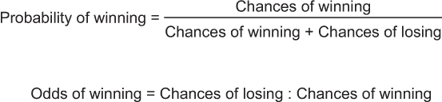
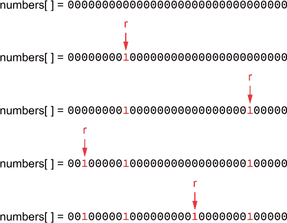

# 14 彩票选择

在我还是一个 C 程序员新手的时候，我从拉斯维加斯旅行回来，渴望编写自己的 keno 程序。keno 是一种随机数字游戏，是彩票和宾果游戏的结合。你从 1 到 80 的范围内选择几个数字。奖金取决于你选择了多少个数字并且猜对了多少。

在编写代码的过程中，很明显，赌场提供的奖金远远低于真实概率。例如，如果你选择了 10 个数字并且猜对了，你将赢得 20 万美元。但在 80 个数字中选择 10 个数字的概率是 1:8,911,712。你应该赢得 8,911,712 美元，对吧？但至少他们有一美元的杀手虾鸡尾酒。或者他们曾经有过。

编程机会游戏的过程让你了解到几个有趣和有用的编程领域，包括这些：

+   理解概率和概率

+   计算概率

+   探索随机数字

+   模拟抽取彩票球

+   运行模拟来测试概率

我承认我不是一个数学天才。我理解数学，但我微积分只得了个 D，这是一个及格的分数，所以这就是我的极限。在概率等领域，我并不擅长。毕竟，是计算机在做数学。你的工作是输入正确的方程式，并做所有那些防止计算机崩溃的编程工作。这个技能的概率相当高。

## 14.1 对数学不好的征税

我玩 Powerball，尽管我的理性大脑知道我赢得的机会很小。我的情感大脑争辩说：“好吧，总得有人赢！”满意了，我扔下 20 美元在一张随机彩票上，幻想着我将如何处理那些永远不会出现的财富。

正是这种希望让人们继续玩机会游戏。无论是彩票、keno 还是任何赌场游戏（除了扑克和可能还有 21 点），人们更多地依赖欲望而不是对数学的清晰理解。这是因为数学并不对你有利。

### 14.1.1 玩彩票

传言说，彩票资助了中国的长城。即使这个传言是不真实的，政府几个世纪以来一直使用彩票来资助各种项目。早期的美国使用彩票来资助国防。

彩票也被用于其他目的。热那亚大议会使用彩票来选择其成员，从更大的池子中抽取几个名字。市民会赌赢家，称这种游戏为“彩票”。它最终变得如此受欢迎，以至于彩票是通过抽取数字而不是名字来举行的。

一个好彩票的目标是筹集资金，无论是为了一个项目还是作为奖金分配。一部分资金总是用来支付赢家。为了保持彩票的成功和受欢迎，奖金通常会在许多赢家之间分配。对于大多数人来说，在购买了价值 20 美元的彩票后看到两三美元的回报就是“赢”。

在多州 Powerball 彩票中，数字印在手掌大小的球上，并依次从机器中抽取。抽取了五个白色球，范围从 1 到 69，然后抽取一个单独的红色“强力球”，范围从 1 到 26。有多种边注可供选择，但目标是匹配抽取的所有五个数字，加上红色强力球，以赢得大奖。如果没有人猜对所有六个数字，奖金就会滚存——有时会积累到数亿美元。

本章中模拟的彩票类型是一种随机数彩票，类似于 Powerball。随机数被抽取来代表 Powerball 彩票中的球。对于模拟来说，重要的是不要重复抽取相同的数字，这在物理彩票中是不可能的。本章提供了两种防止重复抽取数字的方法。

### 14.1.2 理解赔率

为了减少你对潜在彩票赢利的喜悦，我必须讨论赔率。这些数字解释了某事发生或不发生的概率比率。我不希望深入数学，也不讨论统计赔率和赌博赔率之间的区别。只需盯着图 14.1 看。



图 14.1 一些数学公式解释了赔率。

假设你在投掷骰子上下注。以下是计算你猜对数字的概率，即六个数字中的一个的概率：

```
odds = 1 / (1+5) = 1/6 = 0.166...
```

你有 16.6%的几率猜对。为了计算你输的概率，将图 14.1 顶部方程中的分子改为*输的几率*代替*赢的几率*。以下是投掷骰子的数学计算：

```
odds = 5 / (1+5) = 5/6 = 0.833...
```

你有 83.3%的几率会输。看看这样陈述赔率是如何让人所有的希望都破灭的吗？这真是令人沮丧。

赔率也可以用冒号比表示，如图 14.1 底部所示。对于骰子示例，你赢得的概率是 1 比 5，通常表示为 5:1 或“五比一”。赔率不是 1:6，因为有一个选择会赢但五个会输。因此，赔率以 5:1 表示，具有相同的赢/输百分比：16.6 和 83.3。

对于像 Powerball 这样的游戏，赔率是在抽取数字时计算的，同时也考虑到球不是按任何顺序抽取的。为了正确计算赔率，必须考虑这些因素。

例如，如果你只能对一球下注（Powerball 的最小投注是三个数字），赔率是 68:1 或 1/(68+1)，即 1.45%的赢率。如果你对抽取两球下注，第二个球的赔率变为 67:1，然后是第三个球的 66:1，以此类推。如果你做数学计算，你会得到一个非常小的数字：

```
1/69 * 1/68 * 1/67 * 1/66 * 1/65 = 7.415e-10
```

反转结果，你会发现你获胜的概率是 1:1,348,621,560。这个值的问题在于必须考虑抽取的数字的排列。如果你的猜测是 1、2、3、5 和 8，第一个球可以是这些数字中的任何一个。第二个球可以是这些数字中的任意四个，以此类推。从抽取数字的球数（69、68、67、66、65）必须除以 5 * 4 * 3 * 2 * 1，即 5!（五阶乘）：

```
( 69 * 68 * 67 * 66 * 65 ) / (5 * 4 * 3 * 2 * 1 ) = 11,238,513
```

从 69 个球中正确选择五个数字的概率是 1:11,268,513。顺便说一下，如果你成功准确地选择了五个数字，Powerball 彩票会支付 100 万美元。这个概率是 11 倍。

### 14.1.3 编程赔率

在大学时，我避免使用电脑，因为我认为你必须是一个数学天才才能理解它们。胡说！是电脑在做数学。前面一节介绍了计算赔率的公式。下一步是编写程序。

下一个列表显示了简单赔率计算器的代码。你输入某事发生的概率，例如猜测骰子的正确点数。然后你输入它不发生的概率。电脑使用前面展示的公式（参见图 14.1）来输出结果。源代码可在在线存储库中找到，作为 odds01.c。

列表 14.1 odds01.c 的源代码

```
#include <stdio.h>

int main()
{
    int ow,ol;                                                   ❶

    printf("Chances of happening: ");
    scanf("%d",&ow);
    printf("Chances of not happening: ");
    scanf("%d",&ol);

    printf("Your odds of winning are[CA] %2.1f%%, or %d:%d\n",   ❷
            (float)ow/(float)(ow+ol)*100,                        ❸
            ow,
            ol
          );

    return(0);
}
```

❶ ow = 获胜赔率，ol = 失败赔率

❷ 在格式字符串中使用两个百分号来输出单个百分号。

❸ 方程式

要测试程序，使用本节前面展示的骰子示例：

```
Chances of happening: 1
Chances of not happening: 5
Your odds of winning are 16.7%, or 1:5
```

如果你猜中骰子的六个面之一，它发生的概率是 1，不发生的概率是 5。获胜的赔率是 16.7%，或者说五分之一。

假设你想计算从一副牌中抽到红桃的赔率：

```
Chances of happening: 13
Chances of not happening: 39
Your odds of winning are 25.0%, or 13:39
```

因为红桃是四种花色之一，所以你的赔率是 25% 或四分之一——尽管程序没有减少这个比例。即便如此，答案仍然是准确的。

要计算多次抽取，例如在彩票中，需要更多的数学知识：必须将球的数量相乘，以及猜测的数字的排列。这个公式之前已经展示过，但以下代码块中进行了编码。总项目的乘积在变量 i 中计算；抽取项目的乘积在变量 d 中计算。

列表 14.2 odds02.c 的源代码

```
#include <stdio.h>

int main()
{
    int items,draw,x;
    unsigned long long i,d;                      ❶

    printf("Number of items: ");
    scanf("%d",&items);
    printf("Items to draw: ");
    scanf("%d",&draw);

    i = items;
    d = draw;
    for(x=1;x<draw;x++)                          ❷
    {
        i *= items-x;                            ❸
        d *= draw-x;                             ❹
    }
    printf("Your odds of drawing %d ",draw);
    printf("items from %d are:\n",items);
    printf("\t1:%.0f\n",(float)i/(float)d);      ❺

    return(0);
}
```

❶ 即使是无符号长整型值也可能不足以处理某些计算的赔率。

❷ 循环遍历抽取次数

❸ 获得每个项目的乘积，数值递减

❹ 获得每个抽取排列的乘积，数值递减

❺ 将变量转换为以获得准确的结果

我不得不在代码中不断增大变量 i 和 d 的存储空间，从 *int* 到 *long*，再到 *unsigned long*。多个值的乘积增长得很快。尽管如此，代码仍然为 Powerball 赔率（不包括 Powerball 本身）提供了准确的结果：

```
Number of items: 69
Items to draw: 5
Your odds of drawing 5 items from 69 are:
    1:11238513
```

这个结果与之前显示的值匹配，11,238,513。像往常一样，代码可以进行许多修改。

练习 14.1

odds02.c 的源代码中缺少了一个错误检查。如果用户输入了 10 项但抽取了 12 项会发生什么？如果输入的任一值为 0 会发生什么？本练习的任务是修改代码以确认任一值的输入不是 0，并且抽取的项目数量不超过可用的项目数量。

我的解决方案，注释详尽，可在在线存储库中的 odds03.c 文件中找到。以 odds02.c 的源代码作为起点。

练习 14.2

代码的另一个良好改进是向输出中添加逗号。毕竟，哪个更好：1:11238513 还是 1:11,238,513？人类的眼睛喜欢逗号。

本练习的任务是向中奖号码的数值输出中添加逗号。我建议你编写一个函数，该函数接受一个浮点数作为输入。假设该值没有小数部分。返回一个表示该值的字符串，但每三位放置一个逗号，如之前所示。我的解决方案是 *commify()* 函数，可在在线存储库中找到的源代码文件 oddsd04.c 中找到。

## 14.2 这里是你的中奖号码

你在 fortune cookie 的祝福语中找到的彩票号码很可能是计算机生成的。我发现这种发展令人失望。相反，想象一位智慧的老妇人坐在充满香气的房间里，积极与灵界交流以获得灵感，这不是很迷人吗？但是，事实是这些数字是从计算机中喷涌而出的——随机生成的。当然，它们可能是正确的猜测并赢得你的财富，但几率很小。

要让计算机选择你的彩票中奖号码，需要编程随机数。这些数必须模拟产生 Powerball 实际抽取号码的神奇彩票球机的随机性。与现实世界不同，你的彩票模拟必须确保抽取的值在范围内。此外，你不能抽取相同的数字两次。你的彩票选择必须像现实世界一样是唯一的。

### 14.2.1 生成随机值

我想不出一款不依赖于随机数的电脑游戏。即使是复杂的棋类软件也必须决定它的第一步。转动古老的随机数生成器就是做出这个决定的方法。

计算机不会生成真正的随机数。这些值被称为*伪随机*，因为如果你有所有数据，你可以预测这些值。尽管如此，随机数生成对于设置一个有趣的游戏——或者选择彩票号码——仍然是核心的。所需的工具是*rand()*函数，该函数在 stdlib.h 头文件中进行了原型定义：

```
int rand(void);
```

该函数不接受任何参数，并返回一个范围在 0 到 RAND_MAX 之间的整数值。对于大多数编译器，这个值被设置为 0x7ffffffff 或 2,147,483,647。该函数的改进版本 *random()* 与 *rand()* 类似，尽管这个函数不是标准 C 库的一部分。

下面的源代码类似于我多年前用 BASIC 编写的第一个程序。它输出一个随机数网格，五行五列。*rand()* 函数生成变量 r 中保存的值，并在 *printf()* 语句中输出。

列表 14.3 random01.c 的源代码

```
#include <stdio.h>
#include <stdlib.h>            ❶

int main()
{
    const int rows = 5;
    int x,y,r;

    for( x=0; x<rows; x++ )    ❷
    {
        for( y=0; y<rows; y++ )
        {
            r = rand();        ❸
            printf("%d ",r);   ❹
        }
        putchar('\n');         ❺
    }

    return(0);
}
```

❶ 对于 *rand()* 函数

❷ 嵌套循环处理网格

❸ 获取随机整数

❹ 输出随机整数

❺ 结束行

列表 14.3 中显示的代码完成了它的任务。它生成了 25 个随机值，输出看起来非常糟糕：

```
1804289383 846930886 1681692777 1714636915 1957747793
424238335 719885386 1649760492 596516649 1189641421
1025202362 1350490027 783368690 1102520059 2044897763
1967513926 1365180540 1540383426 304089172 1303455736
35005211 521595368 294702567 1726956429 336465782
```

这些数字非常大，在 *rand()* 函数生成的范围之内，从 0 到 RAND_MAX。要输出不同范围的值，你可以使用取模运算符。以下是我使用的表达式：

```
value = rand() % range;
```

变量的值在 0 和范围值之间。如果你想使值在 1 和范围之间，我使用这个版本的表达式：

```
value = rand() % range + 1;
```

要将随机数输出设置为 1 到 100 之间的值，需要更改两个语句来修改 random01.c 的源代码：

```
r = rand() % 100 +1;
printf("%3d ",r);
```

第一条语句限制了 *rand()* 函数的输出范围在 1 到 100 之间。第二条语句对输出进行了对齐，将值限制在一个三个字符宽的框架内，后面跟一个空格。这些更改已纳入源代码文件 random02.c，可在在线仓库中找到。以下是更新后的输出结果：

```
 84  87  78  16  94
 36  87  93  50  22
 63  28  91  60  64
 27  41  27  73  37
 12  69  68  30  83
```

可惜，如果你运行程序两次，会生成相同的数字。这个结果对你的彩票选择不利，因为目标是随机。

如果你曾经编写过随机数代码，你知道解决方案是给随机数生成器设置种子。*srand()* 函数，也在 stdlib.h 头文件中声明，负责这项任务：

```
void srand(unsigned int seed);
```

种子参数是一个正整数，*rand()* 函数在它的随机数计算中使用这个值。*srand()* 函数只需要调用一次。它通常与 *time()* 函数一起使用，该函数返回当前的时钟滴答值作为种子：

```
srand( (unsigned)time(NULL) );
```

*time()* 函数被转换为 *unsigned* 类型，并传递了 NULL 参数。这种格式确保了时钟滴答值被 *srand()* 函数正确消耗，并且每次程序运行时都会生成一个新的随机数序列。

（如果你使用 *random()* 函数，它有一个类似的种子函数，*srandom()*.）

random02.c 代码的改进包含在 random03.c 中，可在在线仓库中找到。同时还包括了 time.h 头文件。以下是一个示例运行结果：

```
  8  53  95  12  93
 76  92  59  45  21
 32  65  73  95  85
 62  55   9  89  16
 59  13  33  61  74
```

这里还有一个示例运行结果，只是为了展示不同的随机数序列：

```
 14  49  92  92  56
 80  95  41  57  66
  8  99  62  86  73
 26  32  23  55  38
 98  66  94  20  98
```

顺便说一下，因为使用了 *time_t* 值（由 *time()* 函数返回），如果你连续快速运行程序，你会看到相同的值生成。这是用时钟滴答值初始化随机数生成器的弱点，但这不应该对大多数应用造成问题。

### 14.2.2 抽取彩票球

69 个球落入摇奖机，编号为 1 到 69。球在搅拌时上下跳动，紧张地搅拌了几分钟。通过某种魔法，从摇奖机中抽取一个球，沿着管子滚到滑梯上。渴望但愚蠢的人们集中注意力，见证揭示的数字。不，这很可能不是他们选择的数字——但他们还有四次机会！希望仍然很高。这个过程就是 Powerball 彩票的工作方式。

对于我的彩票模拟，我使用 Powerball 的基本前提：随机抽取 1 到 69 范围内的五个数字。第六个数字，Powerball，增加了另一个复杂度，稍后可以编程实现，但不是在本章中。

抽取彩票号码就像抽取任何随机序列的项目一样，例如玩扑克牌。我在下一个列表中展示了模拟的第一个尝试，即 lotto01.c 的源代码。它借鉴了本章前面展示的随机序列程序，但使用一个 *for* 循环来输出 1 到 69 范围内的五个随机数。

列表 14.4 lottt01.c 的源代码

```
#include <stdio.h>
#include <stdlib.h>
#include <time.h>

int main()
{
    const int balls = 69, draw = 5;                  ❶
    int x,r;

    srand( (unsigned)time(NULL) );                   ❷

    printf("Drawing %d numbers from %d balls:\n",    ❸
            draw,
            balls
          );

    for( x=0; x<draw; x++ )                          ❹
    {
        r = rand() % balls+1;                        ❺
        printf("%2d\n",r);                           ❻
    }

    return(0);
}
```

❶ 设置常数以表示总球数和抽取的数字

❷ 初始化随机数生成器

❸ 通知用户

❹ 循环抽取指定数量的球

❺ 在范围内生成随机值

❻ 输出值

有时我想，用于在幸运饼干上生成彩票赢家的代码可能和列表 14.4 中展示的代码一样简单。以下是输出：

```
Drawing 5 numbers from 69 balls:
17
64
38
 1
26
```

确实，输出可以更美观。更新将在几页后展示。但如果你经常运行代码，最终你会看到如下输出：

```
Drawing 5 numbers from 69 balls:
44
19
19
10
33
```

因为代码没有检查之前抽取的数字，值可能会重复。这样的输出不仅不现实——而且不吉利。

代码无法确定抽取的值是否重复，除非将抽取的值存储并检查。为此，需要一个数组，其维度与抽取的球数相同。每个抽取的随机值都必须存储在数组中，然后检查数组以确保没有两个值重复。

对于我对这个问题的第一个方法，我使用 winners[] 数组，如下所示，这是对 lotto01.c 代码的更新。一个 *for* 循环用随机值填充数组。接下来，一个嵌套的 *for* 循环像冒泡排序一样工作，将数组中的每个值与其他值进行比较。当两个值匹配时，第二个值被替换为一个新的随机值，然后循环重置以再次扫描。

列表 14.5 lottt02.c 的源代码

```
#include <stdio.h>
#include <stdlib.h>
#include <time.h>

int main()
{
    const int balls = 69, draw = 5;
    int x,y;
    int winners[draw];                             ❶

    srand( (unsigned)time(NULL) );

    printf("Drawing %d numbers from %d balls:\n",
            draw,
            balls
          );

    for( x=0; x<draw; x++ )                        ❷
    {
        winners[x] = rand()%balls+1;
    }

    for( x=0; x<draw-1; x++ )                      ❸
        for( y=x+1; y<draw ; y++ )                 ❹
            if( winners[x]==winners[y] )           ❺
            {
                winners[y] = rand()%balls + 1;     ❻
                y = draw;                          ❼
                x = -1;                            ❽
            }

    for( x=0; x<draw; x++ )                        ❾
        printf("%2d\n",winners[x]);

    return(0);
}
```

❶ 将数组维度设置为存储抽取的数量

❷ 用随机值填充数组，从第一个球开始

❸ 外循环遍历数组到倒数第二个元素，draw-1。

❹ 内循环从 x+1 元素遍历到数组的最后一个元素。

❺ 将每个值与所有其他值进行比较

❻ 对于匹配，再次抽取重复的值

❼ 通过设置终止值强制 y 循环停止

❽ 将 x 循环重置回起始位置（-1，因为每次循环运行时循环都会增加 x）

❾ 输出结果

改进的彩票程序版本会检查重复的值并替换它们。输出看起来与程序的第一版相同，但没有数字重复。你现在可以准备好投下你的钱，为财富的机会而战，但代码中仍有改进的空间。

练习 14.3

现有版本的 *lotto* 程序的输出很俗气。它看起来根本不像幸运饼干背面的祝福。有两种方法可以改进它：对数字进行排序并将它们输出到单行以提高可读性。例如：

```
Drawing 5 numbers from 69 balls:
 5 - 10 - 14 - 19 - 33
```

现在的输出是线性的，可以打印并节省那位老妇人时间，让她可以和她的孙子辈们共度时光。我为此练习的解决方案命名为 lotto03.c，并在在线仓库中可用。

### 14.2.3 避免重复数字，另一种方法

任何彩票模拟的关键是确保没有两个数字被抽取两次。前面的部分提供了一种方法。另一种方法，我多次使用的方法，是在数组中模拟所有数字或球。当生成随机数时，数组元素会更新以反映球不再可用。我发现这种方法编码起来更容易，尽管可能不是那么容易解释。

图 14.2 展示了一个初始化为所有零的数组 numbers[]。数组的元素代表彩票中的球。当一个元素的值为零时，意味着该球尚未被抽取。当一个球被抽取时，数组中对应的元素被设置为 1，如图所示。例如，如果随机数生成器返回 12，则数组中的第 12 个元素被设置为 1。



图 14.2 代表彩票球的数组元素

为了确认一个数字是否可用于抽取，代码会测试相关的数组元素。如果元素是 0，则该数字可用，并将其设置为 1。如果元素是 1，则跳过并生成另一个随机数。以下代码执行此测试：

```
for( x=0; x<draw; x++ )
{
    do
        r=rand()%balls;
    while( numbers[r]==1 );
    numbers[r] = 1;
}
```

numbers[] 数组代表模拟的彩票球。它的大小设置为可用球的数量，69。变量 draw 是要抽取的球的数量——在这个例子中是五个。

当随机数组元素 numbers[r] 等于 1 时，*do-while* 循环会重复。这个测试确保球不会被抽取两次。否则，如果元素是零，意味着球可用，它会被“抽取”通过将其值设置为 1：numbers[r] = 1。这个语句将球标记为已抽取，并防止它再次被抽取。

变量 balls 通过取模运算符帮助截断 *rand()* 函数的返回值：r=rand()%balls。然而，这个值并没有加 1。因为代码处理数组，第一个值必须是 0。因此，抽取的数字范围是 0 到 balls 减 1，在这个例子中是 68。这个结果可以在输出时进行调整，以反映真实的彩票球号。

模拟彩票抽取的其余代码如下所示。初始化 numbers[] 数组，抽取球，然后输出结果。因为 numbers[] 数组在最终的 for 循环中按顺序处理，所以输出前不需要对中奖号码进行排序。

列表 14.6 lotto04.c 的源代码

```
#include <stdio.h>
#include <stdlib.h>
#include <time.h>
int main()
{
    const int balls = 69, draw = 5;
    int x,r,count;
    int numbers[balls];

    srand( (unsigned)time(NULL) );

    printf("Drawing %d numbers from %d balls:\n",
            draw,
            balls
          );

    for( x=0; x<balls; x++ )       ❶
    {
        numbers[x] = 0;
    }

    for( x=0; x<draw; x++ )        ❷
    {
        do
            r=rand()%balls;
        while( numbers[r]==1 );
        numbers[r] = 1;
    }

    count = 0;
    for( x=0; x<balls; x++ )       ❸
    {
        if( numbers[x] )           ❹
        {
            printf(" %d",x+1);     ❺
            count++;
            if( count<draw )       ❻
                printf-");
        }
    }
    putchar('\n');

    return(0);
}
```

❶ 初始化数组

❷ 选择随机值

❸ 处理数组以筛选中奖号码

❹ 如果元素非零（1），则抽中了球。

❺ 输出球号，加一以考虑数组从元素 0 开始

❻ 在最后一个数字之前，输出一个破折号分隔符

列表 14.6 中所示的 lotto04.c 源代码文件可在在线存储库中找到。以下是输出结果：

```
Drawing 5 numbers from 69 balls:
 1 - 25 - 37 - 39 - 40
```

没有重复的数字，输出是排序的。祝你好运！

## 14.3 永远不要告诉我概率

如果你能永远地玩彩票该多好。或者也许你足够古怪，以至于相信你可以购买 11,238,513 张彩票，每张彩票上的数字组合都不同，并且以某种方式脱颖而出。但系统根本不会这样运作。哦，我可以大谈特谈各种“赢得”彩票的技术，但这一切都是胡说八道。

幸运的是，你不需要购买一大堆彩票来看到你玩游戏的表现如何。计算机不仅可以生成彩票选择，还可以将这些选择与其他选择匹配。你可以运行模拟来确定计算机猜测它选择的数字需要多少次随机抽取。只要编码正确，你就可以测试概率。唉，你只是赢不到钱。

### 14.3.1 创建 lotto() 函数

要模拟彩票的多次抽取，你必须修改现有的 *lotto* 代码，以便在函数中抽取球，我称之为 *lotto()*。这种代码改进允许函数被重复调用，以表示原始号码的匹配以及所做的猜测。

我多次努力编写了 *lotto()* 函数：它应该返回抽取的随机数字，还是应该将它们作为数组传入？我最终选择传入一个数组，这在函数中作为一个指针工作。这种方法允许直接修改数组的元素，因此函数不返回任何内容。

下面的 *lotto()* 函数与本章前面展示的 *lotto* 系列程序中的 *main()* 函数使用类似的语句：numbers[] 数组现在位于 *lotto()* 函数内部，因为其内容在调用之间不需要保留。初始化数组后，一个 *for* 循环设置代表抽取数字的随机元素值。此操作之后，第二个 *for* 循环处理整个 numbers[] 数组，从传入的数组中填充元素。

列表 14.7 来自 lotto05.c 的 *lotto()* 函数

```
void lotto(int *a)              ❶
{
    int numbers[BALLS];         ❷
    int x,y,r;

    for( x=0; x<BALLS; x++ )    ❸
    {
        numbers[x] = 0;
    }

    for( x=0; x<DRAW; x++ )     ❹
    {
        do
            r=rand()%BALLS;
        while( numbers[r]==1 );
        numbers[r] = 1;
    }

    y = 0;                      ❺
    for( x=0; x<BALLS; x++ )    ❻
    {
        if( numbers[x] )        ❼
        {
            *(a+y) = x;         ❽
            y++;                ❾
        }
        if( y==DRAW )           ❿
            break;
    }
}
```

❶ 在此函数中，数组作为指针进行引用。

❷ 此数组仅限于 *lotto()* 函数内部使用。

❸ 初始化 numbers[] 数组

❹ 随机抽取数组中的项目

❺ 变量 y 作为传入数组的索引。

❻ 将抽取的随机数字填充到传入数组的元素中

❼ 如果球已经被抽取 . . .

❽ . . . 设置传入数组中的元素编号

❾ 增加索引

❿ 如果传入的数组已满，则提前中断循环

定义常量 BALLS 和 DRAW 与早期版本的 lotto 程序中显示的 *const int* 值相同。这些值被定义为常量，以便在源代码文件中的所有函数中可用。

*main()* 函数调用 *lotto()* 函数，然后输出传入数组的元素。下一个列表显示了 *main()* 函数，它再次基于本章前面展示的 *lotto* 系列程序的部分内容。

列表 14.8 来自 lotto05.c 的 *main()* 函数

```
int main()
{
    int x;
    int match[DRAW];                ❶

    srand( (unsigned)time(NULL) );

    printf("Trying to match:");
    lotto(match);                   ❷
    for( x=0; x<DRAW; x++ )         ❸
    {
        printf(" %d",match[x]+1);
        if( x<DRAW-1 )
            printf(" -");
    }
    putchar('\n');

    return(0);
}
```

❶ 将数组作为 lotto 函数的参数使用

❷ 调用 *lotto()* 函数，填充 match 数组

❸ 输出数组的元素，即彩票“中奖者”

lotto05.c 的完整源代码可在在线仓库中找到。以下是一个示例运行：

```
Trying to match: 32 - 33 - 45 - 55 - 61
```

输出看起来与其他 *lotto* 程序类似，尽管现在可以通过设置 *lotto()* 函数在同一代码中抽取多个彩票数字。毕竟，上面的提示说，“试图匹配。”程序生成的下一步是获取另一组随机彩票球抽取，以查看它们是否与第一次抽取的数字匹配。

### 14.3.2 匹配彩票选择

*lotto()* 函数允许代码反复抽取彩票数字，试图匹配原始抽取。为此，我在 lotto05.c 代码中复制了 *for* 循环和输出语句，但使用了第二个数组 guess[]。这个更改出现在源代码文件 lotto06.c 中，它输出第二轮彩票数字，以查看两次抽取是否匹配。以下是示例输出：

```
Trying to match: 2 - 18 - 38 - 47 - 69
     Your guess: 6 - 10 - 34 - 35 - 49
```

我在这里不展示完整的源代码，因为它没有做任何新的事情——它只是重复了相同的代码块，但使用了新的数组 guess[]。这个数组被传递给 *lotto()* 函数，然后输出，如前所述。结果是两次彩票数字抽取。它们匹配吗？可能不匹配。

即使两个数组匹配，你也必须进行视觉检查以确认。在前面的示例输出中，它们没有匹配。但为什么自己工作，当计算机不仅无聊，而且过于渴望呢？

为了比较两组彩票球抽取，我使用了*winner()* 函数，如下所示。作为参数，它消耗两个数组，作为整数指针引用。嵌套 *for* 循环将第一个数组中的每个数组值与第二个数组中的每个数组值进行比较。使用指针表示法进行比较。当找到匹配时，变量 c 增加。返回的总匹配数，范围从 0 到 DRAW。

列表 14.9 从 lotto07.c 的 *winner()* 函数

```
int winner(int *m, int *g)              ❶
{
    int x,y,c;

    c = 0;                              ❷
    for( x=0; x<DRAW; x++ )             ❸
        for( y=0; y<DRAW; y++ )         ❹
        {
            if( *(m+x) == *(g+y) )      ❺
                c++;                    ❻
        }
    return(c);                          ❼
}
```

❶ 两个数组都作为整数指针传递，m 为匹配，g 为猜测。

❷ 将匹配计数初始化为 0

❸ 遍历第一个数组中的所有 DRAW 数字

❹ 遍历第二个数组中的每个 DRAW 数字

❺ 比较每个元素值

❻ 如果两个值匹配，则增加变量 y

❼ 返回匹配数

在 *lotto()* 函数填充数组 guess[] 后，*main()* 函数立即调用 *winner()* 函数：

```
lotto(guess);
c = winner(match,guess);
```

数组是通过名称传递的。在 *winner()* 函数中，这些数组被识别为整数指针。回到 *main()* 函数，输出数组 *guess[]* 的值，以及一个最终的 *printf()* 语句，报告匹配数。

完整的代码可在在线仓库中找到，作为 lotto07.c。以下是一个示例运行：

```
Trying to match: 20 - 27 - 34 - 41 - 59
      Your draw: 1 - 19 - 27 - 33 - 48
You matched 1 numbers
```

真是幸运，在我第一次运行代码（如上所示）时，两个模拟彩票抽奖之间的一个值匹配了。*winner()* 函数返回变量 c 中的一个值，因为两个数组共享值 27。我很高兴我不需要多次运行代码来展示匹配。然而，正是这一步反复运行程序激发了我编写程序的最终版本，这在下一节中介绍。

### 14.3.3 测试赔率

在 Powerball 游戏中，你只能匹配一个球来获胜。不，你必须匹配一个球和 Powerball 才能赢得一些微不足道的金额。同样，对于两个球：两个球加上 Powerball 等于一些适度的回报。然而，你可以匹配三个主要数字，以 2 美元的赌注赢得 7 美元。哎呀！当然，我没有编写任何关于 Powerball 的无聊代码，所以我的 *lotto* 程序很简单，奖金始终为零。

匹配一个数字和 Powerball 的概率是 1:92。这个值意味着如果你玩 92 次，你可能会至少匹配一次一个值和 Powerball，但这并不是保证。我不会涉及数学，但可能需要几百次才能看到匹配，或者你可能会在第一次就匹配。正是这种不可预测性吸引了人们去赌博——即使赔率愚蠢地高。

为了避免反复运行彩票程序，我决定编写一个循环，直到至少有两个数字匹配为止输出猜测。下一列表显示了更新版——最终版 *lotto* 系列程序的 *main()* 函数。*lotto()* 和 *winner()* 函数保持不变，但我向 *main()* 函数添加了一个常量，tomatch。它设置在 *do-while* 循环停止抽取随机彩票球之前需要匹配的最小球数。直到找到匹配，否则不输出任何内容，这可以节省几秒钟的处理时间。

列表 14.10 从 lotto08.c 中的 *main()* 函数

```
int main()
{
    const int tomatch = 2;                               ❶
    int x,c,count;
    int match[DRAW],guess[DRAW];                         ❷

    srand( (unsigned)time(NULL) );

    printf("Trying to match:");                          ❸
    lotto(match);
    for( x=0; x<DRAW; x++ )
    {
        printf(" %d",match[x]+1);
        if( x<DRAW-1 )
            printf(" -");
    }
    putchar('\n');

    count = 0;                                           ❹
    do
    {
        lotto(guess);                                    ❺
        c = winner(match,guess);                         ❻
        count++;                                         ❼
    } while( c<tomatch );                                ❽

    printf("It took %d times to match %d balls:\n",      ❾
            count,
            c
          );
    for( x=0; x<DRAW; x++ )                              ❿
    {
        printf(" %d",guess[x]+1);
        if( x<DRAW-1 )
            printf(" -");
    }
    putchar('\n');

    return(0);
}
```

❶ 确定要匹配的球数

❷ 两个数组——一个用于存储要匹配的数字，另一个用于存储猜测

❸ 输出要匹配的数字

❹ 跟踪尝试了多少次抽奖

❺ 获取模拟的彩票抽奖结果

❻ 检查是否有球匹配

❼ 增加计数

❽ 只要匹配的球数少于目标，就继续循环

❾ 通知用户结果，需要多少次抽奖

❿ 输出中奖抽奖结果

lotto08.c 的完整代码可在在线仓库中找到。程序会持续抽取随机彩票号码，直到变量 tomatch 中存储的最小匹配值被满足。以下是一个示例运行过程：

```
Trying to match: 1 - 5 - 21 - 33 - 37
It took 5 times to match 2 balls:
 1 - 30 - 37 - 63 - 66
```

根据输出，计算机进行了五次循环找到了两个匹配——1 和 37。你可以多次运行程序，看看需要多少次循环才能从总共 69 个号码中至少匹配到五个球。再次强调，我不知道确切的概率，但肯定小于 100。

当你修改代码时，有趣的部分就来了：将 tomatch 常量改为 5，然后运行程序。以下是修改后我的示例输出：

```
Trying to match: 15 - 33 - 47 - 59 - 60
It took 5907933 times to match 5 balls:
 15 - 33 - 47 - 59 - 60
```

在上面，在达到五个球完全匹配之前，需要旋转 *do-while* 循环 5,907,933 次。

我不知道这段代码是否能让任何人相信玩彩票的无用。问题从来不是数学；而是人类对概率和机会的误解。每次“总有人会赢”的观念都战胜了逻辑和常识。

练习 14.4

计算机无意识地、毫不费力地模拟了您愿意让它执行的所有彩票球抽奖。lotto08.c 代码显示，即使尝试匹配五个球中的五个，程序运行也相当快。然而，总是可以进行更多的编码，特别是为了满足好奇的心。

本练习的任务是修改 lotto08.c 代码，目标是确定匹配 69 个可能号码中的所有五个球所需的平均游戏次数。运行模拟 100 次，每次记录需要多少次重复调用 *lotto()* 函数才能实现匹配。存储每个值，然后报告制作匹配所需的平均游戏次数。

以下是来自我的解决方案的示例输出，该解决方案可在在线仓库中找到，作为 lotto09.c：

```
Trying to match: 9 - 32 - 33 - 42 - 64
For 100 times, the average count to match 5 balls is 11566729
```

平均而言，需要调用*lotto()*函数 11,566,729 次才能匹配上原始抽取的数字。记得在本章前面提到，从 69 个彩票球中抽取相同五个数字的计算概率是 11,238,513。差得真是不多。

我解决方案中的注释解释了我的方法，尽管请在看到我所做之前尝试这个练习。修改并不复杂，因为大部分必要的编码已经在`lotto08.c`源代码文件中。

哦！解决方案程序运行需要一段时间。在我的最快系统上，我计时了几乎 9 分钟才生成结果。请耐心等待。
