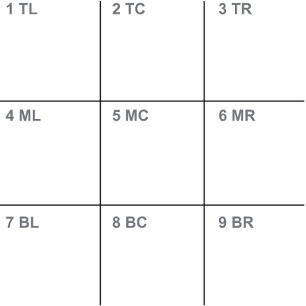
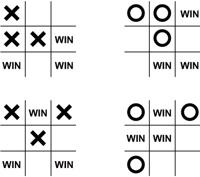
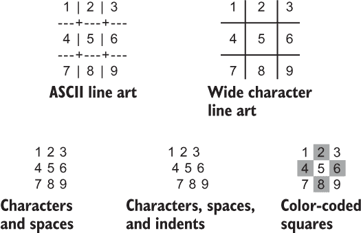
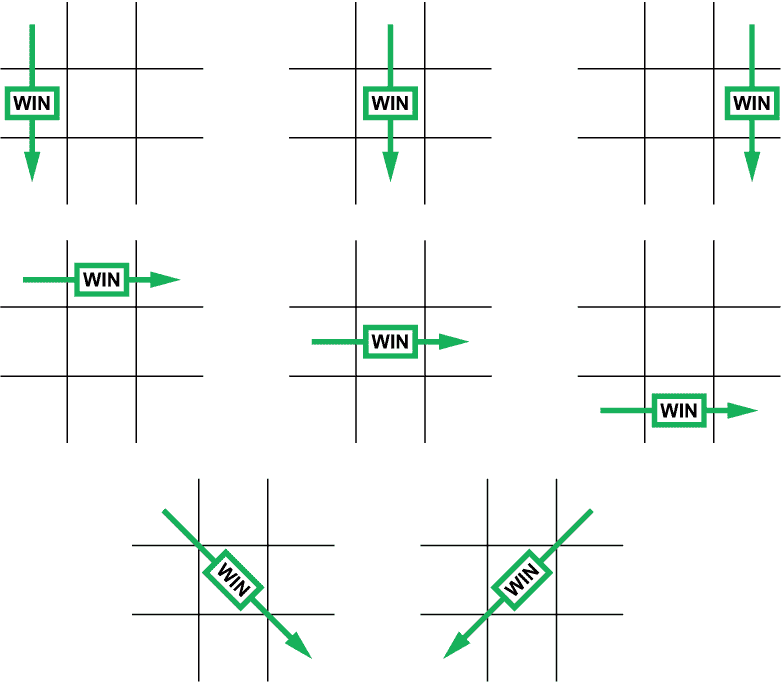

# 15 井字棋

在 1983 年电影《战争游戏》的高潮部分，即将引发第三次世界大战的计算机被指示与自己玩井字棋。计算机意识到这个游戏很愚蠢，因为经验丰富的玩家通常以平局结束游戏，因此它决定核战争是徒劳的。它决定不炸毁世界。这个结论应该会给本章增添一些兴奋感，因为你可以将任何井字棋游戏——即使是计算机模拟的——等同于核战争。

井字棋的游戏玩法很简单。很容易编写代码。如果你还没有这样做，现在就是时候编写你自己的游戏版本了。当然，当你考虑以下任务时，它会变得更加复杂：

+   编写游戏循环

+   编程玩家的回合

+   确定游戏何时结束

+   添加计算机作为玩家

+   给计算机一些智能

当你编程像井字棋这样的文本模式游戏时，你面临的最大挑战是 C 语言中的 I/O 不是交互式的。除非你使用第三方库，如 Ncurses，否则你必须依赖流 I/O 来编写你的程序。它可以工作，但流 I/O 会为代码带来潜在的问题，代码必须处理这些问题，否则用户可能会遇到麻烦。

## 15.1 一个愚蠢的儿童游戏

没有人知道井字棋游戏的确切起源，所以我想到编造一些有趣的事实：在古埃及，一种类似于井字棋的游戏是在一个木制钉板上用从敌人截断的脚趾雕刻的标记玩的。罗马人喜欢玩一种叫做“tria ordine”的游戏，涉及在大理石板上排列鹅卵石。奖品是打对手的脸。在中世纪的欧洲，挪威的孩子玩一种将鱼扔进篮子的游戏，这与井字棋无关，但味道很糟糕。

是的，我编造了所有这些。

井字棋最早的书面记载来自 19 世纪末，当时使用的是“noughts and crosses”这个名字。即使在今天，这仍然是除美国以外的英联邦国家的游戏名称。美国名称井字棋，最初是 tick-tack-toe，起源于 20 世纪初。第一个井字棋计算机程序是在 20 世纪 50 年代初编写的。

那就是今天的历史课——一些部分是真的，但其他部分大多是假的。

### 15.1.1 玩井字棋

根据计算机作者协会的要求，我必须解释井字棋游戏，尽管你对它非常熟悉。即便如此，请记住——与在纸上、在泥土中或在雾蒙蒙的镜子上玩不同——编写这个游戏需要你回顾游戏玩法。

图 15.1 显示了标准的井字棋网格：两条垂直线与两条水平线相交。这个网格包含九个方格，它们成为战场。这些方格在图中编号，从一到九，并为每个方格的位置提供了方便的记忆法：顶部、中间和底部，以及左、中、右。



图 15.1 井字棋游戏网格，方格编号并标注

玩家轮流在一个九宫格方块中放置标记。在选择谁先手（一个优势）之后，玩家交替在方块中标记 X 或 O。传统上，第一个玩家标记 X，尽管这个选择并不是规则。

胜利者是第一个在其标记连成一行的情况下放置三个标记的玩家。如果这个目标未能实现，游戏就是平局，或者称为“猫的游戏”。除了最愚蠢的人类之外，所有人都能实现平局，所以绝望的成年人会和小孩子玩游戏，让自己感觉胜利。

经验丰富的玩家知道先手是有利的。此外，在第一回合或“回合”中标记中心方块是最佳策略。否则，优秀的玩家会尝试设置一个方块三角形，如图 15.2 所示，这保证了胜利，因为他们的对手只能阻止一条腿。



图 15.2 获胜三角形的排列

无论策略如何，井字棋只有八条通往胜利的路径：三行、三列或两条对角线。尽管游戏种类繁多，但只有这八种可能性定义了胜利者。由于网格中有九个方块，胜利可以在九步或更少的步骤中实现，这使得游戏易于学习，快速玩耍，并且短时间内很有趣。

### 15.1.2 以数学方式接近游戏

作为一名极客，我不得不讨论有关井字棋游戏的数学细节。其中一些细节在你编写自己的游戏时会有所体现——特别是，如果你敢于编写一个具有一定智能的计算机对手。

井字棋游戏可能的排列总数是 19,683。不要相信我；有人做了数学计算。这个数字考虑了每个九宫格方块可以放置 X、O 或者为空。记住，游戏网格是三进制，而不是二进制。我在本节的末尾再次提到这一点。

19,683 这个数字并不包括实际的游戏玩法，因为 X 和 O 会跟随对方并消除方块；随着游戏的进行，排列的数量会减少。实际上，这个游戏有 3,200 种可能的排列。去掉那些游戏已经获胜或平局的情况，数字进一步减少到 2,460。

通过消除由于旋转或镜像游戏网格而产生的重复项，进行最后的减少。当这些重复项被移除后，井字棋游戏排列的总数降至 120。由于这个值比 19,683 更容易处理，许多程序员选择在内存中创建所有 120 种排列，并使用这个数据库在游戏过程中指导计算机。

处理 120 种排列的编码方法是创建一个游戏树。这个结构包含所有可能的玩法，程序可以从中选择一条通往胜利的路径。从某种意义上说，这种方法就像一张巨大的作弊表，计算机根据所有可能性来抄袭其下一步动作，并倾向于只探索通往胜利或平局的路径。

我对计算机游戏玩法的处理并不像遵循游戏树那样聪明。相反，我选择模仿人们玩游戏的方式：移动以获胜或移动以阻止。在本章的后面部分，我将扩展这一技术。

最后，重要的是要记住游戏网格是三元的：空白、X 或 O。显然，你使用数组在网格中存储值。最初，我使用值 0、1 和 2 分别代表空白、X 和 O。这种方法在检查行、列和对角线时使数学变得复杂。因此，我改用 0 表示空白，但用-1 表示 O 和+1 表示 X。你可以在下一节中了解更多关于这些选择的信息。

## 15.2 基本游戏

对于我的井字棋实现，我首先编写了游戏网格的代码。实际上，我编写了许多输出井字棋网格的程序，但从未费心编写任何游戏玩法，可能是因为游戏本身并不好玩。

任何交互式文本模式游戏的核心都是一个游戏循环。它接受新的移动输入，更新网格，并确定何时满足胜利条件。虽然也提供了其他退出循环的选项，但正是胜利条件打破了循环。

在这一轮中，我正在编写一个人类对人类版本的游戏。它包含输出游戏网格、提示输入和确定胜者的函数。在本章后面部分将介绍添加计算机作为对手的更新版本。

### 15.2.1 创建游戏网格

编程井字棋网格是初学者在学习 C 语言编程时执行的基本任务之一。毕竟，网格代表了二维数组的真实生活示例，具有行和列。它可以以多种方式实现，如图 15.3 所示。



图 15.3 展示了文本模式井字棋游戏网格的各种呈现选项

在决定使用彩色文本来显示网格会更有趣之前，我实验了图 15.3 中显示的每种变体。彩色文本输出在第十三章中介绍。它涉及向标准输出发送 ANSI 转义序列，这些序列被大多数终端解释为颜色。我选择的网格显示在图 15.3 的右下角，彩色方格。

创建了七个颜色常量来实现我想要的颜色，如表 15.1 所示。对于三种方格可能性：空白、X 和 O，每个都使用两个不同的值。交替的值有助于设置棋盘图案，这有助于我避免添加丑陋的 ASCII 线艺术来构建游戏网格。

表 15.1 用于创建井字棋游戏网格的颜色常量和它们的值

| 常量名称 | 代码 | 输出 |
| --- | --- | --- |
| bfwb[] | \x1b[32;47m | 空白方格，绿色前景/白色背景 |
| bf[] | \x1b[32m | 空白方格，绿色前景 |
| xfwb[] | \x1b[31;47m | X 方格，红色前景/白色背景 |
| xf[] | \x1b[31m | X 方格，红色前景 |
| ofwb[] | \x1b[34;47m | O 方格，蓝色前景/白色背景 |
| of[] | \x1b[34m | O 方块，蓝色前景 |
| reset[] | \x1b[0m | 关闭颜色值 |

每个序列设置前景或前景-背景组合。背景颜色用于每隔一个方块，以创建棋盘图案。最后的 reset[] 序列从输出中移除颜色，避免了输出行之间的颜色溢出。

下一个列表显示了 ttt01.c 的源代码，这是本章所有代码的基础。*showgrid()* 函数输出带有交替颜色的游戏网格，并为每个位置编号，从一至九。一个 *switch-case* 测试确定方块是否被 O（-1）、X（+1）或空白（0）占据。在 *main()* 函数中，网格在 grid[] 数组中初始化，然后输出。这个小程序的目的是确保输出看起来很好。

列表 15.1 ttt01.c 的源代码

```
#include <stdio.h>

void showgrid(int *g)                             ❶
{
    const char bfwb[] = "\x1b[32;47m";            ❷
    const char bf[] = "\x1b[32m";
    const char xfwb[] = "\x1b[31;47m";
    const char xf[] = "\x1b[31m";
    const char ofwb[] = "\x1b[34;47m";
    const char of[] = "\x1b[34m";
    const char reset[] = "\x1b[0m";
    int x;

    for( x=0; x<9; x++ )                          ❸
    {
        switch( *(g+x) )                          ❹
        {
            case -1:                              ❺
                if( x%2 )                         ❻
                    printf("%s O %s",ofwb,reset);
                else                              ❼
                    printf("%s O %s",of,reset);
                break;
            case 1:                               ❽
                if( x%2 )
                    printf("%s X %s",xfwb,reset);
                else
                    printf("%s X %s",xf,reset);
                break;
            default:                              ❾
                if( x%2 )
                    printf("%s %d %s",bfwb,x+1,reset);
                else
                    printf("%s %d %s",bf,x+1,reset);
        }
        if( (x+1)%3==0 )                          ❿
            putchar('\n');
    }
    putchar('\n');
}

int main()
{
    int grid[] = {                                ⓫
        0, 0, 0,
        0, 0, 0,
        0, 0, 0
    };

    puts("Tic-Tac-Toe");

    showgrid(grid);                               ⓬

    return(0);
}
```

❶ 将 grid[] 数组作为整数指针传递。

❷ 定义网格输出的颜色常量

❸ 遍历整个网格，九个方块

❹ 测试每个方块的价值：-1 表示 O，+1 表示 X，0 表示空白

❺ O 占据了方块。

❻ 输出带有背景（和 O）的方块

❼ 输出没有背景的方块

❽ 重复相同的输出给 X

❾ 为未占据的方块编号，为人类眼睛增加 1

❿ 每隔三个方块，添加一个换行符

⓫ 在这里初始化游戏网格。

⓬ 输出网格

*showgrid()* 函数处理游戏网格中的方块。对于每个可能的值——-1、+1 或 0——输出有两个选项。第一个是在奇数方块上触发的，其中应用了背景颜色。对于偶数方块，不使用背景颜色。这种效果是在一致的图案中输出当前游戏状态，无需额外的文本字符来构建网格。

这里是一个示例运行：

```
Tic-Tac-Toe
 1 * 2 * 3
 *4* 5 *6* 
 7 * 8 * 9
```

网格中的数字有助于在游戏过程中参考方块。最终，它们会被 X 和 O 字符替换，这不仅告知用户同一个方块不能被两次使用，还显示了游戏的进度。

你可以在这里停下来，只是欣赏你的作品。但不行。下一步是添加游戏玩法。

### 15.2.2 添加游戏玩法

我不确定每个游戏是否都以这种方式进行，但所有我编写的文本模式游戏都包含一个主要游戏循环。循环检查输入，更新游戏区域，并确定何时游戏结束。

通常，游戏循环是无尽的。终止条件是赢得游戏、输掉游戏或玩家放弃。

要更新现有的 ttt01.c 代码，游戏循环必须显示网格，提示输入，然后更新 grid[] 数组。这个循环在下一个列表中显示，位于输出游戏标题的 *puts()* 语句下方。必须声明两个整数变量：ply 和 p。

列表 15.2 *main()* 函数中的游戏循环

```
ply = 0;                            ❶
while(1)                            ❷
{
    showgrid(grid);                 ❸
    p = prompt(ply);                ❹
    if( p==0 )                      ❺
        break;
    grid[p-1] = ply%2 ? -1 : 1;     ❻
    ply++;                          ❼
}
```

❶ 轮次，或回合，从零开始。

❷ 循环是无尽的，依赖于胜利或退出命令来中断。

❸ 输出网格

❹ 接受输入，返回放置标记的方格

❺ 如果用户输入零，则游戏退出。

❻ 在网格上设置标记，从 p 中减去一以获得数组偏移量，并使用当前回合来确定是 O (-1) 还是 X (+1) 在玩游戏

❼ 将 ply 增加到下一个回合

*prompt()* 函数获取用户输入，即放置标记的方格或零以退出游戏。零返回值被测试以中断循环，结束游戏。否则，grid[] 数组将被更新。

变量 ply（当前回合）的值决定了是 X 还是 O 在玩游戏。假设 X 先走。当 ply%2 为 0 时，则在网格中生成 O 或 -1；否则，设置 X 或 +1。

文本模式游戏必须依赖于流 I/O 来完成其功能。如果输入有限并且对用户有意义，则这种技巧是可能的。对于我的井字棋游戏，只允许数字输入。我依赖于 *scanf()* 函数，虽然我讨厌它，但它完成了工作。

下面的列表显示了 *prompt()* 函数，该函数在前面列表 15.2 中显示的无限 *while* 循环中从 *main()* 函数中被调用。函数的参数是当前回合，游戏的下一个回合。该值被测试以确定是 X 还是 O 在玩游戏。输入范围从 1 到 9（人类数字，而不是实际的数组偏移量），0 表示玩家想要退出。超出范围的值被解释为 0。

列表 15.3 *prompt()* 函数

```
int prompt(int p)
{
    int square;

    printf("%c's turn: Pick a square, 0 to quit: ",
            p%2 ? 'O' : 'X'        ❶
          );
    scanf("%d",&square);           ❷
    if( square<0 || square>9 )     ❸
        return(0);
    return(square);
}
```

❶ 使用变量 p 中的 ply 值来确定当前是 X 还是 O 在玩游戏

❷ 获取数字输入

❸ 对于超出范围的值，返回 0（退出）

*main()* 函数使用 *prompt()* 函数的返回值将 X 或 O 设置到网格中。完整的源代码可在在线存储库中找到，作为 ttt02.c。以下是一个示例运行：

```
Tic-Tac-Toe
 1 * 2 * 3
 *4* 5 *6* 
 7 * 8 * 9

X's turn: Pick a square, 0 to quit: 5
 1 * 2 * 3
 *4* X *6* 
 7 * 8 * 9

O's turn: Pick a square, 0 to quit: 1
 O * 2 * 3
 *4* X *6* 
 7 * 8 * 9

X's turn: Pick a square, 0 to quit: 2
 O * X * 3
 *4* X *6* 
 7 * 8 * 9

O's turn: Pick a square, 0 to quit: 5
 O * X * 3
 *4* O *6* 
 7 * 8 * 9

X's turn: Pick a square, 0 to quit: 0
```

代码成功地在网格上放置了 X 或 O，轮流进行。从这次示例运行中可以看出，O 在 X 已经占用了中心方格之后，仍然能够捕获中心方格。代码还缺少确定游戏何时结束的方法；游戏将继续进行，直到用户输入零以退出。

### 15.2.3 限制输入到空白方格

ttt02.c 代码有很多改进的空间。目前对我来说，优先级是限制游戏只限于网格中的空白方格。例如，如果中心方格被 X 占用，玩家 O 就无法选择该方格。这次更新需要一些修改。为了防止方格被重新占用，必须更新 *prompt()* 函数以及 *main()* 函数中的游戏循环。

更新的 *prompt()* 函数如下所示。必须将 grid[] 数组作为参数传递，以便函数能够确定一个方格是否被占用。此外，-1 被添加为返回值，以标记一个方格被占用或输入值超出范围。否则，返回值从 1 到 9，用于选择一个空方格，或 0 用于退出。

列表 15.4 更新的`*prompt()*`函数

```
int prompt(int p, int *g)                                ❶
{
    int square;

    printf("%c's turn: Pick a square, 0 to quit: ",
            p%2 ? 'O' : 'X'
          );
    scanf("%d",&square);

    if( square<0 || square>9 )
    {
        puts("Value out of range");                      ❷
        return(-1);                                      ❸
    }

    if( square==0 )                                      ❹
        return(square);

    if( *(g+square-1) != 0 )                             ❺
    {
        printf("Square %d is occupied, try again\n",     ❻
                square
              );
        return(-1);                                      ❼
    }

    return(square);                                      ❽
}
```

❶ 在这里，数组`grid[]`被用作指针变量`g`。

❷ 通知用户值超出范围

❸ 对于无效输入返回-1

❹ 在这里测试 0 以退出；否则，返回值被使用，并在数组`grid[]`上使用不当。

❺ 如果选择的值已被占用，或者不是零；请注意，减去 1，因为输入是 1 到 9，尽管数组元素编号为 0 到 8。

❻ 通知用户方块已被占用，请重试

❼ 对于无效输入返回-1

❽ 返回选择的方块，该方块是空的

为了使更新的`*prompt()*`函数工作，必须修改调用函数的语句。必须立即处理不良输入。因此，我选择将函数放入`*while*`循环中，其中`*prompt()*`的返回值是条件：

```
while( (p = prompt(ply,grid)) == -1 )
    ;
```

`*while*`循环会重复调用`*prompt()*`函数，直到返回值是-1。只有有效的输入——0 或开放的方块编号——才会中断循环。`*main()*`函数的其余部分保持不变。

更新的源代码可以在在线存储库中找到，作为`ttt03.c`。以下是一个示例运行：

```
Tic-Tac-Toe
 1 * 2 * 3
 *4* 5 *6* 
 7 * 8 * 9

X's turn: Pick a square, 0 to quit: 5
 1 * 2 * 3
 *4* X *6* 
 7 * 8 * 9

O's turn: Pick a square, 0 to quit: 5
Square 5 is occupied, try again
O's turn: Pick a square, 0 to quit: 1
 O * 2 * 3
 *4* X *6* 
 7 * 8 * 9

X's turn: Pick a square, 0 to quit: 9
 O * 2 * 3
 *4* X *6* 
 7 * 8 * X

O's turn: Pick a square, 0 to quit: 0
```

在第二次移动时，程序成功阻止了 O 选择 X 的方块。它输出一条消息显示问题，并敦促玩家再试一次。

### 15.2.4 确定胜者

游戏目前运行良好，玩家可以来回选择方块并设置他们的标记。但是代码不知道何时你赢了。此外，由于游戏循环是无限的，最终你会耗尽开放的方块，游戏不会停止，程序也不知道何时叫平局，或者猫的游戏。需要进行修复。

为了确定胜者，我编写了`*winner()*`函数。该函数检查游戏网格中可能获胜的八个切片，如图 15.4 所示。为了使一个切片被识别为胜者，它所有的方块必须包含相同的值——X 为+1，O 为-1。给定切片的总和必须是+3 或-3 才能赢得游戏。



图 15.4 定义井字棋胜利的八个切片

`*winner()*`函数接受游戏网格作为参数。每个方块都按列、行和对角线进行检查，如图 15.4 所示。函数原始版本中的数学表示法很笨拙。例如，为了测试左列，我使用了以下语句：

```
slice[0] = *(g+0) + *(g+3) + *(g+6);
```

切片数组`slice[]`的元素 0 持有第一列的总和——方块 0、3 和 6。然而，我发现`(g+n)`表示法很笨拙且令人困惑：每个方块都由整数指针`g`加上数组中的偏移量表示。因为我编写代码时经常需要参考地图（见图 15.1），所以我选择创建一些定义的常量来更容易地引用各种方块：

```
#define TL *(g+0)
#define TC *(g+1)
#define TR *(g+2)
#define ML *(g+3)
#define MC *(g+4)
#define MR *(g+5)
#define BL *(g+6)
#define BC *(g+7)
#define BR *(g+8)
```

这些定义的常数的助记符，也出现在图 15.1 中，使定义切片更容易。它们还在程序开发的后期发挥作用，当电脑试图阻止或赢得胜利时。

下一个列表显示了*winner()*函数。它的参数是游戏网格。slice[]数组包含八种可能的胜利组合的总和，每个切片中三个方格的值总和。如果一个切片包含相同的标记，它的值是-3（O 胜利）或+3（X 胜利）。一个*for*循环测试这些可能性。当发生胜利时，函数返回 1，否则返回 0。

列表 15.5 *winner()*函数

```
int winner(int *g)
{
    int slice[8];                  ❶
    int x;

    slice[0] = TL + ML + BL;       ❷
    slice[1] = TC + MC + BC;
    slice[2] = TR + MR + BR;
    slice[3] = TL + TC + TR;
    slice[4] = ML + MC + MR;
    slice[5] = BL + BC + BR;
    slice[6] = TL + MC + BR;
    slice[7] = TR + MC + BL;

    for( x=0; x<8; x++ )           ❸
    {
        if( slice[x]==-3 )         ❹
        {
            showgrid(g);           ❺
            puts(">>> O wins!");   ❻
            return(1);             ❼
        }
        if( slice[x]==3 )          ❽
        {
            showgrid(g);
            puts(">>> X wins!");
            return(1);
        }
    }

    return(0);                     ❾
}
```

❶ 八种可能的胜利方式；slice[]数组持有总和。

❷ 计算每个切片的列、行和对角线

❸ 审查总和

❹ 检查 O 胜利

❺ 输出胜利的游戏网格

❻ 通知用户

❼ 退出时返回 1，表示玩家有 1

❽ 重复相同的序列以实现 X 胜利

❾ 如果没有人有 1，则返回 0

*winner()*函数必须集成到游戏循环中的*main()*函数内，以报告胜利。它还提供了一种在用户输入 0 退出游戏之外终止循环的另一种方式。

在添加*winner()*函数后，游戏循环的另一个更改是为*while*循环设置一个终止条件。毕竟，井字棋游戏只有九次回合（回合）是可能的，假设是平局。

在游戏循环之后，我添加了另一个 if 测试以确定游戏是否为平局。这些项目在下一个代码列表中列出，显示了*main()*函数的更新代码。

列表 15.6 在*main()*函数中更新游戏循环

```
    ply = 0;
    while(ply<9)                    ❶
    {
        showgrid(grid);
        while( (p = prompt(ply,grid)) == -1 )
            ;
        if( p==0 )
            break;
        grid[p-1] = ply%2 ? -1 : 1;
        if( winner(grid) )          ❷
            break;                  ❸
        ply++;
    }
    if( ply==9 )                    ❹
    {
        showgrid(grid);             ❺
        puts("Cat's game!");        ❻
    }
```

❶ 将循环限制为九次回合

❷ 调用*winner()*函数，当检测到胜利时返回 1

❸ 停止循环

❹ 测试循环是否以无胜利结束

❺ 输出网格以显示平局

❻ 通知用户

完整的更新可以在在线仓库中找到，作为 ttt04.c。现在游戏允许两名玩家竞争。它准确报告了胜利者，并确定游戏何时以平局结束。以下是示例输出：

```
 Tic-Tac-Toe
 1 * 2 * 3
 *4* 5 *6* 
 7 * 8 * 9

X's turn: Pick a square, 0 to quit: 5
 1 * 2 * 3
 *4* X *6* 
 7 * 8 * 9

O's turn: Pick a square, 0 to quit: 2
 1 * O * 3
 *4* X *6* 
 7 * 8 * 9

X's turn: Pick a square, 0 to quit: 1
 X * O * 3
 *4* X *6* 
 7 * 8 * 9

O's turn: Pick a square, 0 to quit: 9
 X * O * 3
 *4* X *6* 
 7 * 8 * O

X's turn: Pick a square, 0 to quit: 4
 X * O * 3
 *X* X *6* 
 7 * 8 * O

O's turn: Pick a square, 0 to quit: 7
 X * O * 3
 *X* X *6* 
 O * 8 * O

X's turn: Pick a square, 0 to quit: 6
 X * O * 3
 *X* X *X* 
 O * 8 * O

>>> X wins!
```

想想当你用电脑玩井字棋时可以节省多少纸张！当然，大多数用户不想与人类挑战者玩游戏，可能是因为他们没有朋友。井字棋游戏的真正对手是……一台电脑。

## 15.3 电脑玩游戏

在电影《战争游戏》中，天才程序员被问及他的井字棋游戏是否有电脑可以自己玩的游戏配置。有的。关键是输入玩家数量为 0。电脑自己玩，意识到游戏毫无意义，然后我们进入 DEFCON 5。

显然，任何编写井字棋计算机版本的程序员都会被迫提供与我们的勇敢电影英雄相同的“玩家数量为零”的选项。谁不想看到计算机与自身斗智呢？这个功能不仅使游戏更有趣，而且考验程序员的逻辑：当计算机与自身对战时，游戏是否总是以平局结束？

### 15.3.1 选择玩家数量

为井字棋程序设置玩家数量的决策树确实很丑陋。我尝试让它变得美观，但面对三个选项进行筛选，编码选择有限。

提示输入很容易编写：

```
Number of players (0, 1, 2):
```

在 *main()* 函数中设置，程序标题输出后立即提示输入玩家数量：0、1 或 2。如果输入无效数字，程序将退出。

然而，在游戏循环中，决策是基于玩家数量的：

+   当玩家数量为 0 时，计算机进行每一轮。

+   当玩家数量为 1 时，计算机轮流进行每轮。

+   当玩家数量为 2 时，人类轮流进行，就像游戏 ttt04.c 版本一样。

以下列表显示了更新的 *main()* 函数。输入玩家数量，然后一个 *if-else* 结构筛选玩家，确保人类和计算机轮流进行。如果玩家数量为 1，游戏在计算机和玩家之间交替进行，玩家先手。

列表 15.7 更新的 *main()* 函数

```
int main()
{
    int grid[] = {
        0, 0, 0,
        0, 0, 0,
        0, 0, 0
    };
    int ply,p,players;                          ❶

    srand( (unsigned)time(NULL) );              ❷

    puts("Tic-Tac-Toe");
    printf("Number of players (0, 1, 2): ");    ❸
    scanf("%d",&players);
    if( players<0 || players>2 )                ❹
        return(1);

    ply = 0;
    while(ply<9)
    {
        showgrid(grid);
        if( players==0 )                        ❺
        {
            p = computer(grid);                 ❻
        }
        else if( players==1 )                   ❼
        {
            if( ply%2 )                         ❽
            {
                p = computer(grid);
            }
            else                                ❾
            {
                while( (p = prompt(ply,grid)) == -1 )
                    ;
            }
        }
        else                                    ❿
        {
            while( (p = prompt(ply,grid)) == -1 )
                ;
        }
        if( p==0 )
            break;
        grid[p-1] = ply%2 ? -1 : 1;
        if( winner(grid) )
            break;
        ply++;
    }
    if( ply==9 )
    {
        showgrid(grid);
        puts("Cat's game!");
    }

    return(0);
}
```

❶ 变量 players 跟踪玩家数量：0、1 或 2。

❷ 为计算机游戏设置随机种子

❸ 提示输入

❹ 在无效输入时退出程序

❺ 未指定玩家数量。

❻ 计算机始终自己玩，每轮都如此。

❼ 指定一个玩家。

❽ 在奇数回合，计算机进行游戏。

❾ *prompt()* 函数处理玩家的回合。

❿ 对于两位玩家，*prompt()* 函数处理两个回合。

*computer()* 函数处理计算机的玩法，即使两个玩家都是计算机。*prompt()* 函数处理人类玩家的交互。

代码尚未完成。必须编写 *computer()* 函数，这将在下一节中介绍。然而，为了完成本节的更新，你必须添加指令以包含 stdlib.h 和 time.h 头文件，这些文件支持 *main()* 函数中的 *srand()* 语句，以及 *computer()* 函数中的 *rand()* 语句。

### 15.3.2 编写一个愚蠢的对手

在游戏开发的这个阶段，*computer()* 函数不需要隐藏狡猾的智慧或对如何赢得游戏的深入了解。因此，我编写了一个纯随机选择程序，如下一列表所示。该函数检查网格中是否有可用的随机方格，并在该位置设置其标记。随机值返回——与人类玩家选择兼容的范围内——在 *main()* 函数中将标记设置在。

列表 15.8 *computer()* 函数

```
int computer(int *g)
{
    int r;

    do
    {
        r = rand() % 9;                                ❶
    } while( *(g+r) != 0 );                            ❷

    r++;                                               ❸
    printf("The computer moves to square %d\n",r);     ❹
    return(r);
}
```

❶ 生成一个随机值，0 到 8

❷ 确认方格是空的，否则继续循环

❸ 为人类玩家以及与 *prompt()* 函数的一致性增加方格值

❹ 通知用户

完整的代码，包括上一节更新的 *main()* 函数以及 *computer()* 函数，可以在在线仓库中找到，文件名为 ttt05.c。

在程序演化的这个阶段，电脑总是第二个出手的，用 O 表示其移动。以下是一些示例输出：

```
Tic-Tac-Toe
Number of players (0, 1, 2): 1
 1 * 2 * 3
 *4* 5 *6* 
 7 * 8 * 9

X's turn: Pick a square, 0 to quit: 5
 1 * 2 * 3
 *4* X *6* 
 7 * 8 * 9

The computer moves to square 6
 1 * 2 * 3
 *4* X *O* 
 7 * 8 * 9

X's turn: Pick a square, 0 to quit: 3
 1 * 2 * X
 *4* X *O* 
 7 * 8 * 9

The computer moves to square 2
 1 * O * X
 *4* X *O* 
 7 * 8 * 9

X's turn: Pick a square, 0 to quit: 7
 1 * O * X
 *4* X *O* 
 X * 8 * 9

>>> X wins!
```

可以给承认愚蠢的 *computer()* 函数增加一些智能，但事实上并没有这样的东西。我会提供一个示例运行，让你相信电脑很聪明，但相反，你应该自己运行代码，将玩家数量设置为 0，并查看输出。偶尔，电脑看起来像是聪明的。相信我——它不是。

练习 15.1

电脑抱怨说，在一对一的对战中，它总是第二个出手的，这很不公平。为了解决这个问题，更新 ttt05.c 中的 *main()* 函数，以便进行随机选择，确定哪个玩家先出手：电脑或人类。

这里是我解决方案输出的第一部分：

```
Tic-Tac-Toe
Number of players (0, 1, 2): 1
A flip of the bitcoin says that the computer goes first

 1 * 2 * 3
 *4* 5 *6* 
 7 * 8 * 9

The computer moves to square 3
 1 * 2 * X
 *4* 5 *6* 
 7 * 8 * 9
```

当只有一个玩家被选中，即人机对战时，才需要随机选择谁先出手。我的解决方案可以在在线仓库中找到，文件名为 ttt06.c。

### 15.3.3 增加一些智能

大多数编写电脑玩井字棋的程序员都使用游戏树。他们绘制每一个移动及其后果，所有大约 120 种游戏排列。我也考虑了这种方法，但感觉工作量很大。由于懒惰，我为电脑玩井字棋并希望获胜想出了一个自己的方法。

我的代码为电脑玩家提供了三个智能点。首先，如果它是第一个回合（回合值为 0）并且电脑先出手，它应该抓住中心方格。这个更新是针对 *computer()* 函数的：

```
if( p==0 )
{
    puts("The computer snags the center");
    return(5);
}
```

变量 p 是 *main()* 函数中游戏循环的当前回合值。当其值为 0 时，电脑是第一个出手的，所有方格都是开放的。输出一条消息，并函数返回 5，即中心方格。这个值应该是 4，因为这是 grid[] 数组中的偏移量，但 *computer()* 函数必须与用户的 *prompt()* 函数兼容，并返回 1 到 9 范围内的值。（记住，*prompt()* 返回 0 以退出游戏。）

这个 *if* 测试可以改进为在第二回合检查中心方格：如果电脑是第二个出手的，但它的对手太笨拙而无法抓住中心方格，它应该去占据它。以下是 if 决策的更新：

```
if( p==0 || (p==1 && MC==0) )
{
    puts("The computer snags the center");
    return(5);
}
```

*if* 条件读取为：“如果是第一回合——或者如果是第二回合且中心方格（MC）仍然是空的——则占据中心方格。”在这个游戏中，中心方格是一个强势位置。事实上，占据中心是孩子在第一次玩井字棋时学会的第一个技巧。

第二项智慧是在中心方块被占据时玩一个角落方块。这个移动在第二个移动时提供了最好的防御。这里的 *if* 决定很简单：

```
if( p==1 && TL==0 )
{
    puts("The computer moves to square 1");
    return(1);
}
```

*if* 条件读取：“如果是第二个回合（回合）且左上角（TL）方块为空，则取它。”返回值 1。在 *computer()* 函数的这个点，中心方块已经被占据——这是保证的。前面的 *if* 条件排除了 MC 不是 0 的可能性。因此，在第二个回合，p==1，左上角（TL）方块最可能是空的。*if* 条件仍然测试它，并防御性地移动到左上角方块。

第三项智慧是扫描游戏网格以寻找阻止或获胜的移动。在计算机求助于随机移动之前，它会扫描游戏网格上所有八个可能的获胜切片。如果这些切片中的任何一个包含两个相同的标记加上一个空方块，则填充空方块，以便计算机获胜或阻止获胜。

我最初写了两个函数，*towin()* 和 *toblock()*，用于执行游戏网格扫描。最终，我意识到这两个函数工作方式相同，只是查找不同的值。*towin()* 函数希望计算机的标记总和为 2 或 -2；*toblock()* 函数希望对手的标记总和为 2 或 -2。我编写了 *three()* 函数来处理这两种情况：

```
int three(int *g, int p)
```

函数的参数是 g，游戏网格，和 p，要查找的标记：-1 代表 O，+1 代表 X。

*three()* 函数的语句是重复的，每个块代表建立胜利的八个切片中的一个。在本章前面定义的常量代表特定的方块。以下是一个典型的块：

```
if( TL + ML + BL == p*2 )
{
    if( TL==0 ) return 0;
    if( ML==0 ) return 3;
    if( BL==0 ) return 6;
}
```

定义了常量 TL、ML 和 BL 代表网格的第一列。如果它们的总和等于变量 p 的两倍，则该列包含两个匹配的标记和一个空白。无论 p 是 -1 代表 O 还是 +1 代表 X，这个结果都成立。

在确定一个切片为潜在的获胜或阻止后，函数返回一个表示空白方块的值：如果是左上角方块，则返回 TL，0。如果中间左边的方块为空，ML==0，则返回其偏移量。这种逻辑允许计算机根据变量 p 的值获胜或阻止。

*three()* 函数继续对八个切片中的每一个进行类似的测试。返回的值是要选择的方块，报告给下一个列表中显示的 *computer()* 函数。代码首先检查获胜，然后检查阻止。如果这两个测试都不成功（返回 -1），则计算机随机选择一个可用的方块，就像以前一样。

列表 15.9 更新的 *computer()* 函数

```
int computer(int p,int *g)                           ❶
{
    int r;

    if( p==0 || (p==1 && MC==0) )                    ❷
    {
        puts("The computer snags the center");
        return(5);
    }

    if( p==1 && TL==0 )                              ❸
    {
        puts("The computer moves to square 1");
        return(1);
    }

    if( p%2 )                                        ❹
        r = three(g,-1);                             ❺
    else
        r = three(g,1);                              ❻

    if( r==-1 )                                      ❼
    {
        if( p%2 )                                    ❽
            r = three(g,1);                          ❾
        else
            r = three(g,-1);                         ❿
    }

    if( r==-1 )                                      ⓫
    {
        do
        {
            r = rand() % 9;
        } while( *(g+r) != 0 );
    }
    r++;                                             ⓬
    printf("The computer moves to square %d\n",r);   ⓭

    return(r);
}
```

❶ 变量 p 是当前回合，g 是游戏网格。

❷ 如果中心方块为空，则抓取它

❸ 在第二轮，如果角落方块为空，则抓取它

❹ 使用回合值检测获胜：0 代表 O 的回合，1 代表 X。

❺ 检查 O 的获胜（-1）

❻ 检查 X 的获胜（+1）

如果没有检测到胜利，*three()* 返回 -1；检查是否有阻挡（你希望在阻挡之前获胜）。

❽ 确定下一个是 X 还是 O 在移动

❾ 为 X 阻挡

❿ 为 O 阻挡

⓫ 如果 r 等于 -1e，计算机没有获胜或阻挡；是时候随机选择一个格子了。

⓬ 将 r 增加以表示适当的偏移量，1 到 9

⓭ 通知用户

*computer()* 函数中的智能从上到下工作：首先是中心格检查，然后计算机尝试抓住角落格。之后，首先检查 *three()* 函数以获胜，然后以阻挡。当这些努力失败时，返回值 -1 显示，计算机使用随机数生成器。

*main()* 函数也必须更新，以反映 *computer()* 函数的新参数。需要两个更新来修改这个语句：

```
p = computer(grid);
```

进入这个语句：

```
p = computer(ply,grid);
```

在 *computer()* 函数中，ply 参数用于调用 *three()* 函数。因为这个变量的值决定了函数是阻挡还是获胜，因为在程序中，X 总是先走。

所有更改，包括完整的 *three()* 函数，都可以在在线仓库的源代码文件 ttt07.c 中找到。计算机玩家并不完美聪明，但足够聪明，可以构成挑战——至少在几场比赛中，肯定可以击败一个小孩或愚蠢的成人。

当然，真正的测试是在计算机与自己对战时。理论上，它应该每次都平局。但程序仍然使用随机数生成来规划其初始游戏。具体来说，在下面显示的计算机对计算机输出中，看看计算机如何抓住中心格以及左上角格？这些是优势性和防御性移动：

```
Tic-Tac-Toe
Number of players (0, 1, 2): 0
 1 * 2 * 3
 *4* 5 *6* 
 7 * 8 * 9

The computer snags the center
 1 * 2 * 3
 *4* X *6* 
 7 * 8 * 9

The computer moves to square 1
 O * 2 * 3
 *4* X *6* 
 7 * 8 * 9

The computer moves to square 3
 O * 2 * X
 *4* X *6* 
 7 * 8 * 9

The computer moves to square 7
 O * 2 * X
 *4* X *6* 
 O * 8 * 9

The computer moves to square 4
 O * 2 * X
 *X* X *6* 
 O * 8 * 9

The computer moves to square 6
 O * 2 * X
 *X* X *O* 
 O * 8 * 9

The computer moves to square 9
 O * 2 * X
 *X* X *O* 
 O * 8 * X

The computer moves to square 8
 O * 2 * X
 *X* X *O* 
 O * O * X

The computer moves to square 2
 O * X * X
 *X* X *O* 
 O * O * X

Cat's game!
```

从输出中，你可以看到计算机在与自己对战时表现不错。它并不特别聪明，但挑战性足够大——游戏以平局结束。

在这一点上对代码的进一步更新将导致游戏树策略，其中你在一个复杂的树形决策结构中规划最佳的第二、第三和第四步。然而，在某个时候，玩游戏会采用阻挡和获胜的策略。

我考虑的一个狡猾的改进是让计算机作弊。例如，它可以替换对手的棋子或阻止对手选择一个获胜的格子。尽管这样的修改很有趣，但它涉及到重写大量现有的代码。不过，这个任务就留给你们了，虽然不是正式的练习。
